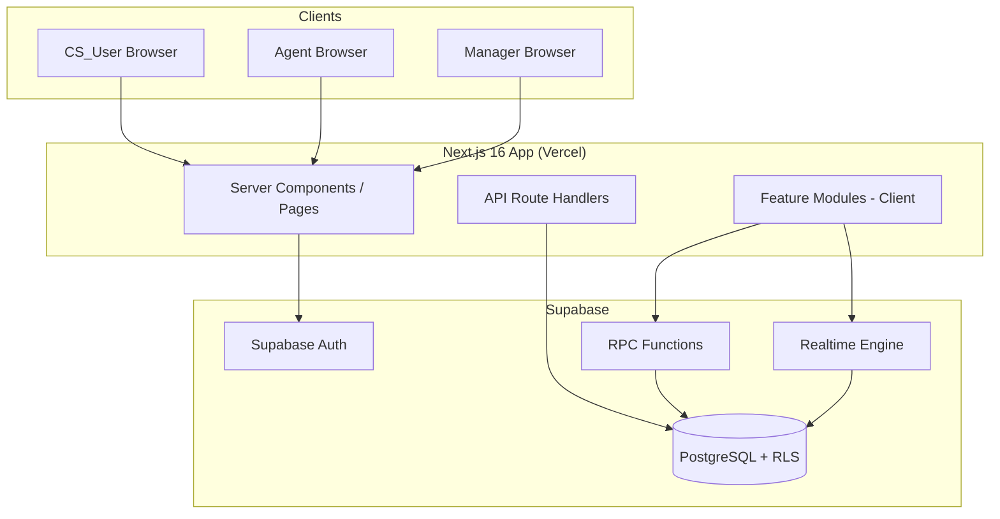
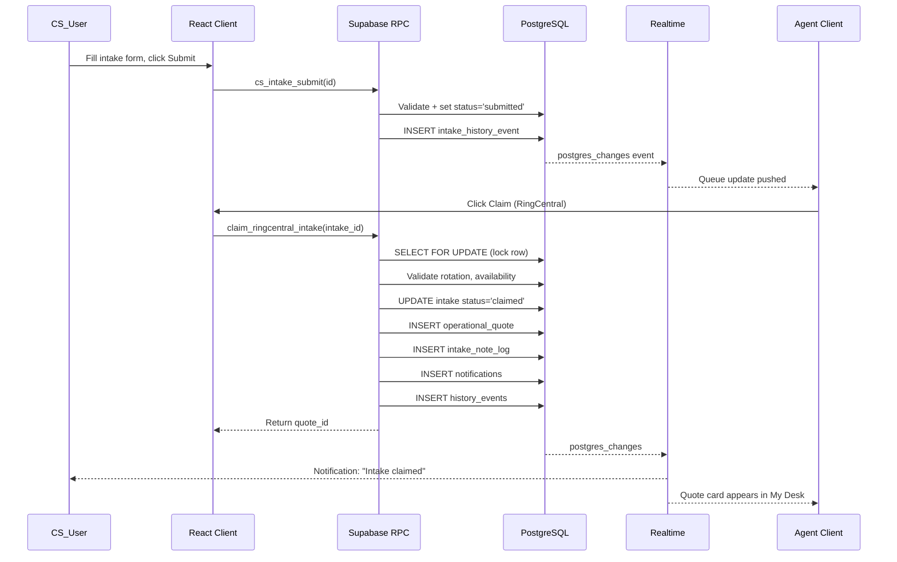
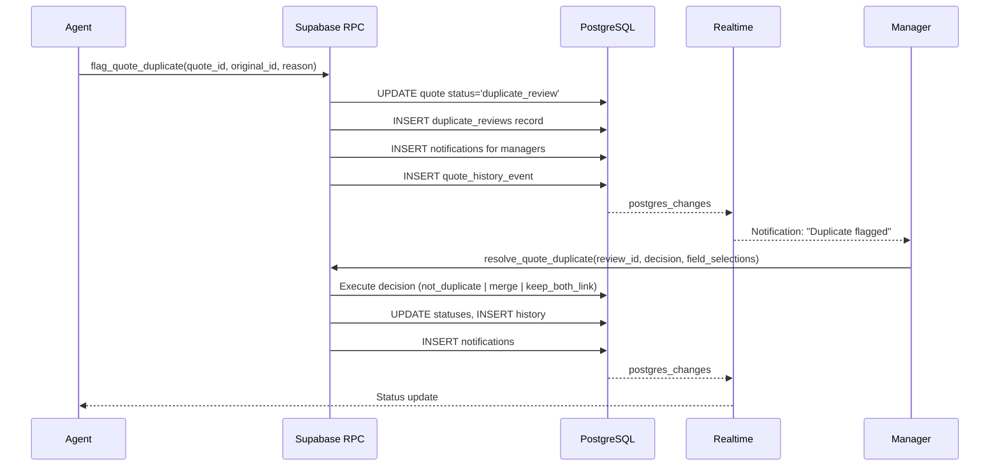
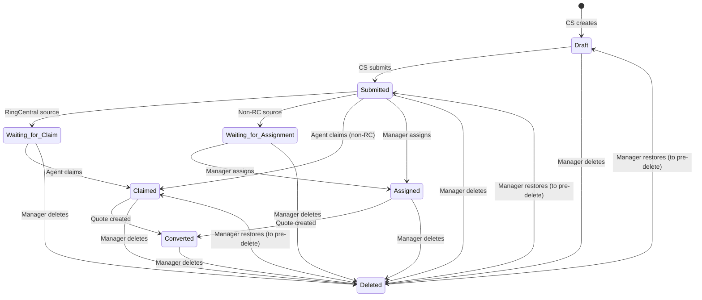
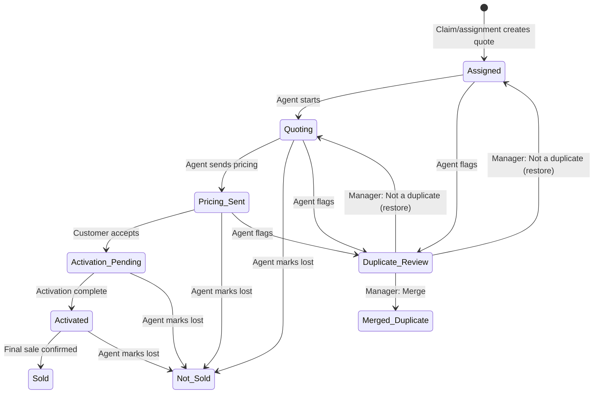
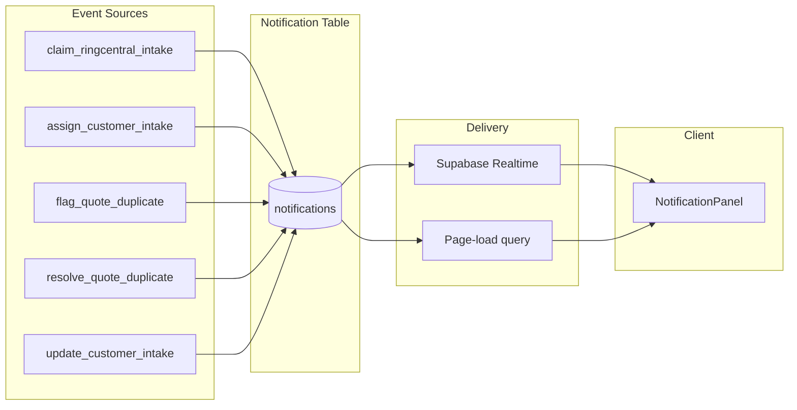

# Design Document: Customer Intake, Claim, and Duplicate Quote

## Overview

This design covers the end-to-end operational workflow for Customer Service intakes, Agent claim/assignment, automatic quote creation, Intake Note Log generation, duplicate quote detection/review, history events, notifications, and reporting. The system operates as a Next.js 16 + React 19 front-end consuming Supabase RPC functions with Row Level Security (RLS) enforcing role-based access at the database layer.

### Key Design Decisions

1. **Transactional RPC over client-side writes** — All state-changing operations use Supabase `plpgsql` functions with explicit transactions to prevent race conditions and partial writes.
2. **Status state machines enforced in SQL** — Intake and Quote status transitions are validated inside RPC functions, not in client code, ensuring consistency even with direct API access.
3. **Immutable history events** — `INSERT`-only tables with no `UPDATE`/`DELETE` policies; history is append-only.
4. **Real-time via Supabase Realtime** — Postgres Changes channels push queue/notification updates to subscribed clients within 5 seconds.
5. **Feature module pattern** — All new code lives under `src/features/cs-intake/` (expanded) and `src/features/quotes/` (new), following the existing `nhwd-shared` conventions.
6. **Soft-delete pattern** — Deleted records retain `deleted_at` and `deleted_reason` columns; RLS policies filter them from non-manager views.

## Architecture

### System Context Diagram



### Data Flow: Intake to Quote



### Duplicate Review Flow



## Components and Interfaces

### Feature Module Layout

```
src/features/
├── cs-intake/              (existing, expanded)
│   ├── api.ts              — Supabase client calls (expanded)
│   ├── CsIntakeLanding.tsx — CS queue view (refactored)
│   ├── IntakeForm.tsx      — Create/edit form (expanded for all statuses)
│   ├── IntakeQueue.tsx     — Agent/Manager queue (refactored)
│   ├── IntakeHistory.tsx   — NEW: Timeline component
│   └── IntakeEditForm.tsx  — NEW: Post-claim edit form (subset of fields)
├── quotes/                 (NEW feature module)
│   ├── api.ts              — Quote RPC calls
│   ├── QuoteCard.tsx       — Agent My Desk card
│   ├── QuoteDetail.tsx     — Full quote view
│   ├── QuoteHistory.tsx    — Quote timeline + Intake Note Log
│   ├── IntakeNoteLog.tsx   — Formatted note log renderer
│   ├── DuplicateFlagForm.tsx — Flag as duplicate modal
│   ├── DuplicateReviewScreen.tsx — Manager side-by-side review
│   └── types.ts            — Quote-specific TypeScript types
├── notifications/          (NEW feature module)
│   ├── api.ts              — Notification CRUD
│   ├── NotificationPanel.tsx — Bell icon + dropdown
│   └── types.ts
└── nhwd-shared/            (existing, minor additions)
    ├── client.ts
    ├── types.ts            — Add QuoteStatus, IntakeStatus enums
    ├── ModuleShell.tsx
    └── ui.ts
```

### API Route Layout

```
src/app/api/
├── intakes/
│   ├── route.ts            — GET list, POST create
│   ├── [id]/
│   │   ├── route.ts        — GET detail, PATCH update, DELETE soft-delete
│   │   ├── submit/route.ts — POST submit
│   │   ├── claim/route.ts  — POST claim (RingCentral validated)
│   │   ├── assign/route.ts — POST manager assign
│   │   ├── restore/route.ts — POST restore
│   │   └── history/route.ts — GET history events
├── quotes/
│   ├── route.ts            — GET list (filtered by role)
│   ├── [id]/
│   │   ├── route.ts        — GET detail, PATCH status change
│   │   ├── duplicate/route.ts — POST flag, GET review data
│   │   └── history/route.ts — GET history events
├── duplicates/
│   ├── route.ts            — GET pending reviews
│   ├── [id]/
│   │   ├── resolve/route.ts — POST resolve decision
│   │   └── merge/route.ts  — POST merge records
├── notifications/
│   ├── route.ts            — GET unread, PATCH mark read
│   └── dismiss/route.ts    — POST dismiss
└── admin/users/route.ts    (existing)
```

### React Component Interfaces

```typescript
// --- IntakeQueue (refactored) ---
interface IntakeQueueProps {
  initialProfile: ProfileLite;
  embedded?: boolean;
}
// Displays: source, customer name, submission date, claim status,
// current RingCentral_Agent name for unclaimed RC intakes.
// Claim button enabled only when viewing Agent === current RC Agent.
// Real-time subscription to rotation changes + queue updates.

// --- QuoteCard ---
interface QuoteCardProps {
  quote: OperationalQuote;
  onStatusChange: (quoteId: string, newStatus: QuoteStatus) => Promise<void>;
  onFlagDuplicate: (quoteId: string) => void;
  onOpen: (quoteId: string) => void;
}
// Displays: customer name, source, dealership, salesperson, quote type,
// intake creator, assigned date, Quote_Status, urgency indicator, last activity.
// Shows only valid actions for current status.

// --- IntakeEditForm (post-claim editing) ---
interface IntakeEditFormProps {
  intake: CustomerIntake;
  drivers: CsIntakeDriver[];
  vehicles: CsIntakeVehicle[];
  profile: ProfileLite;
  onSave: () => void;
  onCancel: () => void;
}
// Available to creating CS_User and Managers.
// Appends changes as history update entries.
// Manager edits require mandatory reason field (min 5 chars).

// --- IntakeHistory ---
interface IntakeHistoryProps {
  intakeId: string;
  events: IntakeHistoryEvent[];
}
// Reverse-chronological timeline.
// Grouped multi-field edits shown as single entry.
// Human-readable formatting (no raw JSON).

// --- DuplicateReviewScreen ---
interface DuplicateReviewScreenProps {
  review: DuplicateReview;
  flaggedQuote: OperationalQuote;
  originalQuote: OperationalQuote;
  onDecision: (decision: DuplicateDecision) => Promise<void>;
}
// Side-by-side comparison with highlighted diffs.
// Three actions: Not a Duplicate, Merge Records, Keep Both but Link.
// Merge requires field-by-field selection for conflicts.

// --- DuplicateFlagForm ---
interface DuplicateFlagFormProps {
  quoteId: string;
  onSubmit: (originalId: string, reason: string) => Promise<void>;
  onCancel: () => void;
}
// Search/select original quote.
// Reason field: 10-500 chars, inline validation.
// Cannot select self.

// --- NotificationPanel ---
interface NotificationPanelProps {
  profile: ProfileLite;
}
// Bell icon with unread count badge.
// Dropdown with notification list (newest first).
// Each notification: message, timestamp, action button.
// Real-time subscription for new notifications.
```

### Supabase RPC Function Signatures

```sql
-- Claim a RingCentral-sourced intake atomically
-- Returns: quote_id UUID on success
CREATE OR REPLACE FUNCTION claim_ringcentral_intake(
  p_intake_id UUID
) RETURNS UUID

-- Assign intake to agent (Manager action)
-- Returns: quote_id UUID on success
CREATE OR REPLACE FUNCTION assign_customer_intake(
  p_intake_id UUID,
  p_agent_id UUID,
  p_reason TEXT DEFAULT NULL
) RETURNS UUID

-- Convert intake to quote (internal, called by claim/assign)
-- Returns: quote_id UUID
CREATE OR REPLACE FUNCTION convert_intake_to_quote(
  p_intake_id UUID,
  p_agent_id UUID,
  p_method TEXT  -- 'ringcentral_claim' | 'manager_assignment' | 'automatic_rotation' | 'renewal_requote'
) RETURNS UUID

-- Update intake fields with history tracking
CREATE OR REPLACE FUNCTION update_customer_intake(
  p_intake_id UUID,
  p_changes JSONB,         -- { field_name: new_value, ... }
  p_reason TEXT DEFAULT NULL -- required for managers
) RETURNS JSONB  -- { success: true, affected_ids: [...] }

-- Soft-delete an intake (Manager only)
CREATE OR REPLACE FUNCTION delete_customer_intake(
  p_intake_id UUID,
  p_reason TEXT  -- min 5 chars
) RETURNS JSONB

-- Restore a soft-deleted intake (Manager only)
CREATE OR REPLACE FUNCTION restore_customer_intake(
  p_intake_id UUID,
  p_reason TEXT
) RETURNS JSONB

-- Flag a quote as possible duplicate (Agent action)
CREATE OR REPLACE FUNCTION flag_quote_duplicate(
  p_quote_id UUID,
  p_original_quote_id UUID,
  p_reason TEXT  -- 10-500 chars
) RETURNS JSONB

-- Resolve a duplicate review (Manager action)
CREATE OR REPLACE FUNCTION resolve_quote_duplicate(
  p_review_id UUID,
  p_decision TEXT,  -- 'not_duplicate' | 'merge' | 'keep_both_link'
  p_field_selections JSONB DEFAULT NULL,
  p_reason TEXT DEFAULT NULL
) RETURNS JSONB

-- Merge two quote records (Manager action, called by resolve)
CREATE OR REPLACE FUNCTION merge_quote_records(
  p_surviving_id UUID,
  p_merged_id UUID,
  p_field_selections JSONB,
  p_reason TEXT
) RETURNS JSONB
```

## Data Models

### Database Schema

#### Table: `customer_intakes` (refactored from `cs_intake_submissions`)

```sql
CREATE TABLE customer_intakes (
  id UUID PRIMARY KEY DEFAULT gen_random_uuid(),
  
  -- Identity components (Req 1)
  customer_name VARCHAR(150) NOT NULL,
  source_type TEXT NOT NULL CHECK (source_type IN (
    'dealership','walk_in_office','whatsapp','ringcentral',
    'customer_service','renewal_requote','existing_customer','referral','other'
  )),
  source_description VARCHAR(100),  -- required when source_type='other'
  dealer_id UUID REFERENCES dealers(id),
  dealer_salesperson_id UUID REFERENCES dealer_salespeople(id),
  line_of_business TEXT NOT NULL CHECK (line_of_business IN ('personal_auto','commercial_auto')),
  phone VARCHAR(20),
  email VARCHAR(254),
  drivers_license_ref VARCHAR(30),
  date_of_birth DATE,
  quote_origin TEXT,  -- free-text origin description
  
  -- Status & workflow
  status TEXT NOT NULL DEFAULT 'draft' CHECK (status IN (
    'draft','submitted','waiting_for_claim','waiting_for_assignment',
    'claimed','assigned','converted','deleted'
  )),
  priority TEXT NOT NULL DEFAULT 'normal' CHECK (priority IN ('normal','high','urgent')),
  
  -- Ownership
  created_by UUID NOT NULL REFERENCES profiles(id),
  assigned_to UUID REFERENCES profiles(id),
  claimed_at TIMESTAMPTZ,
  assignment_method TEXT CHECK (assignment_method IN (
    'ringcentral_claim','manager_assignment','automatic_rotation','renewal_requote'
  )),
  
  -- Conversion link
  converted_quote_id UUID REFERENCES operational_quotes(id),
  converted_at TIMESTAMPTZ,
  converted_by UUID REFERENCES profiles(id),
  
  -- Soft-delete
  deleted_at TIMESTAMPTZ,
  deleted_by UUID REFERENCES profiles(id),
  deleted_reason TEXT,
  pre_delete_status TEXT,  -- status to restore to
  
  -- Personal Auto fields
  insured_first_name VARCHAR(75),
  insured_last_name VARCHAR(75),
  insured_dob DATE,
  insured_email VARCHAR(254),
  insured_phone_primary VARCHAR(20),
  insured_phone_alt VARCHAR(20),
  preferred_language TEXT,
  preferred_contact TEXT,
  addr_street TEXT,
  addr_unit TEXT,
  addr_city TEXT,
  addr_state VARCHAR(2),
  addr_zip VARCHAR(10),
  mailing_same_as_addr BOOLEAN DEFAULT true,
  
  -- Commercial Auto fields
  business_name VARCHAR(200),
  dot_number VARCHAR(20),
  dot_not_applicable BOOLEAN DEFAULT false,
  business_type TEXT,
  years_in_business SMALLINT,
  operating_radius_miles INTEGER,
  
  -- Coverage fields
  desired_coverage TEXT,
  liability_limit TEXT,
  comprehensive_deductible TEXT,
  collision_deductible TEXT,
  current_carrier TEXT,
  current_policy_number TEXT,
  current_premium NUMERIC(10,2),
  current_expiration DATE,
  prior_insurance BOOLEAN,
  prior_lapse BOOLEAN,
  months_continuous_coverage SMALLINT,
  
  -- Notes
  csr_notes TEXT,
  
  -- Timestamps
  created_at TIMESTAMPTZ NOT NULL DEFAULT now(),
  updated_at TIMESTAMPTZ NOT NULL DEFAULT now(),
  submitted_at TIMESTAMPTZ,
  
  -- Constraints
  CONSTRAINT customer_name_not_empty CHECK (char_length(trim(customer_name)) > 0),
  CONSTRAINT phone_or_email_required CHECK (phone IS NOT NULL OR email IS NOT NULL),
  CONSTRAINT dealership_requires_salesperson CHECK (
    source_type != 'dealership' OR (dealer_id IS NOT NULL AND dealer_salesperson_id IS NOT NULL)
  ),
  CONSTRAINT other_requires_description CHECK (
    source_type != 'other' OR char_length(trim(COALESCE(source_description,''))) > 0
  )
);

-- Unique constraint: one quote per intake
CREATE UNIQUE INDEX idx_customer_intakes_converted_quote 
  ON customer_intakes(converted_quote_id) WHERE converted_quote_id IS NOT NULL;
```

#### Table: `operational_quotes`

```sql
CREATE TABLE operational_quotes (
  id UUID PRIMARY KEY DEFAULT gen_random_uuid(),
  
  -- Link to intake
  customer_intake_id UUID NOT NULL REFERENCES customer_intakes(id),
  
  -- Identity (copied from intake at creation)
  customer_name VARCHAR(150) NOT NULL,
  source_type TEXT NOT NULL,
  dealer_id UUID REFERENCES dealers(id),
  dealer_salesperson_id UUID REFERENCES dealer_salespeople(id),
  line_of_business TEXT NOT NULL,
  phone VARCHAR(20),
  email VARCHAR(254),
  quote_origin TEXT,
  
  -- Status state machine
  status TEXT NOT NULL DEFAULT 'assigned' CHECK (status IN (
    'assigned','quoting','pricing_sent','not_sold',
    'activation_pending','activated','sold',
    'duplicate_review','merged_duplicate'
  )),
  pre_flag_status TEXT,  -- status before duplicate_review (for restore)
  
  -- Assignment
  assigned_to UUID NOT NULL REFERENCES profiles(id),
  intake_creator UUID NOT NULL REFERENCES profiles(id),
  assignment_method TEXT NOT NULL,
  assigned_at TIMESTAMPTZ NOT NULL DEFAULT now(),
  claimed_at TIMESTAMPTZ,
  
  -- Intake Note Log (stored as first history entry reference)
  intake_note_log_id UUID,  -- FK to quote_history_events
  
  -- Urgency tracking
  last_progression_at TIMESTAMPTZ NOT NULL DEFAULT now(),
  
  -- Duplicate linking
  linked_quote_id UUID REFERENCES operational_quotes(id),  -- bidirectional
  merged_into_id UUID REFERENCES operational_quotes(id),
  
  -- Timestamps
  created_at TIMESTAMPTZ NOT NULL DEFAULT now(),
  updated_at TIMESTAMPTZ NOT NULL DEFAULT now(),
  completed_at TIMESTAMPTZ,  -- when terminal status reached
  
  -- Constraints
  CONSTRAINT one_quote_per_intake UNIQUE (customer_intake_id)
);

CREATE INDEX idx_quotes_assigned_to ON operational_quotes(assigned_to) WHERE status NOT IN ('not_sold','sold','merged_duplicate');
CREATE INDEX idx_quotes_status ON operational_quotes(status);
CREATE INDEX idx_quotes_duplicate_review ON operational_quotes(id) WHERE status = 'duplicate_review';
```

#### Table: `intake_history_events`

```sql
CREATE TABLE intake_history_events (
  id UUID PRIMARY KEY DEFAULT gen_random_uuid(),
  intake_id UUID NOT NULL REFERENCES customer_intakes(id),
  linked_quote_id UUID REFERENCES operational_quotes(id),
  
  actor_id UUID NOT NULL REFERENCES profiles(id),
  actor_display_name TEXT NOT NULL,
  
  event_type TEXT NOT NULL CHECK (event_type IN (
    'created','updated','source_changed','submitted','claimed',
    'assigned','converted_to_quote','deleted','restored'
  )),
  
  -- For 'updated' events: grouped field changes
  changed_fields JSONB,  -- [{ field, old_value, new_value }]
  
  -- Human-readable details
  details TEXT CHECK (char_length(details) BETWEEN 1 AND 500),
  reason TEXT,  -- mandatory for manager edits, deletes, restores
  
  created_at TIMESTAMPTZ NOT NULL DEFAULT now(),
  
  -- Immutability: no UPDATE/DELETE RLS policies
  CONSTRAINT no_empty_event CHECK (details IS NOT NULL OR changed_fields IS NOT NULL)
);

CREATE INDEX idx_intake_history_intake ON intake_history_events(intake_id, created_at DESC);
```

#### Table: `quote_history_events`

```sql
CREATE TABLE quote_history_events (
  id UUID PRIMARY KEY DEFAULT gen_random_uuid(),
  quote_id UUID NOT NULL REFERENCES operational_quotes(id),
  linked_intake_id UUID REFERENCES customer_intakes(id),
  
  actor_id UUID NOT NULL REFERENCES profiles(id),
  actor_display_name TEXT NOT NULL,
  
  event_type TEXT NOT NULL CHECK (event_type IN (
    'quote_created','intake_note_log','intake_update','agent_started_quoting',
    'pricing_sent','follow_up_recorded','activation_started','activation_completed',
    'sold','not_sold','duplicate_review_entered','duplicate_resolved',
    'merged','reassigned','note_added','attachment_added','status_changed'
  )),
  
  -- Intake Note Log content (for event_type='intake_note_log')
  note_log_content TEXT,  -- Formatted Personal/Commercial Auto note
  
  -- For intake_update events
  changed_fields JSONB,
  
  -- General
  details TEXT CHECK (char_length(details) BETWEEN 1 AND 500),
  reason TEXT,
  
  created_at TIMESTAMPTZ NOT NULL DEFAULT now()
);

CREATE INDEX idx_quote_history_quote ON quote_history_events(quote_id, created_at ASC);
```

#### Table: `notifications`

```sql
CREATE TABLE notifications (
  id UUID PRIMARY KEY DEFAULT gen_random_uuid(),
  recipient_id UUID NOT NULL REFERENCES profiles(id),
  
  notification_type TEXT NOT NULL CHECK (notification_type IN (
    'quote_assigned','intake_claimed','duplicate_flagged',
    'duplicate_resolved','intake_updated','quote_reassigned'
  )),
  
  -- Payload (type-specific content)
  title TEXT NOT NULL,
  body TEXT NOT NULL,
  metadata JSONB NOT NULL DEFAULT '{}',  -- { quote_id, intake_id, agent_name, etc. }
  action_url TEXT,  -- navigation target for action button
  
  -- State
  is_read BOOLEAN NOT NULL DEFAULT false,
  is_dismissed BOOLEAN NOT NULL DEFAULT false,
  
  created_at TIMESTAMPTZ NOT NULL DEFAULT now(),
  read_at TIMESTAMPTZ,
  dismissed_at TIMESTAMPTZ
);

CREATE INDEX idx_notifications_recipient_unread 
  ON notifications(recipient_id, created_at DESC) WHERE NOT is_read AND NOT is_dismissed;
```

#### Table: `duplicate_reviews`

```sql
CREATE TABLE duplicate_reviews (
  id UUID PRIMARY KEY DEFAULT gen_random_uuid(),
  
  flagged_quote_id UUID NOT NULL REFERENCES operational_quotes(id),
  original_quote_id UUID NOT NULL REFERENCES operational_quotes(id),
  
  flagged_by UUID NOT NULL REFERENCES profiles(id),
  flagged_at TIMESTAMPTZ NOT NULL DEFAULT now(),
  reason TEXT NOT NULL CHECK (char_length(reason) BETWEEN 10 AND 500),
  
  -- Resolution
  resolved_by UUID REFERENCES profiles(id),
  resolved_at TIMESTAMPTZ,
  decision TEXT CHECK (decision IN ('not_duplicate','merge','keep_both_link')),
  resolution_details JSONB,  -- field selections, merge details
  
  -- Status
  status TEXT NOT NULL DEFAULT 'pending' CHECK (status IN ('pending','resolved')),
  
  -- Constraints
  CONSTRAINT not_self_duplicate CHECK (flagged_quote_id != original_quote_id),
  CONSTRAINT no_double_flag UNIQUE (flagged_quote_id) -- one active flag per quote
);

CREATE INDEX idx_duplicate_reviews_pending ON duplicate_reviews(id) WHERE status = 'pending';
```

#### Table: `quote_links`

```sql
CREATE TABLE quote_links (
  id UUID PRIMARY KEY DEFAULT gen_random_uuid(),
  quote_a_id UUID NOT NULL REFERENCES operational_quotes(id),
  quote_b_id UUID NOT NULL REFERENCES operational_quotes(id),
  link_type TEXT NOT NULL CHECK (link_type IN ('keep_both','merged_source')),
  created_by UUID NOT NULL REFERENCES profiles(id),
  created_at TIMESTAMPTZ NOT NULL DEFAULT now(),
  
  CONSTRAINT no_self_link CHECK (quote_a_id != quote_b_id),
  CONSTRAINT unique_link UNIQUE (quote_a_id, quote_b_id)
);
```

### Status State Machines

#### Intake Status Transitions



#### Quote Status Transitions



### TypeScript Type Definitions

```typescript
// src/features/quotes/types.ts

export type IntakeStatus =
  | 'draft'
  | 'submitted'
  | 'waiting_for_claim'
  | 'waiting_for_assignment'
  | 'claimed'
  | 'assigned'
  | 'converted'
  | 'deleted';

export type QuoteStatus =
  | 'assigned'
  | 'quoting'
  | 'pricing_sent'
  | 'not_sold'
  | 'activation_pending'
  | 'activated'
  | 'sold'
  | 'duplicate_review'
  | 'merged_duplicate';

export type AssignmentMethod =
  | 'ringcentral_claim'
  | 'manager_assignment'
  | 'automatic_rotation'
  | 'renewal_requote';

export type SourceType =
  | 'dealership'
  | 'walk_in_office'
  | 'whatsapp'
  | 'ringcentral'
  | 'customer_service'
  | 'renewal_requote'
  | 'existing_customer'
  | 'referral'
  | 'other';

export type NotificationType =
  | 'quote_assigned'
  | 'intake_claimed'
  | 'duplicate_flagged'
  | 'duplicate_resolved'
  | 'intake_updated'
  | 'quote_reassigned';

export type DuplicateDecision = 'not_duplicate' | 'merge' | 'keep_both_link';

export type UrgencyLevel = 'normal' | 'elevated' | 'high';

export interface OperationalQuote {
  id: string;
  customer_intake_id: string;
  customer_name: string;
  source_type: SourceType;
  dealer_id: string | null;
  dealer_salesperson_id: string | null;
  line_of_business: 'personal_auto' | 'commercial_auto';
  phone: string | null;
  email: string | null;
  quote_origin: string | null;
  status: QuoteStatus;
  pre_flag_status: QuoteStatus | null;
  assigned_to: string;
  intake_creator: string;
  assignment_method: AssignmentMethod;
  assigned_at: string;
  claimed_at: string | null;
  last_progression_at: string;
  linked_quote_id: string | null;
  merged_into_id: string | null;
  created_at: string;
  updated_at: string;
  completed_at: string | null;
}

export interface DuplicateReview {
  id: string;
  flagged_quote_id: string;
  original_quote_id: string;
  flagged_by: string;
  flagged_at: string;
  reason: string;
  resolved_by: string | null;
  resolved_at: string | null;
  decision: DuplicateDecision | null;
  resolution_details: Record<string, unknown> | null;
  status: 'pending' | 'resolved';
}

export interface Notification {
  id: string;
  recipient_id: string;
  notification_type: NotificationType;
  title: string;
  body: string;
  metadata: Record<string, unknown>;
  action_url: string | null;
  is_read: boolean;
  is_dismissed: boolean;
  created_at: string;
  read_at: string | null;
}

export interface IntakeHistoryEvent {
  id: string;
  intake_id: string;
  linked_quote_id: string | null;
  actor_id: string;
  actor_display_name: string;
  event_type: string;
  changed_fields: Array<{ field: string; old_value: unknown; new_value: unknown }> | null;
  details: string | null;
  reason: string | null;
  created_at: string;
}

export interface QuoteHistoryEvent {
  id: string;
  quote_id: string;
  linked_intake_id: string | null;
  actor_id: string;
  actor_display_name: string;
  event_type: string;
  note_log_content: string | null;
  changed_fields: Array<{ field: string; old_value: unknown; new_value: unknown }> | null;
  details: string | null;
  reason: string | null;
  created_at: string;
}

// Valid transitions map (enforced in SQL, mirrored for UI)
export const QUOTE_TRANSITIONS: Record<QuoteStatus, QuoteStatus[]> = {
  assigned: ['quoting'],
  quoting: ['pricing_sent', 'not_sold'],
  pricing_sent: ['activation_pending', 'not_sold'],
  activation_pending: ['activated', 'not_sold'],
  activated: ['sold', 'not_sold'],
  sold: [],
  not_sold: [],
  duplicate_review: [],  // resolved by manager
  merged_duplicate: [],
};

// Urgency calculation
export function calculateUrgency(quote: OperationalQuote): UrgencyLevel {
  if (quote.status !== 'assigned') return 'normal';
  const hoursSince = (Date.now() - new Date(quote.last_progression_at).getTime()) / 3_600_000;
  if (hoursSince > 48) return 'high';
  if (hoursSince > 24) return 'elevated';
  return 'normal';
}
```

### Row Level Security Policies

```sql
-- ========================================
-- customer_intakes RLS
-- ========================================
ALTER TABLE customer_intakes ENABLE ROW LEVEL SECURITY;

-- CS_User: can see own intakes only
CREATE POLICY "cs_select_own" ON customer_intakes FOR SELECT
  TO authenticated
  USING (
    (SELECT role FROM profiles WHERE id = auth.uid()) = 'customer_service'
    AND created_by = auth.uid()
  );

-- CS_User: can insert (create new intakes)
CREATE POLICY "cs_insert" ON customer_intakes FOR INSERT
  TO authenticated
  WITH CHECK (
    (SELECT role FROM profiles WHERE id = auth.uid()) = 'customer_service'
    AND created_by = auth.uid()
  );

-- CS_User: can update own intakes (status-dependent logic in RPC)
CREATE POLICY "cs_update_own" ON customer_intakes FOR UPDATE
  TO authenticated
  USING (
    (SELECT role FROM profiles WHERE id = auth.uid()) = 'customer_service'
    AND created_by = auth.uid()
  );

-- Agent: can view submitted/claimed/converted intakes (queue view)
CREATE POLICY "agent_select_queue" ON customer_intakes FOR SELECT
  TO authenticated
  USING (
    (SELECT role FROM profiles WHERE id = auth.uid()) = 'agent'
    AND status NOT IN ('draft', 'deleted')
  );

-- Manager: full read access including deleted (audit view)
CREATE POLICY "manager_select_all" ON customer_intakes FOR SELECT
  TO authenticated
  USING (
    (SELECT role FROM profiles WHERE id = auth.uid()) = 'manager'
  );

-- Manager: can update any intake
CREATE POLICY "manager_update_all" ON customer_intakes FOR UPDATE
  TO authenticated
  USING (
    (SELECT role FROM profiles WHERE id = auth.uid()) = 'manager'
  );

-- ========================================
-- operational_quotes RLS
-- ========================================
ALTER TABLE operational_quotes ENABLE ROW LEVEL SECURITY;

-- Agent: can see own quotes + team quotes (non-merged)
CREATE POLICY "agent_select" ON operational_quotes FOR SELECT
  TO authenticated
  USING (
    (SELECT role FROM profiles WHERE id = auth.uid()) IN ('agent', 'manager')
    AND status != 'merged_duplicate'
  );

-- Agent: can update own quotes (status changes, notes)
CREATE POLICY "agent_update_own" ON operational_quotes FOR UPDATE
  TO authenticated
  USING (
    (SELECT role FROM profiles WHERE id = auth.uid()) = 'agent'
    AND assigned_to = auth.uid()
  );

-- Manager: full access
CREATE POLICY "manager_all_quotes" ON operational_quotes FOR ALL
  TO authenticated
  USING (
    (SELECT role FROM profiles WHERE id = auth.uid()) = 'manager'
  );

-- ========================================
-- intake_history_events RLS (INSERT only, no UPDATE/DELETE)
-- ========================================
ALTER TABLE intake_history_events ENABLE ROW LEVEL SECURITY;

-- All authenticated: can read history for intakes they can see
CREATE POLICY "read_intake_history" ON intake_history_events FOR SELECT
  TO authenticated
  USING (
    EXISTS (
      SELECT 1 FROM customer_intakes ci WHERE ci.id = intake_id
    )
  );

-- Insert only via RPC (SECURITY DEFINER functions)
-- No direct INSERT policy for regular users

-- ========================================
-- quote_history_events RLS
-- ========================================
ALTER TABLE quote_history_events ENABLE ROW LEVEL SECURITY;

CREATE POLICY "read_quote_history" ON quote_history_events FOR SELECT
  TO authenticated
  USING (
    EXISTS (
      SELECT 1 FROM operational_quotes q WHERE q.id = quote_id
    )
  );

-- ========================================
-- notifications RLS
-- ========================================
ALTER TABLE notifications ENABLE ROW LEVEL SECURITY;

-- Users can only see their own notifications
CREATE POLICY "own_notifications" ON notifications FOR SELECT
  TO authenticated
  USING (recipient_id = auth.uid());

CREATE POLICY "mark_own_read" ON notifications FOR UPDATE
  TO authenticated
  USING (recipient_id = auth.uid())
  WITH CHECK (recipient_id = auth.uid());

-- ========================================
-- duplicate_reviews RLS
-- ========================================
ALTER TABLE duplicate_reviews ENABLE ROW LEVEL SECURITY;

-- Agents can see reviews they flagged
CREATE POLICY "agent_own_reviews" ON duplicate_reviews FOR SELECT
  TO authenticated
  USING (
    (SELECT role FROM profiles WHERE id = auth.uid()) = 'agent'
    AND flagged_by = auth.uid()
  );

-- Managers can see all reviews
CREATE POLICY "manager_all_reviews" ON duplicate_reviews FOR SELECT
  TO authenticated
  USING (
    (SELECT role FROM profiles WHERE id = auth.uid()) = 'manager'
  );
```

### RPC Function Implementation Details

#### `claim_ringcentral_intake` — Atomic RingCentral Claim

```sql
CREATE OR REPLACE FUNCTION claim_ringcentral_intake(p_intake_id UUID)
RETURNS UUID
LANGUAGE plpgsql
SECURITY DEFINER
SET statement_timeout = '30s'
AS $$
DECLARE
  v_intake customer_intakes%ROWTYPE;
  v_caller_id UUID := auth.uid();
  v_caller_profile profiles%ROWTYPE;
  v_current_rc_agent UUID;
  v_quote_id UUID;
  v_note_log TEXT;
BEGIN
  -- 1. Lock the intake row
  SELECT * INTO v_intake
  FROM customer_intakes
  WHERE id = p_intake_id
  FOR UPDATE NOWAIT;
  
  IF NOT FOUND THEN
    RAISE EXCEPTION 'INTAKE_NOT_FOUND: Intake does not exist.';
  END IF;
  
  -- 2. Validate source is RingCentral
  IF v_intake.source_type != 'ringcentral' THEN
    RAISE EXCEPTION 'NOT_RINGCENTRAL: This intake is not RingCentral-sourced.';
  END IF;
  
  -- 3. Validate intake is unclaimed
  IF v_intake.assigned_to IS NOT NULL OR v_intake.claimed_at IS NOT NULL THEN
    RAISE EXCEPTION 'ALREADY_CLAIMED: This intake has already been claimed.';
  END IF;
  
  IF v_intake.status NOT IN ('submitted', 'waiting_for_claim') THEN
    RAISE EXCEPTION 'INVALID_STATUS: Intake status does not allow claiming.';
  END IF;
  
  -- 4. Verify caller is the current RingCentral agent
  SELECT * INTO v_caller_profile FROM profiles WHERE id = v_caller_id;
  
  IF v_caller_profile.role != 'agent' AND v_caller_profile.role != 'manager' THEN
    RAISE EXCEPTION 'NOT_AGENT: Only agents can claim intakes.';
  END IF;
  
  -- Read current rotation state
  SELECT id INTO v_current_rc_agent
  FROM profiles
  WHERE ringcentral_active = true
    AND is_active = true
    AND availability = 'available'
  ORDER BY ringcentral_position
  LIMIT 1;
  
  IF v_current_rc_agent IS NULL THEN
    RAISE EXCEPTION 'NO_RC_AGENT: No RingCentral agent is currently available.';
  END IF;
  
  IF v_caller_id != v_current_rc_agent AND v_caller_profile.role != 'manager' THEN
    RAISE EXCEPTION 'NOT_YOUR_TURN: Current turn belongs to another agent.';
  END IF;
  
  -- 5. Check availability
  IF v_caller_profile.availability != 'available' AND v_caller_profile.role != 'manager' THEN
    RAISE EXCEPTION 'AGENT_UNAVAILABLE: You must be available to claim.';
  END IF;
  
  -- 6. Create the operational quote (calls internal helper)
  v_quote_id := _create_quote_from_intake(p_intake_id, v_caller_id, 'ringcentral_claim');
  
  -- 7. Update intake
  UPDATE customer_intakes SET
    status = 'claimed',
    assigned_to = v_caller_id,
    claimed_at = now(),
    assignment_method = 'ringcentral_claim',
    converted_quote_id = v_quote_id,
    converted_at = now(),
    converted_by = v_caller_id,
    updated_at = now()
  WHERE id = p_intake_id;
  
  -- 8. Record history events
  INSERT INTO intake_history_events (intake_id, linked_quote_id, actor_id, actor_display_name, event_type, details)
  VALUES (p_intake_id, v_quote_id, v_caller_id, v_caller_profile.display_name, 'claimed',
          'RingCentral claim by ' || v_caller_profile.display_name);
  
  -- 9. Create notifications
  -- Notify CS creator
  INSERT INTO notifications (recipient_id, notification_type, title, body, metadata, action_url)
  VALUES (v_intake.created_by, 'intake_claimed',
          'Intake Claimed',
          v_intake.customer_name || ' claimed by ' || v_caller_profile.display_name,
          jsonb_build_object('intake_id', p_intake_id, 'agent_name', v_caller_profile.display_name, 'claimed_at', now()),
          '/tools/quotes/' || v_quote_id);
  
  -- Notify assigned agent
  INSERT INTO notifications (recipient_id, notification_type, title, body, metadata, action_url)
  VALUES (v_caller_id, 'quote_assigned',
          'New Quote Assigned',
          v_intake.customer_name || ' — ' || v_intake.source_type || ' / ' || v_intake.line_of_business,
          jsonb_build_object('quote_id', v_quote_id, 'intake_id', p_intake_id, 'customer_name', v_intake.customer_name),
          '/tools/quotes/' || v_quote_id);
  
  RETURN v_quote_id;
END;
$$;
```

#### `_create_quote_from_intake` — Internal Quote Creation Helper

```sql
CREATE OR REPLACE FUNCTION _create_quote_from_intake(
  p_intake_id UUID,
  p_agent_id UUID,
  p_method TEXT
) RETURNS UUID
LANGUAGE plpgsql
AS $$
DECLARE
  v_intake customer_intakes%ROWTYPE;
  v_quote_id UUID;
  v_note_log TEXT;
  v_agent profiles%ROWTYPE;
BEGIN
  SELECT * INTO v_intake FROM customer_intakes WHERE id = p_intake_id;
  SELECT * INTO v_agent FROM profiles WHERE id = p_agent_id;
  
  -- Check idempotency: if quote already exists, return it
  IF v_intake.converted_quote_id IS NOT NULL THEN
    RETURN v_intake.converted_quote_id;
  END IF;
  
  -- Generate Intake Note Log
  v_note_log := _generate_intake_note_log(p_intake_id);
  
  -- Insert operational quote
  INSERT INTO operational_quotes (
    customer_intake_id, customer_name, source_type, dealer_id,
    dealer_salesperson_id, line_of_business, phone, email,
    quote_origin, status, assigned_to, intake_creator,
    assignment_method, claimed_at
  ) VALUES (
    p_intake_id, v_intake.customer_name, v_intake.source_type, v_intake.dealer_id,
    v_intake.dealer_salesperson_id, v_intake.line_of_business, v_intake.phone, v_intake.email,
    v_intake.quote_origin, 'assigned', p_agent_id, v_intake.created_by,
    p_method, CASE WHEN p_method = 'ringcentral_claim' THEN now() ELSE NULL END
  ) RETURNING id INTO v_quote_id;
  
  -- Insert Intake Note Log as first quote history event
  INSERT INTO quote_history_events (
    quote_id, linked_intake_id, actor_id, actor_display_name,
    event_type, note_log_content, details
  ) VALUES (
    v_quote_id, p_intake_id, v_intake.created_by,
    (SELECT display_name FROM profiles WHERE id = v_intake.created_by),
    'intake_note_log', v_note_log,
    'Auto-generated intake note log'
  );
  
  -- Insert quote_created event
  INSERT INTO quote_history_events (
    quote_id, linked_intake_id, actor_id, actor_display_name,
    event_type, details
  ) VALUES (
    v_quote_id, p_intake_id, p_agent_id, v_agent.display_name,
    'quote_created',
    'Quote created via ' || replace(p_method, '_', ' ') || ' by ' || v_agent.display_name
  );
  
  RETURN v_quote_id;
END;
$$;
```

#### `_generate_intake_note_log` — Intake Note Log Generation

```sql
CREATE OR REPLACE FUNCTION _generate_intake_note_log(p_intake_id UUID)
RETURNS TEXT
LANGUAGE plpgsql
AS $$
DECLARE
  v_intake customer_intakes%ROWTYPE;
  v_creator_name TEXT;
  v_log TEXT := '';
  v_driver RECORD;
  v_vehicle RECORD;
  v_driver_count INT;
  v_vehicle_count INT;
BEGIN
  SELECT * INTO v_intake FROM customer_intakes WHERE id = p_intake_id;
  SELECT display_name INTO v_creator_name FROM profiles WHERE id = v_intake.created_by;
  
  -- Metadata header
  v_log := '═══ INTAKE NOTE LOG ═══' || E'\n';
  v_log := v_log || 'Created by: ' || v_creator_name || E'\n';
  v_log := v_log || 'Generated: ' || to_char(now() AT TIME ZONE 'America/Chicago', 'MM/DD/YYYY HH12:MI AM TZ') || E'\n';
  v_log := v_log || '───────────────────────' || E'\n\n';
  
  IF v_intake.line_of_business = 'personal_auto' THEN
    -- PERSONAL AUTO FORMAT
    -- Section: Customer
    v_log := v_log || '▸ CUSTOMER' || E'\n';
    v_log := v_log || '  Name: ' || COALESCE(v_intake.insured_first_name,'') || ' ' || COALESCE(v_intake.insured_last_name,'') || E'\n';
    IF v_intake.insured_dob IS NOT NULL THEN
      v_log := v_log || '  DOB: ' || to_char(v_intake.insured_dob, 'MM/DD/YYYY') || E'\n';
    END IF;
    IF v_intake.insured_phone_primary IS NOT NULL THEN
      v_log := v_log || '  Phone: ' || v_intake.insured_phone_primary || E'\n';
    END IF;
    IF v_intake.insured_phone_alt IS NOT NULL THEN
      v_log := v_log || '  Alt Phone: ' || v_intake.insured_phone_alt || E'\n';
    END IF;
    IF v_intake.insured_email IS NOT NULL THEN
      v_log := v_log || '  Email: ' || v_intake.insured_email || E'\n';
    END IF;
    IF v_intake.addr_street IS NOT NULL THEN
      v_log := v_log || '  Address: ' || v_intake.addr_street;
      IF v_intake.addr_unit IS NOT NULL THEN v_log := v_log || ' ' || v_intake.addr_unit; END IF;
      v_log := v_log || ', ' || COALESCE(v_intake.addr_city,'') || ' ' || COALESCE(v_intake.addr_state,'') || ' ' || COALESCE(v_intake.addr_zip,'') || E'\n';
    END IF;
    v_log := v_log || E'\n';
    
    -- Section: Source
    v_log := v_log || '▸ SOURCE' || E'\n';
    v_log := v_log || '  Type: ' || replace(v_intake.source_type, '_', ' ') || E'\n';
    IF v_intake.dealer_id IS NOT NULL THEN
      v_log := v_log || '  Dealership: ' || (SELECT name FROM dealers WHERE id = v_intake.dealer_id) || E'\n';
    END IF;
    IF v_intake.dealer_salesperson_id IS NOT NULL THEN
      v_log := v_log || '  Salesperson: ' || (SELECT name FROM dealer_salespeople WHERE id = v_intake.dealer_salesperson_id) || E'\n';
    END IF;
    v_log := v_log || E'\n';
    
    -- Section: Coverage Requested
    IF v_intake.desired_coverage IS NOT NULL OR v_intake.liability_limit IS NOT NULL THEN
      v_log := v_log || '▸ COVERAGE REQUESTED' || E'\n';
      IF v_intake.desired_coverage IS NOT NULL THEN
        v_log := v_log || '  Desired: ' || replace(v_intake.desired_coverage, '_', ' ') || E'\n';
      END IF;
      IF v_intake.liability_limit IS NOT NULL THEN
        v_log := v_log || '  Liability Limit: ' || v_intake.liability_limit || E'\n';
      END IF;
      IF v_intake.comprehensive_deductible IS NOT NULL THEN
        v_log := v_log || '  Comp Deductible: ' || v_intake.comprehensive_deductible || E'\n';
      END IF;
      IF v_intake.collision_deductible IS NOT NULL THEN
        v_log := v_log || '  Coll Deductible: ' || v_intake.collision_deductible || E'\n';
      END IF;
      IF v_intake.current_carrier IS NOT NULL THEN
        v_log := v_log || '  Current Carrier: ' || v_intake.current_carrier || E'\n';
      END IF;
      IF v_intake.current_expiration IS NOT NULL THEN
        v_log := v_log || '  Expiration: ' || to_char(v_intake.current_expiration, 'MM/DD/YYYY') || E'\n';
      END IF;
      v_log := v_log || E'\n';
    END IF;
    
    -- Section: Drivers
    SELECT count(*) INTO v_driver_count FROM cs_intake_drivers WHERE submission_id = p_intake_id;
    IF v_driver_count > 0 THEN
      v_log := v_log || '▸ DRIVERS' || E'\n';
      FOR v_driver IN SELECT * FROM cs_intake_drivers WHERE submission_id = p_intake_id ORDER BY position LOOP
        v_log := v_log || '  [' || v_driver.position || '] ' || v_driver.first_name || ' ' || v_driver.last_name;
        IF v_driver.dob IS NOT NULL THEN v_log := v_log || ' (DOB: ' || to_char(v_driver.dob, 'MM/DD/YYYY') || ')'; END IF;
        IF v_driver.relationship IS NOT NULL THEN v_log := v_log || ' — ' || v_driver.relationship; END IF;
        v_log := v_log || E'\n';
        IF v_driver.license_number IS NOT NULL THEN
          v_log := v_log || '     DL: ' || v_driver.license_number || ' (' || COALESCE(v_driver.license_state,'') || ')' || E'\n';
        END IF;
      END LOOP;
      v_log := v_log || E'\n';
    END IF;
    
    -- Section: Vehicles
    SELECT count(*) INTO v_vehicle_count FROM cs_intake_vehicles WHERE submission_id = p_intake_id;
    IF v_vehicle_count > 0 THEN
      v_log := v_log || '▸ VEHICLES' || E'\n';
      FOR v_vehicle IN SELECT * FROM cs_intake_vehicles WHERE submission_id = p_intake_id ORDER BY position LOOP
        v_log := v_log || '  [' || v_vehicle.position || '] ';
        v_log := v_log || COALESCE(v_vehicle.year::TEXT,'') || ' ' || COALESCE(v_vehicle.make,'') || ' ' || COALESCE(v_vehicle.model,'');
        v_log := v_log || E'\n';
        IF v_vehicle.vin IS NOT NULL THEN v_log := v_log || '     VIN: ' || v_vehicle.vin || E'\n'; END IF;
        IF v_vehicle.ownership IS NOT NULL THEN v_log := v_log || '     Ownership: ' || v_vehicle.ownership || E'\n'; END IF;
        IF v_vehicle.usage IS NOT NULL THEN v_log := v_log || '     Usage: ' || v_vehicle.usage || E'\n'; END IF;
        IF v_vehicle.annual_mileage IS NOT NULL THEN v_log := v_log || '     Mileage: ' || v_vehicle.annual_mileage || '/yr' || E'\n'; END IF;
        IF v_vehicle.garaging_zip IS NOT NULL THEN v_log := v_log || '     Garaging ZIP: ' || v_vehicle.garaging_zip || E'\n'; END IF;
      END LOOP;
      v_log := v_log || E'\n';
    END IF;
    
  ELSE
    -- COMMERCIAL AUTO FORMAT
    -- Section: Business
    v_log := v_log || '▸ BUSINESS' || E'\n';
    IF v_intake.business_name IS NOT NULL THEN v_log := v_log || '  Name: ' || v_intake.business_name || E'\n'; END IF;
    IF v_intake.business_type IS NOT NULL THEN v_log := v_log || '  Type of Work: ' || v_intake.business_type || E'\n'; END IF;
    IF v_intake.dot_number IS NOT NULL THEN v_log := v_log || '  DOT: ' || v_intake.dot_number || E'\n'; END IF;
    IF v_intake.years_in_business IS NOT NULL THEN v_log := v_log || '  Years in Business: ' || v_intake.years_in_business || E'\n'; END IF;
    IF v_intake.operating_radius_miles IS NOT NULL THEN v_log := v_log || '  Operating Radius: ' || v_intake.operating_radius_miles || ' miles' || E'\n'; END IF;
    v_log := v_log || E'\n';
    
    -- Section: Source (same as personal)
    v_log := v_log || '▸ SOURCE' || E'\n';
    v_log := v_log || '  Type: ' || replace(v_intake.source_type, '_', ' ') || E'\n';
    IF v_intake.dealer_id IS NOT NULL THEN
      v_log := v_log || '  Dealership: ' || (SELECT name FROM dealers WHERE id = v_intake.dealer_id) || E'\n';
    END IF;
    IF v_intake.dealer_salesperson_id IS NOT NULL THEN
      v_log := v_log || '  Salesperson: ' || (SELECT name FROM dealer_salespeople WHERE id = v_intake.dealer_salesperson_id) || E'\n';
    END IF;
    v_log := v_log || E'\n';
    
    -- Section: Drivers (same loop)
    SELECT count(*) INTO v_driver_count FROM cs_intake_drivers WHERE submission_id = p_intake_id;
    IF v_driver_count > 0 THEN
      v_log := v_log || '▸ DRIVERS' || E'\n';
      FOR v_driver IN SELECT * FROM cs_intake_drivers WHERE submission_id = p_intake_id ORDER BY position LOOP
        v_log := v_log || '  [' || v_driver.position || '] ' || v_driver.first_name || ' ' || v_driver.last_name;
        IF v_driver.dob IS NOT NULL THEN v_log := v_log || ' (DOB: ' || to_char(v_driver.dob, 'MM/DD/YYYY') || ')'; END IF;
        IF v_driver.relationship IS NOT NULL THEN v_log := v_log || ' — ' || v_driver.relationship; END IF;
        v_log := v_log || E'\n';
        IF v_driver.license_number IS NOT NULL THEN
          v_log := v_log || '     DL: ' || v_driver.license_number || ' (' || COALESCE(v_driver.license_state,'') || ')' || E'\n';
        END IF;
      END LOOP;
      v_log := v_log || E'\n';
    END IF;
    
    -- Section: Vehicles (same loop)
    SELECT count(*) INTO v_vehicle_count FROM cs_intake_vehicles WHERE submission_id = p_intake_id;
    IF v_vehicle_count > 0 THEN
      v_log := v_log || '▸ VEHICLES' || E'\n';
      FOR v_vehicle IN SELECT * FROM cs_intake_vehicles WHERE submission_id = p_intake_id ORDER BY position LOOP
        v_log := v_log || '  [' || v_vehicle.position || '] ';
        v_log := v_log || COALESCE(v_vehicle.year::TEXT,'') || ' ' || COALESCE(v_vehicle.make,'') || ' ' || COALESCE(v_vehicle.model,'');
        v_log := v_log || E'\n';
        IF v_vehicle.vin IS NOT NULL THEN v_log := v_log || '     VIN: ' || v_vehicle.vin || E'\n'; END IF;
        IF v_vehicle.ownership IS NOT NULL THEN v_log := v_log || '     Ownership: ' || v_vehicle.ownership || E'\n'; END IF;
        IF v_vehicle.usage IS NOT NULL THEN v_log := v_log || '     Usage: ' || v_vehicle.usage || E'\n'; END IF;
        IF v_vehicle.annual_mileage IS NOT NULL THEN v_log := v_log || '     Mileage: ' || v_vehicle.annual_mileage || '/yr' || E'\n'; END IF;
        IF v_vehicle.garaging_zip IS NOT NULL THEN v_log := v_log || '     Garaging ZIP: ' || v_vehicle.garaging_zip || E'\n'; END IF;
      END LOOP;
      v_log := v_log || E'\n';
    END IF;
    
    -- Section: Coverage Requested
    IF v_intake.desired_coverage IS NOT NULL OR v_intake.liability_limit IS NOT NULL THEN
      v_log := v_log || '▸ COVERAGE REQUESTED' || E'\n';
      IF v_intake.desired_coverage IS NOT NULL THEN v_log := v_log || '  Desired: ' || replace(v_intake.desired_coverage, '_', ' ') || E'\n'; END IF;
      IF v_intake.liability_limit IS NOT NULL THEN v_log := v_log || '  Liability Limit: ' || v_intake.liability_limit || E'\n'; END IF;
      IF v_intake.comprehensive_deductible IS NOT NULL THEN v_log := v_log || '  Comp Deductible: ' || v_intake.comprehensive_deductible || E'\n'; END IF;
      IF v_intake.collision_deductible IS NOT NULL THEN v_log := v_log || '  Coll Deductible: ' || v_intake.collision_deductible || E'\n'; END IF;
      IF v_intake.current_carrier IS NOT NULL THEN v_log := v_log || '  Current Carrier: ' || v_intake.current_carrier || E'\n'; END IF;
      IF v_intake.current_expiration IS NOT NULL THEN v_log := v_log || '  Expiration: ' || to_char(v_intake.current_expiration, 'MM/DD/YYYY') || E'\n'; END IF;
      v_log := v_log || E'\n';
    END IF;
  END IF;
  
  -- Section: Additional Notes (both formats)
  IF v_intake.csr_notes IS NOT NULL AND v_intake.csr_notes != '' THEN
    v_log := v_log || '▸ ADDITIONAL NOTES' || E'\n';
    v_log := v_log || '  ' || v_intake.csr_notes || E'\n';
  END IF;
  
  RETURN v_log;
END;
$$;
```

#### `update_customer_intake` — Edit with History Tracking

```sql
CREATE OR REPLACE FUNCTION update_customer_intake(
  p_intake_id UUID,
  p_changes JSONB,
  p_reason TEXT DEFAULT NULL
) RETURNS JSONB
LANGUAGE plpgsql
SECURITY DEFINER
SET statement_timeout = '30s'
AS $$
DECLARE
  v_intake customer_intakes%ROWTYPE;
  v_caller_id UUID := auth.uid();
  v_caller profiles%ROWTYPE;
  v_field TEXT;
  v_old_value TEXT;
  v_new_value TEXT;
  v_changed_fields JSONB := '[]'::JSONB;
  v_linked_quote_id UUID;
BEGIN
  SELECT * INTO v_caller FROM profiles WHERE id = v_caller_id;
  
  -- Lock and fetch intake
  SELECT * INTO v_intake FROM customer_intakes WHERE id = p_intake_id FOR UPDATE;
  IF NOT FOUND THEN
    RETURN jsonb_build_object('success', false, 'error', 'INTAKE_NOT_FOUND');
  END IF;
  
  -- Validate permissions
  IF v_caller.role = 'customer_service' THEN
    IF v_intake.created_by != v_caller_id THEN
      RETURN jsonb_build_object('success', false, 'error', 'NOT_OWNER: Cannot edit intake created by another user.');
    END IF;
  ELSIF v_caller.role = 'manager' THEN
    -- Managers require reason
    IF p_reason IS NULL OR char_length(trim(p_reason)) < 5 THEN
      RETURN jsonb_build_object('success', false, 'error', 'REASON_REQUIRED: Manager edits require a reason (min 5 chars).');
    END IF;
    -- Cannot edit deleted intakes
    IF v_intake.status = 'deleted' THEN
      RETURN jsonb_build_object('success', false, 'error', 'DELETED: Intake must be restored before editing.');
    END IF;
  ELSE
    RETURN jsonb_build_object('success', false, 'error', 'UNAUTHORIZED');
  END IF;
  
  -- Apply changes and build change log
  FOR v_field IN SELECT jsonb_object_keys(p_changes) LOOP
    -- Get old value via dynamic SQL
    EXECUTE format('SELECT ($1).%I::TEXT', v_field) INTO v_old_value USING v_intake;
    v_new_value := p_changes->>v_field;
    
    IF v_old_value IS DISTINCT FROM v_new_value THEN
      -- Apply update
      EXECUTE format('UPDATE customer_intakes SET %I = $1, updated_at = now() WHERE id = $2', v_field)
        USING v_new_value, p_intake_id;
      
      v_changed_fields := v_changed_fields || jsonb_build_object(
        'field', v_field,
        'old_value', v_old_value,
        'new_value', v_new_value
      );
    END IF;
  END LOOP;
  
  -- Record history event (grouped)
  IF jsonb_array_length(v_changed_fields) > 0 THEN
    v_linked_quote_id := v_intake.converted_quote_id;
    
    INSERT INTO intake_history_events (
      intake_id, linked_quote_id, actor_id, actor_display_name,
      event_type, changed_fields, reason, details
    ) VALUES (
      p_intake_id, v_linked_quote_id, v_caller_id, v_caller.display_name,
      'updated', v_changed_fields, p_reason,
      v_caller.display_name || ' updated ' || jsonb_array_length(v_changed_fields) || ' field(s)'
    );
    
    -- If intake is converted, also append update entry to quote history
    IF v_linked_quote_id IS NOT NULL THEN
      INSERT INTO quote_history_events (
        quote_id, linked_intake_id, actor_id, actor_display_name,
        event_type, changed_fields, details
      ) VALUES (
        v_linked_quote_id, p_intake_id, v_caller_id, v_caller.display_name,
        'intake_update', v_changed_fields,
        'Intake updated by ' || v_caller.display_name || ': ' || jsonb_array_length(v_changed_fields) || ' field(s) changed'
      );
    END IF;
  END IF;
  
  RETURN jsonb_build_object('success', true, 'affected_ids', jsonb_build_array(p_intake_id));
END;
$$;
```

#### `flag_quote_duplicate` — Agent Flags Possible Duplicate

```sql
CREATE OR REPLACE FUNCTION flag_quote_duplicate(
  p_quote_id UUID,
  p_original_quote_id UUID,
  p_reason TEXT
) RETURNS JSONB
LANGUAGE plpgsql
SECURITY DEFINER
SET statement_timeout = '30s'
AS $$
DECLARE
  v_caller_id UUID := auth.uid();
  v_caller profiles%ROWTYPE;
  v_quote operational_quotes%ROWTYPE;
  v_original operational_quotes%ROWTYPE;
  v_review_id UUID;
  v_mgr RECORD;
BEGIN
  SELECT * INTO v_caller FROM profiles WHERE id = v_caller_id;
  
  -- Validate reason length
  IF char_length(trim(COALESCE(p_reason, ''))) < 10 OR char_length(p_reason) > 500 THEN
    RETURN jsonb_build_object('success', false, 'error', 'INVALID_REASON: Reason must be 10-500 characters.');
  END IF;
  
  -- Cannot flag self
  IF p_quote_id = p_original_quote_id THEN
    RETURN jsonb_build_object('success', false, 'error', 'SELF_FLAG: Cannot flag a quote as a duplicate of itself.');
  END IF;
  
  -- Lock and validate flagged quote
  SELECT * INTO v_quote FROM operational_quotes WHERE id = p_quote_id FOR UPDATE;
  IF NOT FOUND THEN
    RETURN jsonb_build_object('success', false, 'error', 'QUOTE_NOT_FOUND');
  END IF;
  
  IF v_quote.status IN ('duplicate_review', 'merged_duplicate', 'sold', 'not_sold') THEN
    RETURN jsonb_build_object('success', false, 'error', 'INVALID_STATUS: Quote cannot be flagged in current status.');
  END IF;
  
  -- Validate original exists
  SELECT * INTO v_original FROM operational_quotes WHERE id = p_original_quote_id;
  IF NOT FOUND THEN
    RETURN jsonb_build_object('success', false, 'error', 'ORIGINAL_NOT_FOUND');
  END IF;
  
  -- Set quote to duplicate_review, store pre-flag status
  UPDATE operational_quotes SET
    pre_flag_status = status,
    status = 'duplicate_review',
    updated_at = now()
  WHERE id = p_quote_id;
  
  -- Create duplicate review record
  INSERT INTO duplicate_reviews (flagged_quote_id, original_quote_id, flagged_by, reason)
  VALUES (p_quote_id, p_original_quote_id, v_caller_id, trim(p_reason))
  RETURNING id INTO v_review_id;
  
  -- Record history
  INSERT INTO quote_history_events (
    quote_id, actor_id, actor_display_name, event_type, details
  ) VALUES (
    p_quote_id, v_caller_id, v_caller.display_name, 'duplicate_review_entered',
    'Flagged as possible duplicate of quote ' || p_original_quote_id::TEXT || ' by ' || v_caller.display_name
  );
  
  -- Notify all active managers
  FOR v_mgr IN SELECT id FROM profiles WHERE role = 'manager' AND is_active = true LOOP
    INSERT INTO notifications (recipient_id, notification_type, title, body, metadata, action_url)
    VALUES (v_mgr.id, 'duplicate_flagged',
            'Duplicate Quote Flagged',
            v_quote.customer_name || ' flagged as duplicate of ' || v_original.customer_name || ' by ' || v_caller.display_name,
            jsonb_build_object('review_id', v_review_id, 'flagged_quote_id', p_quote_id, 'original_quote_id', p_original_quote_id, 'reason', p_reason),
            '/tools/quotes/duplicate-review/' || v_review_id);
  END LOOP;
  
  RETURN jsonb_build_object('success', true, 'review_id', v_review_id);
END;
$$;
```

#### `resolve_quote_duplicate` — Manager Resolves Duplicate

```sql
CREATE OR REPLACE FUNCTION resolve_quote_duplicate(
  p_review_id UUID,
  p_decision TEXT,
  p_field_selections JSONB DEFAULT NULL,
  p_reason TEXT DEFAULT NULL
) RETURNS JSONB
LANGUAGE plpgsql
SECURITY DEFINER
SET statement_timeout = '30s'
AS $$
DECLARE
  v_caller_id UUID := auth.uid();
  v_caller profiles%ROWTYPE;
  v_review duplicate_reviews%ROWTYPE;
  v_flagged operational_quotes%ROWTYPE;
  v_original operational_quotes%ROWTYPE;
  v_merge_result JSONB;
BEGIN
  SELECT * INTO v_caller FROM profiles WHERE id = v_caller_id;
  IF v_caller.role != 'manager' THEN
    RETURN jsonb_build_object('success', false, 'error', 'UNAUTHORIZED: Only managers can resolve duplicates.');
  END IF;
  
  -- Lock review
  SELECT * INTO v_review FROM duplicate_reviews WHERE id = p_review_id FOR UPDATE;
  IF NOT FOUND OR v_review.status != 'pending' THEN
    RETURN jsonb_build_object('success', false, 'error', 'REVIEW_NOT_FOUND_OR_RESOLVED');
  END IF;
  
  SELECT * INTO v_flagged FROM operational_quotes WHERE id = v_review.flagged_quote_id FOR UPDATE;
  SELECT * INTO v_original FROM operational_quotes WHERE id = v_review.original_quote_id FOR UPDATE;
  
  CASE p_decision
    WHEN 'not_duplicate' THEN
      -- Restore flagged quote to pre-flag status
      UPDATE operational_quotes SET
        status = COALESCE(pre_flag_status, 'assigned'),
        pre_flag_status = NULL,
        updated_at = now()
      WHERE id = v_review.flagged_quote_id;
      
      INSERT INTO quote_history_events (quote_id, actor_id, actor_display_name, event_type, details)
      VALUES (v_review.flagged_quote_id, v_caller_id, v_caller.display_name, 'duplicate_resolved',
              'Resolved as Not a Duplicate by ' || v_caller.display_name);
      
    WHEN 'merge' THEN
      -- Require field_selections for conflicting fields
      IF p_field_selections IS NULL THEN
        RETURN jsonb_build_object('success', false, 'error', 'FIELDS_REQUIRED: Merge requires field selections.');
      END IF;
      
      -- Call merge function (original survives by default, flagged is merged)
      v_merge_result := merge_quote_records(
        v_review.original_quote_id,
        v_review.flagged_quote_id,
        p_field_selections,
        COALESCE(p_reason, 'Merged via duplicate review')
      );
      
      IF NOT (v_merge_result->>'success')::BOOLEAN THEN
        RETURN v_merge_result;
      END IF;
      
    WHEN 'keep_both_link' THEN
      -- Create bidirectional link
      INSERT INTO quote_links (quote_a_id, quote_b_id, link_type, created_by)
      VALUES (v_review.flagged_quote_id, v_review.original_quote_id, 'keep_both', v_caller_id);
      
      -- Update both quotes with linked_quote_id
      UPDATE operational_quotes SET linked_quote_id = v_review.original_quote_id,
        status = COALESCE(pre_flag_status, 'assigned'), pre_flag_status = NULL, updated_at = now()
      WHERE id = v_review.flagged_quote_id;
      
      UPDATE operational_quotes SET linked_quote_id = v_review.flagged_quote_id, updated_at = now()
      WHERE id = v_review.original_quote_id;
      
      INSERT INTO quote_history_events (quote_id, actor_id, actor_display_name, event_type, details)
      VALUES (v_review.flagged_quote_id, v_caller_id, v_caller.display_name, 'duplicate_resolved',
              'Kept both, linked to ' || v_review.original_quote_id::TEXT);
      INSERT INTO quote_history_events (quote_id, actor_id, actor_display_name, event_type, details)
      VALUES (v_review.original_quote_id, v_caller_id, v_caller.display_name, 'duplicate_resolved',
              'Linked to ' || v_review.flagged_quote_id::TEXT || ' (kept both)');
      
    ELSE
      RETURN jsonb_build_object('success', false, 'error', 'INVALID_DECISION');
  END CASE;
  
  -- Mark review as resolved
  UPDATE duplicate_reviews SET
    status = 'resolved',
    resolved_by = v_caller_id,
    resolved_at = now(),
    decision = p_decision,
    resolution_details = COALESCE(p_field_selections, '{}'::JSONB)
  WHERE id = p_review_id;
  
  RETURN jsonb_build_object('success', true, 'decision', p_decision);
END;
$$;
```

#### `merge_quote_records` — Consolidate Two Quote Records

```sql
CREATE OR REPLACE FUNCTION merge_quote_records(
  p_surviving_id UUID,
  p_merged_id UUID,
  p_field_selections JSONB,
  p_reason TEXT
) RETURNS JSONB
LANGUAGE plpgsql
SECURITY DEFINER
SET statement_timeout = '30s'
AS $$
DECLARE
  v_caller_id UUID := auth.uid();
  v_caller profiles%ROWTYPE;
  v_surviving operational_quotes%ROWTYPE;
  v_merged operational_quotes%ROWTYPE;
  v_field TEXT;
  v_value TEXT;
BEGIN
  SELECT * INTO v_caller FROM profiles WHERE id = v_caller_id;
  IF v_caller.role != 'manager' THEN
    RETURN jsonb_build_object('success', false, 'error', 'UNAUTHORIZED');
  END IF;
  
  -- Cannot merge with self or already-merged
  IF p_surviving_id = p_merged_id THEN
    RETURN jsonb_build_object('success', false, 'error', 'SELF_MERGE');
  END IF;
  
  SELECT * INTO v_surviving FROM operational_quotes WHERE id = p_surviving_id FOR UPDATE;
  SELECT * INTO v_merged FROM operational_quotes WHERE id = p_merged_id FOR UPDATE;
  
  IF v_merged.status = 'merged_duplicate' THEN
    RETURN jsonb_build_object('success', false, 'error', 'ALREADY_MERGED');
  END IF;
  
  -- Apply field selections to surviving record
  FOR v_field, v_value IN SELECT key, value FROM jsonb_each_text(p_field_selections) LOOP
    EXECUTE format('UPDATE operational_quotes SET %I = $1, updated_at = now() WHERE id = $2', v_field)
      USING v_value, p_surviving_id;
  END LOOP;
  
  -- Move all history from merged to surviving (preserve timestamps/authorship)
  UPDATE quote_history_events SET quote_id = p_surviving_id WHERE quote_id = p_merged_id;
  
  -- Mark merged record
  UPDATE operational_quotes SET
    status = 'merged_duplicate',
    merged_into_id = p_surviving_id,
    updated_at = now()
  WHERE id = p_merged_id;
  
  -- Create link record
  INSERT INTO quote_links (quote_a_id, quote_b_id, link_type, created_by)
  VALUES (p_surviving_id, p_merged_id, 'merged_source', v_caller_id);
  
  -- Record history on surviving
  INSERT INTO quote_history_events (quote_id, actor_id, actor_display_name, event_type, details, reason)
  VALUES (p_surviving_id, v_caller_id, v_caller.display_name, 'merged',
          'Merged with quote ' || p_merged_id::TEXT || '. Fields selected: ' || p_field_selections::TEXT,
          p_reason);
  
  RETURN jsonb_build_object('success', true, 'surviving_id', p_surviving_id, 'merged_id', p_merged_id);
END;
$$;
```

#### `delete_customer_intake` and `restore_customer_intake`

```sql
CREATE OR REPLACE FUNCTION delete_customer_intake(
  p_intake_id UUID,
  p_reason TEXT
) RETURNS JSONB
LANGUAGE plpgsql
SECURITY DEFINER
SET statement_timeout = '30s'
AS $$
DECLARE
  v_caller_id UUID := auth.uid();
  v_caller profiles%ROWTYPE;
  v_intake customer_intakes%ROWTYPE;
BEGIN
  SELECT * INTO v_caller FROM profiles WHERE id = v_caller_id;
  IF v_caller.role != 'manager' THEN
    RETURN jsonb_build_object('success', false, 'error', 'UNAUTHORIZED: Only managers can delete intakes.');
  END IF;
  
  IF char_length(trim(COALESCE(p_reason, ''))) < 5 THEN
    RETURN jsonb_build_object('success', false, 'error', 'REASON_REQUIRED: Reason must be at least 5 characters.');
  END IF;
  
  SELECT * INTO v_intake FROM customer_intakes WHERE id = p_intake_id FOR UPDATE;
  IF NOT FOUND THEN
    RETURN jsonb_build_object('success', false, 'error', 'INTAKE_NOT_FOUND');
  END IF;
  
  IF v_intake.status = 'deleted' THEN
    RETURN jsonb_build_object('success', false, 'error', 'ALREADY_DELETED');
  END IF;
  
  UPDATE customer_intakes SET
    pre_delete_status = status,
    status = 'deleted',
    deleted_at = now(),
    deleted_by = v_caller_id,
    deleted_reason = trim(p_reason),
    updated_at = now()
  WHERE id = p_intake_id;
  
  INSERT INTO intake_history_events (intake_id, actor_id, actor_display_name, event_type, reason, details)
  VALUES (p_intake_id, v_caller_id, v_caller.display_name, 'deleted', trim(p_reason),
          'Soft-deleted by ' || v_caller.display_name);
  
  RETURN jsonb_build_object('success', true, 'affected_ids', jsonb_build_array(p_intake_id));
END;
$$;

CREATE OR REPLACE FUNCTION restore_customer_intake(
  p_intake_id UUID,
  p_reason TEXT
) RETURNS JSONB
LANGUAGE plpgsql
SECURITY DEFINER
SET statement_timeout = '30s'
AS $$
DECLARE
  v_caller_id UUID := auth.uid();
  v_caller profiles%ROWTYPE;
  v_intake customer_intakes%ROWTYPE;
  v_restore_status TEXT;
BEGIN
  SELECT * INTO v_caller FROM profiles WHERE id = v_caller_id;
  IF v_caller.role != 'manager' THEN
    RETURN jsonb_build_object('success', false, 'error', 'UNAUTHORIZED');
  END IF;
  
  SELECT * INTO v_intake FROM customer_intakes WHERE id = p_intake_id FOR UPDATE;
  IF NOT FOUND THEN
    RETURN jsonb_build_object('success', false, 'error', 'INTAKE_NOT_FOUND');
  END IF;
  
  IF v_intake.status != 'deleted' THEN
    RETURN jsonb_build_object('success', false, 'error', 'NOT_DELETED: Intake is not in deleted state.');
  END IF;
  
  v_restore_status := COALESCE(v_intake.pre_delete_status, 'draft');
  
  UPDATE customer_intakes SET
    status = v_restore_status,
    deleted_at = NULL,
    deleted_by = NULL,
    deleted_reason = NULL,
    pre_delete_status = NULL,
    updated_at = now()
  WHERE id = p_intake_id;
  
  INSERT INTO intake_history_events (intake_id, actor_id, actor_display_name, event_type, reason, details)
  VALUES (p_intake_id, v_caller_id, v_caller.display_name, 'restored', trim(p_reason),
          'Restored to ' || v_restore_status || ' by ' || v_caller.display_name);
  
  RETURN jsonb_build_object('success', true, 'restored_status', v_restore_status);
END;
$$;
```

### Notification System Architecture



**Notification Delivery Strategy:**
1. **Insert-time**: RPC functions INSERT notification rows inline (within the same transaction for transactional consistency).
2. **Real-time push**: Client subscribes to `postgres_changes` on `notifications` table filtered by `recipient_id = auth.uid()`. New rows appear within ~2-5 seconds.
3. **Page-load fallback**: On mount, `NotificationPanel` queries unread notifications to catch any missed during offline.
4. **Persistence**: Notifications remain until dismissed. `is_read` toggled on open/action click.

**Real-time Subscription Pattern:**

```typescript
// src/features/notifications/api.ts
export function subscribeToNotifications(
  recipientId: string,
  onNew: (notification: Notification) => void
) {
  const supabase = getSupabase();
  return supabase
    .channel(`notifications-${recipientId}`)
    .on('postgres_changes', {
      event: 'INSERT',
      schema: 'public',
      table: 'notifications',
      filter: `recipient_id=eq.${recipientId}`,
    }, (payload) => {
      onNew(payload.new as Notification);
    })
    .subscribe();
}

// Rotation change subscription (for Agent Intake Queue)
export function subscribeToRotationChanges(
  onUpdate: (profiles: ProfileLite[]) => void
) {
  const supabase = getSupabase();
  return supabase
    .channel('rotation-changes')
    .on('postgres_changes', {
      event: 'UPDATE',
      schema: 'public',
      table: 'profiles',
      filter: 'ringcentral_active=eq.true',
    }, () => {
      // Refetch current rotation state
      onUpdate([]);
    })
    .subscribe();
}
```

## Correctness Properties

*A property is a characteristic or behavior that should hold true across all valid executions of a system — essentially, a formal statement about what the system should do. Properties serve as the bridge between human-readable specifications and machine-verifiable correctness guarantees.*

### Property 1: Intake Validation Rejects Incomplete Identity

*For any* intake save attempt where customer_name, source_type, line_of_business, or both phone and email are missing, the `update_customer_intake` or insert operation SHALL reject with a validation error and no record is persisted.

**Validates: Requirements 1.2, 1.5, 1.6**

### Property 2: Case-Insensitive Identity Matching

*For any* two intakes where customer_name, source_type, and line_of_business differ only in letter case, the duplicate detection function SHALL identify them as a matching combination.

**Validates: Requirements 1.3**

### Property 3: CS_User Edit Access Control

*For any* CS_User and any intake where `created_by != caller_id`, the `update_customer_intake` function SHALL return an error and make no state changes. Conversely, for any intake where `created_by == caller_id`, the edit SHALL succeed regardless of intake status (Draft through Converted).

**Validates: Requirements 2.1, 2.2, 2.5**

### Property 4: Edit Produces Grouped History Event

*For any* successful edit of N fields (N >= 1) on any intake, exactly one `intake_history_events` row SHALL be created containing all N changed fields with their previous values, new values, editor identity, and timestamp.

**Validates: Requirements 2.3, 4.3**

### Property 5: CS_User Cannot Delete

*For any* CS_User calling `delete_customer_intake`, the function SHALL return an unauthorized error and the intake status SHALL remain unchanged.

**Validates: Requirements 2.4, 27.1**

### Property 6: Failed Edit Preserves State

*For any* edit attempt that fails validation (missing required fields, invalid values, or server error), all intake fields SHALL retain their pre-edit values after the function returns.

**Validates: Requirements 2.6, 26.3**

### Property 7: Manager Edit Requires Reason

*For any* Manager calling `update_customer_intake` with a reason shorter than 5 characters or NULL, the function SHALL reject the edit and make no state changes.

**Validates: Requirements 3.2, 3.3**

### Property 8: Soft-Delete Removes From Active Queries

*For any* intake with `status = 'deleted'`, querying the active intake queue (non-manager views) SHALL NOT return that intake. The intake SHALL still be visible in the manager audit view.

**Validates: Requirements 3.4, 22.1**

### Property 9: Delete-Restore Round Trip

*For any* intake that is soft-deleted and then restored, the resulting status SHALL equal the `pre_delete_status` value stored at deletion time, and the intake SHALL be visible in active queues again.

**Validates: Requirements 3.5**

### Property 10: Deleted Intake Cannot Be Edited

*For any* intake with `status = 'deleted'`, calling `update_customer_intake` SHALL return an error indicating the intake must be restored first.

**Validates: Requirements 3.6**

### Property 11: RingCentral Claim Enforces Rotation

*For any* Agent who is NOT the current RingCentral_Agent attempting `claim_ringcentral_intake`, the function SHALL reject the claim and the intake SHALL remain unclaimed.

**Validates: Requirements 5.1, 5.2, 5.4**

### Property 12: Manager Override Preserves Rotation Order

*For any* Manager override of a RingCentral claim, the `ringcentral_position` values of all profiles SHALL remain unchanged after the override completes.

**Validates: Requirements 5.5**

### Property 13: Claim Atomicity — Concurrent Claims

*For any* two concurrent calls to `claim_ringcentral_intake` on the same intake, exactly one SHALL succeed (returning a quote_id) and the other SHALL fail with an error. The intake SHALL have exactly one assigned Agent and one linked quote.

**Validates: Requirements 6.1, 6.2, 6.3**

### Property 14: Claim Atomicity — Failure Rollback

*For any* call to `claim_ringcentral_intake` that fails at any step, the intake's `assigned_to`, `claimed_at`, `status`, and `converted_quote_id` SHALL all remain NULL/unchanged, and no `operational_quotes` row SHALL exist for that intake.

**Validates: Requirements 6.4, 8.2**

### Property 15: RingCentral Quote Non-Stealability

*For any* RingCentral-sourced operational_quote in a non-terminal status (`assigned`, `quoting`, `pricing_sent`, `activation_pending`, `activated`), the `assigned_to` field SHALL equal the original claiming Agent unless a Manager reassignment with reason >= 10 chars has been recorded.

**Validates: Requirements 7.2, 7.3, 7.4**

### Property 16: One Quote Per Intake (Uniqueness + Idempotency)

*For any* intake, at most one `operational_quotes` row SHALL exist with `customer_intake_id` equal to that intake's ID. If a second claim/assignment is attempted on an already-converted intake, the function SHALL return the existing quote_id without creating a duplicate.

**Validates: Requirements 8.5, 8.6**

### Property 17: Quote Created With Correct Intake Data

*For any* successful claim or assignment, the resulting `operational_quotes` row SHALL have `customer_name`, `source_type`, `line_of_business`, `phone`, `email`, `dealer_id`, and `dealer_salesperson_id` matching the source intake, with `status = 'assigned'` and `intake_creator` matching the intake's `created_by`.

**Validates: Requirements 8.1, 8.4**

### Property 18: Quote Status Transition Enforcement

*For any* quote status change attempt, it SHALL succeed only if the target status is in the valid transitions set for the current status (`QUOTE_TRANSITIONS[current]` contains `target`). All other transitions SHALL be rejected with no status change.

**Validates: Requirements 9.5, 9.6**

### Property 19: Urgency Calculation Correctness

*For any* operational quote with `status = 'assigned'`, the urgency level SHALL be `'high'` when `now() - last_progression_at > 48 hours`, `'elevated'` when between 24 and 48 hours, and `'normal'` when less than 24 hours. For quotes not in `'assigned'` status, urgency SHALL always be `'normal'`.

**Validates: Requirements 9.3**

### Property 20: Intake Note Log Section Ordering

*For any* personal auto intake conversion, the generated Intake_Note_Log SHALL contain sections in the order: Customer, Source, Coverage Requested, Drivers, Vehicles, Additional Notes. *For any* commercial auto intake, the order SHALL be: Business, Source, Drivers, Vehicles, Coverage Requested, Additional Notes. Sections with no data SHALL be omitted entirely.

**Validates: Requirements 10.2, 10.3, 11.2, 11.3**

### Property 21: Intake Note Log Data Preservation

*For any* converted intake, every non-null user-entered field value in the intake record SHALL appear verbatim in the generated Intake_Note_Log text. Drivers and vehicles SHALL appear in ascending position order.

**Validates: Requirements 10.4, 11.3, 11.4**

### Property 22: Intake Note Log Stored As First Quote History Entry

*For any* converted quote, the chronologically earliest `quote_history_events` row SHALL have `event_type = 'intake_note_log'` and a non-null `note_log_content`.

**Validates: Requirements 11.5**

### Property 23: Post-Conversion Edit Immutability

*For any* edit to a converted intake, the original `intake_note_log` event's `note_log_content` SHALL remain unchanged. A new `intake_update` event SHALL be appended to the quote's history with the changed fields.

**Validates: Requirements 12.1, 12.4**

### Property 24: Duplicate Flag Validation

*For any* call to `flag_quote_duplicate` where `quote_id = original_quote_id`, or where reason length is outside 10-500 characters, the function SHALL reject with an error and no state changes.

**Validates: Requirements 13.2, 13.3, 13.6**

### Property 25: Duplicate Flag State Change

*For any* successful duplicate flag, the flagged quote's status SHALL become `'duplicate_review'`, its `pre_flag_status` SHALL store the previous status, and the quote SHALL NOT appear in active queue queries (status NOT IN active set).

**Validates: Requirements 13.4, 13.5, 16.1**

### Property 26: Not-A-Duplicate Restores Pre-Flag Status

*For any* duplicate review resolved as `'not_duplicate'`, the flagged quote's status SHALL equal its stored `pre_flag_status`, and the quote SHALL appear in active queue queries again.

**Validates: Requirements 16.2, 25.5**

### Property 27: Merge Consolidates History

*For any* completed merge, all `quote_history_events` previously belonging to the merged quote SHALL now have `quote_id` equal to the surviving quote's ID, preserving original `created_at` timestamps and `actor_id` values.

**Validates: Requirements 15.2**

### Property 28: Merged Duplicate Excluded From Reporting

*For any* reporting query counting quotes (sold, not_sold, pending, conversion rate), records with `status = 'merged_duplicate'` or `status = 'duplicate_review'` SHALL NOT be included in the denominator or numerator.

**Validates: Requirements 15.5, 16.1, 16.3**

### Property 29: Merge Cannot Target Self or Already-Merged

*For any* call to `merge_quote_records` where `surviving_id = merged_id`, or where the merged record's status is already `'merged_duplicate'`, the function SHALL reject with an error and no state changes.

**Validates: Requirements 15.6**

### Property 30: History Event Immutability

*For any* existing `intake_history_events` or `quote_history_events` row, UPDATE and DELETE operations SHALL be rejected by RLS policies, ensuring append-only history.

**Validates: Requirements 17.5**

### Property 31: Notification Created On Claim/Assignment

*For any* successful claim or assignment that creates a quote, exactly one notification with `notification_type = 'quote_assigned'` SHALL exist for the assigned Agent, and exactly one with `notification_type = 'intake_claimed'` SHALL exist for the intake creator.

**Validates: Requirements 19.1, 20.1**

### Property 32: RLS Role Enforcement

*For any* authenticated user with role `'customer_service'` attempting to call `claim_ringcentral_intake`, `assign_customer_intake`, `flag_quote_duplicate`, `resolve_quote_duplicate`, or `merge_quote_records`, the function SHALL reject with an authorization error. *For any* user with role `'agent'` attempting `delete_customer_intake`, `restore_customer_intake`, `resolve_quote_duplicate`, or `merge_quote_records`, the function SHALL reject with an authorization error.

**Validates: Requirements 27.1, 27.2, 27.3, 27.4, 27.5**

## Error Handling

### Database-Level Error Strategy

All RPC functions follow a consistent error pattern:

```typescript
// Returned by all RPC functions
type RpcResult = {
  success: boolean;
  error?: string;       // Machine-readable error code + message
  affected_ids?: string[];
};

// Error code format: ERROR_CODE: Human-readable message
// Examples:
//   INTAKE_NOT_FOUND: Intake does not exist.
//   NOT_YOUR_TURN: Current turn belongs to another agent.
//   UNAUTHORIZED: Only managers can resolve duplicates.
//   REASON_REQUIRED: Manager edits require a reason (min 5 chars).
//   ALREADY_CLAIMED: This intake has already been claimed.
//   SELF_FLAG: Cannot flag a quote as a duplicate of itself.
```

### Transaction Timeout

- All RPC functions have `SET statement_timeout = '30s'`
- If a function exceeds 30 seconds, PostgreSQL aborts and rolls back automatically
- Client receives a timeout error with `success: false`

### Client-Side Error Handling Pattern

```typescript
// Consistent error handling in feature API modules
function throwIfError(error: { message?: string } | null) {
  if (error) throw new Error(error.message || 'The request could not be completed.');
}

// RPC call pattern with structured error handling
export async function claimRingcentralIntake(intakeId: string): Promise<string> {
  const { data, error } = await getSupabase().rpc('claim_ringcentral_intake', {
    p_intake_id: intakeId,
  });
  throwIfError(error);
  return data as string; // quote_id
}

// In components: try/catch with user-facing error display
async function handleClaim(intakeId: string) {
  setBusy(true);
  setError(null);
  try {
    const quoteId = await claimRingcentralIntake(intakeId);
    router.push(`/tools/quotes/${quoteId}`);
  } catch (err) {
    setError(err instanceof Error ? err.message : 'Claim failed. Another agent may have claimed first.');
    await refresh(); // Refresh queue to show current state
  } finally {
    setBusy(false);
  }
}
```

### History Event Persistence Failure

Per Requirement 17.4, if a history event INSERT fails:
1. Retry up to 3 times with 100ms backoff
2. If all retries fail, log the event to a `failed_history_events` recovery table
3. The originating action (claim, edit, etc.) is NOT blocked

```sql
-- Recovery table for failed history inserts
CREATE TABLE failed_history_events (
  id UUID PRIMARY KEY DEFAULT gen_random_uuid(),
  target_table TEXT NOT NULL, -- 'intake_history_events' or 'quote_history_events'
  payload JSONB NOT NULL,
  error_message TEXT,
  retry_count SMALLINT DEFAULT 0,
  created_at TIMESTAMPTZ DEFAULT now(),
  resolved_at TIMESTAMPTZ
);
```

### Concurrency Conflict Resolution

- Row-level locking (`SELECT ... FOR UPDATE NOWAIT`) prevents race conditions
- If lock acquisition fails (another transaction holds it), the function raises immediately with `ALREADY_LOCKED`
- Client displays: "Another operation is in progress. Please try again."

### Validation Error Display

- Inline validation on forms (client-side) for immediate feedback
- Server-side validation in RPC functions as the authoritative check
- Error messages displayed in the existing `ui.error` styled component
- Field-level errors highlighted adjacent to the relevant input

## Testing Strategy

### Dual Testing Approach

This feature uses both property-based tests and example-based tests for comprehensive coverage.

**Property-Based Testing Library:** [fast-check](https://github.com/dubzzz/fast-check) (TypeScript)

Property tests verify universal correctness properties across randomized inputs. Each property test runs a minimum of 100 iterations with generated inputs.

**Unit/Integration Testing Library:** Vitest (already used with Next.js ecosystem)

### Property-Based Tests

Each property test corresponds to a Correctness Property above and validates the specified requirements.

| Test | Property | What It Generates | What It Asserts |
|------|----------|-------------------|-----------------|
| PBT-1 | Property 1 | Random intake payloads with missing fields | Rejects when required fields absent |
| PBT-2 | Property 2 | Pairs of strings differing only in case | Matching function returns true |
| PBT-3 | Property 3 | Random (caller_id, intake.created_by) pairs | Edit succeeds iff caller == creator (for CS role) |
| PBT-4 | Property 4 | Random N-field edit payloads | Exactly 1 history event with N entries |
| PBT-5 | Property 18 | Random (current_status, target_status) pairs | Transition succeeds iff in valid map |
| PBT-6 | Property 19 | Random timestamps for last_progression_at | Urgency level matches time-based rules |
| PBT-7 | Property 20 | Random intake data (personal auto) | Section order matches specification |
| PBT-8 | Property 20 | Random intake data (commercial auto) | Section order matches specification |
| PBT-9 | Property 21 | Random non-null intake field values | All values present verbatim in log text |
| PBT-10 | Property 24 | Random (quote_id, original_id, reason_length) | Rejects self-flag and invalid reason lengths |
| PBT-11 | Property 26 | Random pre-flag statuses | After not_duplicate resolution, status restored |
| PBT-12 | Property 29 | Random (surviving_id, merged_id) including self | Rejects self-merge and already-merged |
| PBT-13 | Property 32 | Random (role, rpc_function) combinations | Unauthorized roles rejected |

**Tag Format:** Each test includes a comment:
```typescript
// Feature: customer-intake-claim-duplicate-quote, Property 18: Quote Status Transition Enforcement
```

**Configuration:**
```typescript
import fc from 'fast-check';

// Minimum 100 iterations per property
const PBT_CONFIG = { numRuns: 100 };
```

### Example-Based Unit Tests

| Test Suite | Coverage | Key Examples |
|------------|----------|-------------|
| Intake CRUD | Req 1-4 | Create valid intake, edit draft, edit claimed, reject empty |
| RingCentral Claim | Req 5-6 | Happy path claim, wrong agent rejection, concurrent claim |
| Quote Creation | Req 8 | Successful conversion, idempotent re-claim, failure rollback |
| Note Log Generation | Req 10-12 | Personal auto format, commercial auto format, empty sections omitted |
| Duplicate Flagging | Req 13-14 | Flag happy path, self-flag rejection, reason validation |
| Duplicate Resolution | Req 14-16 | Not duplicate, merge with conflicts, keep both link |
| Notifications | Req 19-21 | Claim notification, flag notification, dismiss/read |
| Role Permissions | Req 27 | CS cannot delete, Agent cannot resolve, Manager full access |

### Integration Tests

| Test | What It Validates |
|------|-------------------|
| Realtime subscription | Queue updates pushed within 5 seconds |
| End-to-end claim flow | CS creates → Agent claims → Quote appears in My Desk |
| Duplicate review flow | Agent flags → Manager resolves → Status restored |
| History event audit | Full lifecycle produces correct timeline |

### Test Infrastructure

- **Database:** Supabase local development instance via `supabase start`
- **Mocking:** Supabase client mocked for pure logic tests (urgency, transitions, note log parsing)
- **Fixtures:** Seed data generators using fast-check arbitraries for realistic intake/quote data
- **CI:** Run `vitest --run` for single-pass execution (no watch mode)

