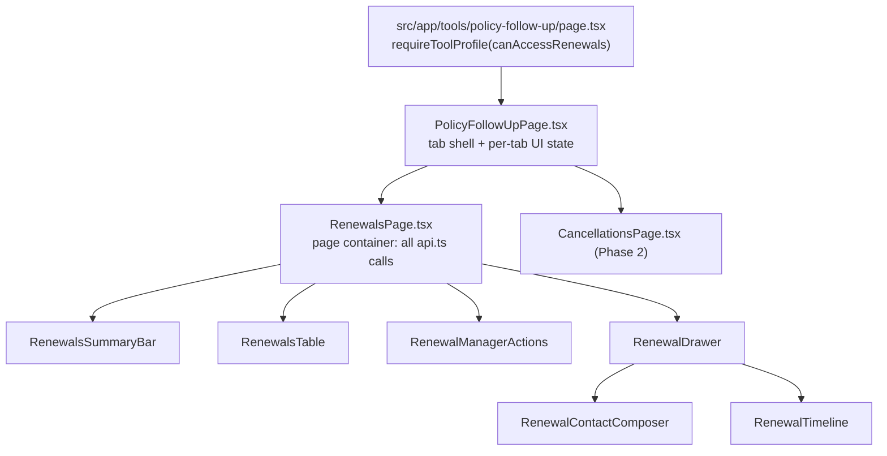
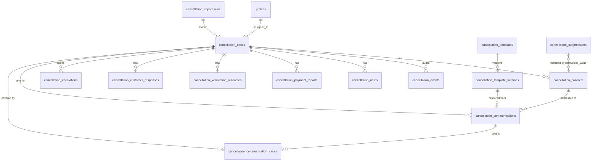

# Design Document

## Overview

One workspace, `Policy Follow-up`, with two tabs. Phase 1 rewrites the Renewals UI into six components plus a page container over the existing `src/features/renewals/api.ts` surface; no RPC, table, column, or bucket changes. Phase 2 adds the Cancellations module: new `cancellation_*` tables, a CSV importer that preserves source rows verbatim, a versioned bilingual template renderer with a prohibited-phrase gate, a scheduler that sends four fixed touchpoints over RingCentral SMS and a new email module, and payment/reinstatement outcome tracking.

Phase 1 ships as commit `feat(renewals): simplify renewal workspace`, Phase 2 as `feat(cancellations): add reminder and tracking workflow`, both on `feature/renewals-cancellations`.

---

## Phase 1 — Renewals UI structure

### Component tree



`src/app/tools/renewals/page.tsx` stays as a thin redirect to the new route so existing links keep working. The workspace registers in `src/platform/module-registry.ts` as `policy-follow-up` with `roles: rolesWhere(canAccessRenewals)`; the existing `renewals` entry is retargeted to the new route rather than removed.

### api.ts consumption per component

Data access stays in `src/features/renewals/api.ts`. Components import functions from that module only — zero `getSupabase()` calls and zero `.rpc(...)` calls inside the six components (Requirement 7.2).

| Component | api.ts functions it consumes |
| --- | --- |
| `RenewalsPage` (container) | `listRenewals`, `listRenewalAssignees`, `listRenewalAssignmentAliases`, `listRenewalImportRuns`, `listRenewalSyncExceptions` |
| `RenewalsSummaryBar` | none — pure props (records + derived counts) |
| `RenewalsTable` | none — pure props (records + derived cells) |
| `RenewalDrawer` | `listContacts`, `listRenewalEvents`, `listSmsLogs`, `updateWorkflow`, `updateRenewalContactInfo`, `sendToRequote`, `sendRenewalSms` |
| `RenewalContactComposer` | `addContact`, `getEvidenceUrl`, `downloadEvidenceFile` |
| `RenewalTimeline` | none — pure props (contacts + events + sms logs, merged by the container/drawer) |
| `RenewalManagerActions` | `importBatch`, `parseCsv`, `guessMapping`, `buildNormalizedRows`, `extractDistinctAssignmentLabels`, `assignRenewal`, `managerUpdateRecord`, `upsertRenewalAssignmentAlias`, `deleteRenewalAssignmentAlias`, `listRenewalAssignees` |

`RenewalManagerActions` absorbs the whole of `PowerBiRenewalImport.tsx` (import wizard, assignment mapping, unmatched review) behind the single collapsed manager control required by Requirement 6.3, rendered only when `role` is `manager` or `super_admin`.

### Derived-value helpers

All derived values are pure functions in a new `src/features/renewals/derive.ts` — no React, no I/O, no Supabase. Components receive results as props. Unit and property tests target this module directly.

| Export | Purpose |
| --- | --- |
| `currentBusinessDate(now, timeZone)` | Agency-local calendar date string used by every date comparison (Req 3.6) |
| `daysRemaining(renewalDate, businessDate)` | Whole-day signed difference; `0` on the business date, negative before it (Req 4.7) |
| `premiumChange(current, renewal)` | `null` when either side is absent; otherwise signed amount rounded to 2 dp plus percentage (Req 4.4, 4.8) |
| `isOpenRenewal(record)` | No outcome of Renewed / Lost / Cancelled recorded (Req 3.5) |
| `matchesSummaryFilter(record, contacts, filterId, businessDate)` | Per-filter counting rule for the ten filters (Req 3.7–3.9) |
| `summaryCounts(records, contactIndex, searchText, businessDate)` | All ten counts computed independently of the active filter (Req 3.3) |
| `matchesSearch(record, searchText)` | Trim, cap at 100 chars, case-insensitive substring over name / policy / carrier / phone / email (Req 4.5) |
| `compareRenewalRows(a, b, businessDate)` | Five-key total order: overdue-first, renewal date asc, no-contact-first, customer name asc, policy number asc (Req 4.2) |
| `recommendedNextAction(record, contacts, requotes)` | Six-rule chain evaluated in fixed order, returns exactly one action (Req 5.2) |

`recommendedNextAction` is a single ordered array of `{ action, when }` predicates returning the first match, so the rule order is the data rather than nested branches.

### State ownership

Page container (`RenewalsPage.tsx`): records array, load/error/retry state, search text, active summary filter (at most one), sort order, selected record id, assignees, aliases, import runs, sync exceptions, manager-menu open state, and the business date computed once per render pass.

Drawer (`RenewalDrawer.tsx`): the selected record's contacts, events, and SMS logs; composer draft state (channel, notes text, pending attachments, upload progress and failures) held in `RenewalContactComposer`; follow-up-date draft; outcome draft (value + note); per-action submitting/error state. On successful write the drawer refreshes its own detail queries and calls a container-supplied `onRecordChanged` so the list row and counters update without closing the drawer (Req 5.5).

Tab shell (`PolicyFollowUpPage.tsx`): per-tab `{ searchText, savedFilter, sortOrder }` retained for the page load, drawer closed on tab leave, Renewals selected on every fresh load (Req 1.2, 1.3).

### Explicitly out of scope for Phase 1

No new or altered RPC, no table or column added, renamed, or removed, no change to any migration file, no change to the `renewal-contact-evidence` bucket, and no change to `canAccessRenewals`. Every write continues through the eight existing renewal functions. Line budget: the six components plus the page container must total no more than 2,740 lines, the pre-revision combined length of `RenewalsPage.tsx` (1,623) and `PowerBiRenewalImport.tsx` (1,117) (Req 7.6).

---

## Phase 2 — Data model

Snake_case, every table prefixed `cancellation_`. All FKs to communications and events use `on delete restrict`; case-owned child rows that carry no audit weight (contacts) cascade.

### `cancellation_cases`

| Column | Type | Notes |
| --- | --- | --- |
| `id` | `uuid pk default gen_random_uuid()` | |
| `policy_number` | `text not null` | as imported |
| `policy_number_normalized` | `text generated always as (upper(regexp_replace(policy_number, '\s', '', 'g'))) stored` | Req 9.1 normalization |
| `cancellation_effective_date` | `date not null` | |
| `customer_name` | `text` | |
| `client_identifier` | `text` | exact decoded characters, leading zeros kept (Req 24.3) |
| `customer_match_key` | `text` | client identifier, else normalized customer name; `null` when zero characters (Req 9.5, 9.9, 9.11) |
| `carrier` | `text` | |
| `cancellation_reason` | `text` | |
| `amount_due` | `numeric(12,2)` | `check (amount_due >= 0 and amount_due <= 999999999.99)` |
| `case_status` | `text not null default 'Imported'` | `check` over the 10 values |
| `communication_status` | `text not null default 'Not Scheduled'` | `check` over the 9 values |
| `next_required_action` | `text` | `check` over the 9 action values, nullable |
| `assigned_to` | `uuid references public.profiles(id)` | |
| `assignment_source` | `text` | `check in ('import','manager')` |
| `producer_label` | `text` | raw import label |
| `follow_up_deadline` | `timestamptz` | |
| `assistance_requested` | `boolean not null default false` | |
| `legacy_send_flag` | `text` | `Enviar` |
| `legacy_state` | `text` | `Estado` |
| `legacy_result` | `text` | `Resultado` |
| `legacy_notices_sent` | `text` | `AvisosEnviados` |
| `legacy_first_notice` | `text` | `PrimerAviso` |
| `legacy_last_notice` | `text` | `UltimoAviso` |
| `legacy_days_remaining` | `text` | `Days remaining` |
| `legacy_notice_label` | `text` | `Aviso` |
| `legacy_subject` | `text` | `Asunto` |
| `legacy_email_body` | `text` | `MensajeEmail` |
| `legacy_sms_body` | `text` | `MensajeSMS` |
| `raw_row` | `jsonb not null` | JSON **array** of decoded field values in source column order |
| `raw_header` | `text[] not null` | source header row, same order and length as `raw_row` |
| `import_run_id` | `uuid references cancellation_import_runs(id)` | |
| `source_row_number` | `integer` | |
| `created_at` / `updated_at` | `timestamptz not null default now()` | |

`unique (policy_number_normalized, cancellation_effective_date)` — the case identity (Req 9.1). `raw_row` is an array, not an object, because JSON object key order is not preserved and Requirement 24.2 requires field order equality.

### `cancellation_contacts`

One row per phone or per email.

| Column | Type | Notes |
| --- | --- | --- |
| `id` | `uuid pk` | |
| `case_id` | `uuid not null references cancellation_cases(id) on delete cascade` | |
| `channel` | `text not null check (channel in ('phone','email'))` | |
| `normalized_value` | `text not null` | E.164 phone or lower-cased email |
| `raw_segment` | `text not null` | segment as it appeared in the cell |
| `validation_status` | `text not null check (validation_status in ('valid','invalid'))` | |
| `authorization_status` | `text not null default 'Unknown' check (authorization_status in ('Authorized','Unknown','Not Authorized'))` | |
| `sms_suppressed` | `boolean not null default false` | |
| `email_suppressed` | `boolean not null default false` | |
| `is_primary` | `boolean not null default false` | first retained row of that channel in cell order |
| `preferred_language` | `text check (preferred_language in ('English','Spanish','Bilingual'))` | nullable |
| `preferred_channel` | `text check (preferred_channel in ('phone','email'))` | nullable |
| `contact_name` | `text` | |
| `contact_role` | `text` | |
| `segment_index` | `integer not null` | cell order, drives primary and dedup-winner selection |
| `created_at` / `updated_at` | `timestamptz not null default now()` | |

`unique (case_id, channel, normalized_value)` — enforces Requirement 10.6 dedup. Cap of 20 rows per case per channel is enforced by the importer, overflow counted in the import run.

### `cancellation_suppressions`

Channel-level, keyed by normalized contact value so it applies across every case that holds that value (Req 21.1–21.4).

`id`, `channel text not null check (channel in ('sms','email'))`, `normalized_value text not null`, `source text not null check (source in ('user-recorded','customer inbound message'))`, `suppressed_at timestamptz not null default now()`, `actor_id uuid references public.profiles(id)` (null for inbound), `reason text`, `cleared_at timestamptz`, `cleared_by uuid references public.profiles(id)`, `clear_reason text`.

`create unique index ... on cancellation_suppressions (channel, normalized_value) where cleared_at is null` — one active suppression per value per channel; cleared rows stay as history.

### `cancellation_templates` / `cancellation_template_versions` / `cancellation_prohibited_phrases`

`cancellation_templates`: `id`, `touchpoint smallint not null check (touchpoint in (15,10,5,1))`, `name text not null`, `created_at`. `unique (touchpoint)`.

`cancellation_template_versions`: `id`, `template_id uuid not null references cancellation_templates(id)`, `version integer not null`, `language text not null check (language in ('English','Spanish'))`, `subject text not null`, `body text not null`, `cancellation_statement text not null`, `contact_request text not null`, `fallback_text jsonb not null default '{}'` (token → fallback string, empty string renders zero characters per Req 14.11), `created_by uuid`, `created_at`. `unique (template_id, version, language)`.

One row per language segment: an English render uses the English row, Spanish the Spanish row, Bilingual both rows of the same version. Versions are immutable — a `before update or delete` trigger raises; saving a template creates `version + 1` rows (Req 14.17).

`cancellation_prohibited_phrases`: `id`, `phrase text not null`, `language text not null check (language in ('English','Spanish'))`, `claim_category text not null check (claim_category in ('reinstatement','payment_guarantees_coverage','payment_card_request','bank_account_request','carrier_legal_notice'))`, `is_active boolean not null default true`. Seeded with at least one English and one Spanish phrase per category (Req 14.7).

### `cancellation_communications` — the Communication_Record

| Column | Type | Notes |
| --- | --- | --- |
| `id` | `uuid pk` | |
| `case_id` | `uuid not null references cancellation_cases(id) on delete restrict` | |
| `contact_id` | `uuid not null references cancellation_contacts(id) on delete restrict` | |
| `touchpoint` | `smallint not null check (touchpoint in (15,10,5,1))` | |
| `channel` | `text not null check (channel in ('sms','email'))` | |
| `template_version_id` | `uuid not null references cancellation_template_versions(id)` | |
| `rendered_subject` | `text not null default ''` | zero characters for SMS (Req 14.15) |
| `rendered_body` | `text not null` | stored character for character as submitted |
| `send_time` | `timestamptz not null default now()` | |
| `provider_message_id` | `text` | |
| `delivery_result` | `text not null check (delivery_result in ('Sent','Delivered','Failed'))` | |
| `failure_reason` | `text` | |
| `attempt_count` | `integer not null default 1` | |
| `combined_group_id` | `uuid` | shared by every row of one combined message |
| `created_at` | `timestamptz not null default now()` | |

`unique (case_id, contact_id, touchpoint, channel)` — the Idempotency_Key (Req 12.6). A `before update` trigger rejects any change to `case_id`, `contact_id`, `touchpoint`, `channel`, `template_version_id`, `rendered_subject`, or `rendered_body`, and rejects all updates unless the session sets the retry marker set only by the `cancellation_retry_communication` security-definer function; `before delete` always raises (Req 14.16, 22.8).

### `cancellation_communication_cases`

Link table so one combined message row set resolves to every included case: `id`, `communication_id uuid not null references cancellation_communications(id) on delete restrict`, `combined_group_id uuid not null`, `case_id uuid not null references cancellation_cases(id) on delete restrict`, `created_at`. `unique (communication_id, case_id)` plus an index on `(combined_group_id)`. Single-case sends write one row; a combined message writes one row per (communication, included case) pair, which is what renders "this notice covers N policies" in the drawer for every case in the group.

### `cancellation_events` — chronological audit timeline

Append-only. `id`, `case_id uuid not null references cancellation_cases(id) on delete restrict`, `actor_id uuid references public.profiles(id)`, `event_type text not null`, `detail jsonb`, `event_time timestamptz not null default now()`, `sequence bigserial not null`. Ordered `event_time desc, sequence desc` so equal timestamps break to latest-recorded-first (Req 17.7). `before update or delete` trigger raises for every role.

### `cancellation_import_runs`

`id`, `file_name text not null`, `column_set text not null check (column_set in ('eficacia','avisos'))`, `imported_by uuid not null references public.profiles(id)`, `confirmed_mapping jsonb not null`, `rows_total integer not null`, `rows_created integer not null`, `rows_updated integer not null`, `rows_rejected integer not null`, `rows_duplicate integer not null`, `rejected_rows jsonb not null default '[]'` (array of `{ row_number, reason }`), `duplicate_rows jsonb not null default '[]'`, `unmatched_producer_labels jsonb not null default '[]'` (array of `{ label, row_number }`), `unmatched_customer_rows jsonb not null default '[]'`, `invalid_contact_count integer not null default 0`, `contact_overflow_count integer not null default 0`, `amount_due_absent_rows jsonb not null default '[]'`, `completed_at timestamptz not null default now()`.

### `cancellation_payment_reports` and verification outcomes

`cancellation_payment_reports`: `id`, `case_id`, `reported_by uuid not null`, `reported_at timestamptz not null default now()`, `reported_amount numeric(12,2) check (reported_amount between 0.01 and 999999999.99)`, `confirmation_reference text check (char_length(confirmation_reference) <= 100)`, `note text not null check (char_length(btrim(note)) between 1 and 2000)`, `evidence jsonb not null default '[]'`.

`cancellation_verification_outcomes`: `id`, `case_id`, `recorded_by uuid not null`, `verified_at timestamptz not null default now()`, `outcome text not null check (outcome in ('Payment verified — reinstatement pending','Policy reinstated','Payment not found','Additional payment required','Policy still scheduled for cancellation','Policy cancelled','Other'))`, `note text`, `next_case_status text`, `next_required_action text`, `evidence jsonb not null default '[]'`.

Supporting tables in the same migration set: `cancellation_notes` (`note text check length 1..4000`, `evidence jsonb`), `cancellation_customer_responses` (`response_type` constrained to the six values, `response_channel`, `response_time`, `note text`), `cancellation_escalations` (`case_id`, `reason` constrained to the seven escalation reasons, `raised_at`, `cleared_at`, `cleared_by`, `notified_at`, with `unique (case_id, reason)` enforcing at most one notification per pair per Req 20.10).

### `cancellation_settings`

Single row, global kill switch and render constants.

`id boolean primary key default true check (id)`, `automatic_sending_enabled boolean not null default true` (Req 26.4), `office_phone text not null`, `agency_name text not null default 'New Hope Insurance Agency'`, `bilingual_separator text not null default E'\n---\n'`, `holidays date[] not null default '{}'`, `updated_by uuid references public.profiles(id)`, `updated_at timestamptz not null default now()`.

### ER diagram



`cancellation_settings` is a standalone single-row table with no foreign keys and is omitted from the diagram.

---

## Cancellation CSV field mapping

Authoritative = drives behavior. Legacy = stored for reference only, excluded from status derivation, touchpoint scheduling, and template selection (Req 8.11, 8.12). Every column also lands verbatim in `raw_row` regardless of its mapping.

### `eficacia` column set

| Source column | Target | Parse / normalize rule | Role |
| --- | --- | --- | --- |
| `Cliente` | `cases.customer_name`; feeds `customer_match_key` fallback | stored as decoded; match key = trim, collapse internal whitespace, strip `.` `,` `"`, upper-case | Authoritative |
| `Poliza` | `cases.policy_number` + generated `policy_number_normalized` | reject row when trimmed value is empty; normalized = remove all whitespace, upper-case, keep leading zeros and hyphens | Authoritative (identity) |
| `Compania` | `cases.carrier` | trim only | Authoritative |
| `FechaCancelacion` | `cases.cancellation_effective_date` | accept `YYYY-MM-DD` or `M/D/YYYY`; anything else or a non-existent calendar date rejects the row | Authoritative (identity) |
| `MontoDebido` | `cases.amount_due` | optional currency symbol, digits with optional comma separators, optional `.` + 1–2 digits; range 0.00–999,999,999.99; empty / whitespace / `nan` / `None` / `null` / `undefined` / `NaN` / unparseable stores absent and is logged in the import run | Authoritative |
| `Enviar` | `cases.legacy_send_flag` | stored verbatim | Legacy |
| `Estado` | `cases.legacy_state` | stored verbatim; never written to `case_status` | Legacy |
| `Resultado` | `cases.legacy_result` | stored verbatim | Legacy |
| `AvisosEnviados` | `cases.legacy_notices_sent` | stored verbatim | Legacy |
| `PrimerAviso` | `cases.legacy_first_notice` | stored verbatim | Legacy |
| `UltimoAviso` | `cases.legacy_last_notice` | stored verbatim | Legacy |
| `Productor` | `cases.producer_label`, resolves `assigned_to` | normalize (trim, collapse whitespace, upper-case) and match the assignment mapping; no match, or a label ending `(Deleted)` case-insensitively, leaves `assigned_to` null and logs the label + row number | Authoritative for the assignment attempt |
| `ClienteID` | `cases.client_identifier`, primary `customer_match_key` | exact decoded characters, trim only; no numeric conversion, no zero-stripping, no zero-padding | Authoritative |

### `avisos` column set

| Source column | Target | Parse / normalize rule | Role |
| --- | --- | --- | --- |
| `Customer` | `cases.customer_name` | same as `Cliente` | Authoritative |
| `Policy number` | `cases.policy_number` + normalized | same as `Poliza` | Authoritative (identity) |
| `Carrier` | `cases.carrier` | trim only | Authoritative |
| `Cancellation date` | `cases.cancellation_effective_date` | same as `FechaCancelacion` | Authoritative (identity) |
| `Days remaining` | `cases.legacy_days_remaining` | stored verbatim; days remaining is always recomputed from the current business date | Legacy |
| `Aviso` | `cases.legacy_notice_label` | stored verbatim; never selects a touchpoint | Legacy |
| `Email` | `cancellation_contacts` rows, `channel='email'` | split on `;`, trim space/tab/CR/LF, lower-case, cap 20 rows, dedup by normalized value keeping the earliest segment, validate per Req 10.7 | Authoritative |
| `Phone` | `cancellation_contacts` rows, `channel='phone'` | split on `;`, trim, reduce to digits plus a leading `+` only from position 1; 10 digits → `+1` + digits, 11 digits starting `1` → `+` + digits, `+` followed by 11–15 digits → unchanged; any other shape stores the trimmed segment and marks `invalid`; cap 20, dedup, primary = first retained | Authoritative |
| `Asunto` | `cases.legacy_subject` | stored verbatim | Legacy |
| `MensajeEmail` | `cases.legacy_email_body` | stored verbatim including embedded line breaks in source form | Legacy |
| `MensajeSMS` | `cases.legacy_sms_body` | stored verbatim | Legacy |

An `avisos` row whose identity matches an existing case updates only import-sourced fields and adds contacts; it never resets `case_status`, `communication_status`, suppression, authorization, preferred language, or any communication or audit row (Req 9.2, 9.8).

---

## Phase 2 — Modules and flow

### `Cancellation_Importer` — `src/features/cancellations/import/`

`parse → classify → map → preview → confirm → load`.

1. **parse** (`csv.ts`): RFC 4180 reader returning `{ header: string[]; rows: string[][]; rowNumbers: number[] }` with quoted fields, doubled quotes collapsed to one, and embedded CR/LF retained in their source form. This is a new reader, not the existing `parseCsv` in `renewals/api.ts`, which trims and drops empty rows and so cannot satisfy Requirement 24.
2. **classify** (`classify.ts`): header contains `Poliza` + `FechaCancelacion` → `eficacia`; contains `Policy number` + `Cancellation date` and no `Poliza` → `avisos`; otherwise reject the whole file. Also rejects > 25 MB, 0 data rows, > 20,000 data rows.
3. **map** (`mapping.ts`): propose header → column by trimmed case-insensitive equality, leave unmatched headers unmapped, allow manager overrides, block confirmation until the policy number and cancellation date columns are mapped.
4. **preview** (`preview.ts`): pure function over parsed rows + confirmed mapping returning the five counts, the rejected list, the duplicate list, and the unmatched producer/customer lists. No writes.
5. **confirm → load**: one call to `cancellation_import_batch(p_file_name, p_column_set, p_mapping jsonb, p_rows jsonb)`, a single security-definer transaction that inserts the import run, upserts cases on the identity constraint, inserts contacts, runs the escalation evaluator, and returns the run row. A rejected row aborts nothing — accepted rows still load (Req 8.9).

**Raw-row preservation (Requirement 24 round trip).** The parser emits, per row, the decoded field values as a `string[]` in source column order with no trimming, case folding, Unicode normalization, numeric or date conversion, and no truncation. That array is stored as `raw_row` (a JSON array, order-preserving) alongside `raw_header`. Re-serialization is `serializeRawRow(values)`: quote a field when it contains `,`, `"`, CR, or LF; double every inner `"`; join with `,`. Round-trip equality is asserted against the acceptable-difference set of Requirement 24.6 (optional quoting of clean fields, empty field as `` vs `""`, `LF` vs `CRLF` record separator, leading BOM). A row that fails a pre-insert `serializeRawRow(parse(row)) ≡ row` self-check is rejected with reason `source row could not be preserved` and no case is created (Req 24.8).

### `Message_Renderer` — `src/features/cancellations/render/`

`renderMessage(input): RenderResult` where `input = { templateVersions, cases, contact, touchpoint, channel, settings, senderName, combined }` and `RenderResult = { ok: true; subject: string; body: string; templateVersionId: string } | { ok: false; blockedBy: 'prohibited_phrase' | 'forbidden_token'; match: string }`. Pure, synchronous, no I/O — templates, cases, and settings are passed in.

- Language resolution: single-case message from the included contacts' `preferred_language`, defaulting to Bilingual when absent, empty, whitespace-only, or unrecognized; a combined message is always Bilingual (Req 11.2, 11.8).
- Segment assembly: English segment first, then exactly one `settings.bilingual_separator`, then the Spanish segment. Each segment carries the cancellation statement, every included cancellation effective date (day, month, four-digit year), and the contact request with the earliest included effective date as the deadline. Agency name and office phone appear in every body; office phone is matched after stripping spaces, hyphens, parentheses, periods, and plus signs.
- Token substitution applies `fallback_text` for absent values and renders zero characters when no fallback is stored.
- Combined email lists every policy number with its effective date ordered by date then policy number plus the count; combined SMS states the count and the earliest date only, at most 640 characters.
- **Gate**: after assembly and before returning `ok: true`, the result is checked against the active prohibited phrases (both texts lower-cased, whitespace runs collapsed to one space) and against the forbidden tokens `nan`, `NaN`, `None`, `null`, `undefined` matched as complete tokens bounded by start/end/whitespace/non-alphanumeric. A match returns `ok: false`. Callers never reach a provider on `ok: false`; they write a `cancellation_events` block entry and set `communication_status = 'Manual Follow-up Required'` for every included case, then continue the run (Req 14.9, 14.10).

The gate lives inside the renderer, so no provider call can bypass it.

### `Notification_Scheduler` — `POST /api/cancellations/scheduler`

Mirrors `POST /api/renewals/sms/scheduler` exactly: `export const runtime = 'nodejs'`, `export const maxDuration = 300`, authorization by `Authorization: Bearer ${CRON_SECRET}` full-string equality, else a session whose profile role is `manager` or `super_admin`, else HTTP 403 with zero sends and zero rows; then a service-role client from `SUPABASE_SECRET_KEY` (falling back to `SUPABASE_SERVICE_ROLE_KEY`) for the batch work.

Run order:

1. Read `cancellation_settings`. If `automatic_sending_enabled` is false, return a summary with every candidate touchpoint counted as skipped and zero rows written (Req 26.5).
2. Compute the business date. Select candidate cases where `case_status in ('Imported','Open')` and `cancellation_effective_date - business_date in (15,10,5,1)`.
3. Resolve eligible contacts per channel: `validation_status = 'valid'`, `authorization_status in ('Authorized','Unknown')`, channel suppression flag not set, and no active row in `cancellation_suppressions` for the normalized value.
4. **Grouping pass**: bucket the remaining `(case, contact_value, channel)` candidates by `(customer_match_key, normalized_value, channel)`; a bucket with more than one case becomes a combined message, chunked at 10 cases per message in ascending effective-date order, rendered from the template version of the lowest days-remaining touchpoint in the chunk. Cases with a null `customer_match_key` never join a bucket.
5. **Reserve then send**, per idempotency key: insert the `cancellation_communications` row first, with `delivery_result = 'Sent'` and `provider_message_id = null`, then call the provider, then update only `provider_message_id`, `delivery_result`, `failure_reason`, `attempt_count`, `send_time` through the retry function. A `23505` unique violation on the reserving insert means another run already owns that key: abandon the send, leave the existing row untouched, count it in `skipped`. Because the constraint is the reservation, two concurrent runs cannot both send — the loser never reaches the provider. The insert precedes the provider call so a crash between the two can at worst leave a reserved row that never sent, which the drawer surfaces as a failed/retryable send rather than as a duplicate message.
6. Run the escalation evaluator for every touched case, recompute `communication_status`, return the run summary: business date, touchpoints evaluated, sent, skipped, failed, and the skipped count per reason (existing record, due date passed, no eligible contact, excluded case status, absent email credentials).

`Send Reminder Now` and `Retry Failed Communication` in the drawer call `POST /api/cancellations/send` with the same reserve-then-send helper, and work while the kill switch is off (Req 26.6).

### Email delivery module — `src/lib/email.ts`

Exactly one send operation, the only place any email provider is called:

```ts
export interface EmailSendResult {
  success: boolean;
  messageId: string | null;
  failureReason: string | null;
  retryable: boolean;
}

export function isEmailConfigured(): boolean;

export async function sendEmail(input: {
  to: string;
  subject: string;
  body: string;
  senderDisplayName: string;
  replyTo: string;
}): Promise<EmailSendResult>;
```

`sendEmail` never throws: every provider error, non-2xx response, and the 30-second timeout is converted to `{ success: false, retryable }`. Retryable covers timeouts, 429, and 5xx; 4xx other than 429 is non-retryable. Retry policy (at most 2 additional attempts, 5–60 s backoff) lives in the calling scheduler helper so a single `cancellation_communications` row carries the final result and `attempt_count`.

**Provider recommendation: Resend.** It is a single HTTPS POST with a bearer key, so it needs no SMTP transport, no extra runtime dependency (plain `fetch` works on the Node runtime), and no additional Vercel integration; domain verification is DNS-only. SendGrid and SES are both viable, and the interface above hides all three — swapping providers changes only the body of `sendEmail` and no `Message_Renderer` output or `cancellation_communications` field (Req 23.1).

New environment variables (server-only, never `NEXT_PUBLIC_`):

| Variable | Purpose |
| --- | --- |
| `RESEND_API_KEY` | Email provider credential |
| `CANCELLATION_EMAIL_FROM` | The single agency from-address |
| `CANCELLATION_EMAIL_REPLY_TO` | Default agency reply-to, overridden per case by the assigned employee's stored email |
| `CRON_SECRET` | Already used by the renewals scheduler; reused here |

When `isEmailConfigured()` is false at the start of a run, the scheduler sends zero emails, continues SMS, writes **zero** communication rows for the skipped email keys so a later run can still send them, and reports the skipped email count (Req 23.3).

SMS keeps using `src/lib/ringcentral-sms.ts` (`isRingCentralConfigured`, `sendSms`). No second SMS provider.

### Escalation evaluator and Communication_Status precedence

`evaluateEscalations(case, contacts, communications, responses, businessDate): EscalationReason[]` is pure and returns any of `No Valid Contact`, `All Channels Failed`, `SMS Suppressed Without Email`, `Customer Assistance Requested`, `No Delivered Contact`, `Payment Reported`, `Authorization Unknown`. Each new reason upserts `cancellation_escalations` on `(case_id, reason)`; the insert path is what creates the notification, so a repeated evaluation notifies once. Notifications go to the assigned employee when present, active, and not deleted, otherwise one row per `manager` / `super_admin` profile, with `notification_type = 'cancellation_follow_up'`. Follow-up deadline is the earlier of escalation time + 24 h and the cancellation effective date. Runs at import completion, on every scheduler run, and after every contact change.

`deriveCommunicationStatus(case, contacts, communications, pendingSends, escalations)` returns the first match in this fixed order:

1. `Manual Follow-up Required` — any uncleared escalation reason
2. `Failed` — at least one record, all `Failed`
3. `Partially Failed` — at least one `Failed` and at least one non-`Failed`
4. `Suppressed` — zero records, at least one contact, every phone contact SMS-suppressed and every email contact email-suppressed
5. `Partially Sent` — at least one record and at least one pending touchpoint-channel send
6. `Delivered` — at least one record, all `Delivered`, zero pending
7. `Sent` — zero pending and every record `Sent` or `Delivered`
8. `Scheduled` — zero records, at least one pending
9. `Not Scheduled` — zero records, zero pending

Case status is never derived from delivery results, and delivery results never change case status (Req 15.3, 15.4).

### Scheduler sequence, including a combined message

```mermaid
sequenceDiagram
  participant Cron as Vercel Cron / Manager
  participant Route as POST /api/cancellations/scheduler
  participant DB as Supabase (service role)
  participant R as Message_Renderer
  participant RC as ringcentral-sms
  participant EM as lib/email

  Cron->>Route: POST + Bearer CRON_SECRET
  Route->>Route: authorize (secret or manager/super_admin) else 403
  Route->>DB: read cancellation_settings
  alt automatic sending disabled
    Route-->>Cron: summary, all candidates skipped
  else enabled
    Route->>DB: select due cases + eligible contacts + active suppressions
    Route->>Route: group by (match key, contact value, channel)
    Note over Route: bucket = 2 cases, same email, same customer -> 1 combined message
    Route->>R: renderMessage(combined, Bilingual, lowest-days template version)
    alt gate blocks
      R-->>Route: ok:false + matched phrase/token
      Route->>DB: insert cancellation_events block rows; set Manual Follow-up Required
    else gate passes
      Route->>DB: insert communications for each idempotency key (reserve)
      alt 23505 unique violation
        DB-->>Route: conflict -> skip, no provider call
      else reserved
        Route->>EM: sendEmail(to, subject, body, senderName, replyTo)
        EM-->>Route: EmailSendResult
        Route->>DB: retry-path update: provider id, delivery result, attempts
        Route->>DB: insert cancellation_communication_cases per included case
      end
    end
    Route->>RC: sendSms for single-case SMS keys
    Route->>DB: escalation evaluation + communication_status recompute
    Route-->>Cron: run summary with per-reason skip counts
  end
```

---

## RLS and permissions

Every table has `enable row level security`. Two helper functions in the first migration, used by every policy:

```sql
create or replace function public.cancellation_is_manager() returns boolean
  language sql stable security definer set search_path = public as $$
  select coalesce((select role in ('manager','super_admin') from public.profiles where id = auth.uid()), false) $$;

create or replace function public.cancellation_can_read_all() returns boolean
  language sql stable security definer set search_path = public as $$
  select coalesce((select role in ('manager','super_admin','customer_service','sales_supervisor')
                   from public.profiles where id = auth.uid()), false) $$;
```

Every manager check accepts `super_admin`.

| Table | `agent` | `customer_service` / `sales_supervisor` | `manager` / `super_admin` |
| --- | --- | --- | --- |
| `cancellation_cases` | select where `assigned_to = auth.uid()` or `assigned_to is null`; update only own rows and only the agent-permitted `case_status` set (`Open`, `Payment Reported`, `Verification Pending`, `Reinstatement Pending`) | select all; update only rows assigned to self, same status set | select all; insert; update any column and any status; no delete |
| `cancellation_contacts` | select + insert + update for cases assigned to self | select all; write only for cases assigned to self | full select/insert/update |
| `cancellation_suppressions` | select all; insert (opt-out recording) | select all; insert | select/insert; update only to set `cleared_at`, `cleared_by`, `clear_reason` |
| `cancellation_communications` | select for readable cases; **insert only** | select all; **insert only** | select all; **insert only**; the single update path is `cancellation_retry_communication` (security definer, manager or service role), touching only `send_time`, `provider_message_id`, `delivery_result`, `failure_reason`, `attempt_count` |
| `cancellation_communication_cases` | select for readable cases; insert | select all; insert | select all; insert |
| `cancellation_events` | select for readable cases; **insert only** | select all; **insert only** | select all; **insert only** |
| `cancellation_notes`, `cancellation_customer_responses` | select for readable cases; insert for own cases | select all; insert for own cases | select all; insert |
| `cancellation_payment_reports` | select for readable cases; insert for own cases | select all; insert for own cases | select all; insert |
| `cancellation_verification_outcomes` | select for readable cases; **no insert** | select all; **no insert** | select all; insert |
| `cancellation_escalations` | select for readable cases; update only `cleared_at` / `cleared_by` on own cases | select all; same clear-only update | select all; insert/update |
| `cancellation_templates`, `cancellation_template_versions`, `cancellation_prohibited_phrases` | select | select | select; insert (new version); no update, no delete |
| `cancellation_import_runs` | no select | select | select; insert |
| `cancellation_settings` | select `automatic_sending_enabled` only via the read policy | select | select; update |

No table grants `delete` to any role. `cancellation_communications` and `cancellation_events` carry `before update or delete` triggers that raise, so insert-only holds even for the service role, with the one documented exception of the retry function which sets a transaction-local marker the trigger recognizes. Provider credentials are read only inside route handlers and `src/lib/*`, never returned in a response body.

---

## Migrations

Forward-only, v1.10.x only. No file at v1.9.7 or earlier is modified, byte for byte, and no statement drops or truncates anything created at v1.9.7 or earlier.

| File | Purpose |
| --- | --- |
| `v1.10.0-cancellation-core-tables.sql` | `cancellation_import_runs`, `cancellation_cases`, `cancellation_contacts`, `cancellation_suppressions`, `cancellation_events`, identity and dedup constraints, role helper functions |
| `v1.10.1-cancellation-templates.sql` | `cancellation_templates`, `cancellation_template_versions`, `cancellation_prohibited_phrases`, immutability triggers |
| `v1.10.2-cancellation-communications.sql` | `cancellation_communications` with the idempotency unique constraint, `cancellation_communication_cases`, immutability triggers, `cancellation_retry_communication` |
| `v1.10.3-cancellation-case-activity.sql` | `cancellation_notes`, `cancellation_customer_responses`, `cancellation_payment_reports`, `cancellation_verification_outcomes`, `cancellation_escalations` |
| `v1.10.4-cancellation-settings.sql` | `cancellation_settings` single row seeded with automatic sending enabled, office phone, agency name, separator |
| `v1.10.5-cancellation-import-batch.sql` | `cancellation_import_batch` security-definer loader plus `cancellation_recompute_communication_status` |
| `v1.10.6-cancellation-rls.sql` | Every policy in the table above |
| `v1.10.7-extend-user-notifications-type.sql` | Drops and re-adds the `public.user_notifications` `notification_type` check to allow `'turn'`, `'assignment'`, `'cancellation_follow_up'`; constraint-only, no row or column change |
| `v1.10.8-cancellation-evidence-bucket.sql` | Creates the `cancellation-evidence` storage bucket and its policies, parallel to `renewal-contact-evidence`, signed-URL download only |
| `v1.10.9-cancellation-seed-templates.sql` | Seeds version 1 English and Spanish rows for the 15/10/5/1-day templates and the prohibited phrase list |

Applied with `node --env-file=.env.local scripts/run-sql.mjs <file>` in the order above.

---

## Correctness Properties

A property is a characteristic or behavior that should hold true across all valid executions of a system — essentially, a formal statement about what the system should do. Properties serve as the bridge between human-readable specifications and machine-verifiable correctness guarantees.

Three properties, each implemented as exactly one `fast-check` property test at 100+ runs. Every other testable criterion is covered by example, boundary, or integration tests (see Testing strategy).

### Property 1: CSV raw-row round trip

*For any* CSV data row of 1 to 30 fields whose field values are arbitrary strings of 0 to 10,000 characters, storing that row as a raw row and re-serializing it produces a CSV row whose field count, field order, and decoded field values are equal character for character to the source row, where the only permitted differences are those enumerated in Requirement 24 criterion 6.

**Generator strategy.** `fc.array(fieldArb, { minLength: 1, maxLength: 30 })` where `fieldArb` is a weighted one-of over: the empty string; plain ASCII; strings containing `,`; strings containing `"` and `""`; strings containing `\n` and `\r\n`; leading-zero digit strings such as `007`; accented and non-Latin characters; and a long string near 10,000 characters. Rows are assembled into a file with a header of matching arity, parsed by the importer's reader, stored, and re-serialized.

**Invariant.** `normalizeAcceptable(serializeRawRow(parseRow(source))) === normalizeAcceptable(source)`, where `normalizeAcceptable` strips a leading BOM, treats `LF` and `CRLF` as the same record separator, and treats `""` and the empty string as the same empty field — and nothing else. Field count and field order are asserted separately so a difference there can never be masked by normalization.

**Validates: Requirements 24.1, 24.2, 24.3, 24.4, 24.7, 25.4**

### Property 2: Scheduler idempotency across repeated runs

*For any* set of cancellation cases with contacts, and *for any* run count from 2 to 5, executing the Notification_Scheduler that many times over an unchanged input produces the same set of Communication_Record rows, compared by Idempotency_Key, as the first run alone produces, and issues exactly one provider call per key in that set.

**Generator strategy.** A world of 1 to 12 cases: each case gets a cancellation effective date placed so its 15/10/5/1-day touchpoint may or may not land on the fixed business date, a case status drawn from all ten values, a customer match key drawn from a small pool so multi-policy grouping is exercised, and 0 to 4 contacts per channel with independently generated validation status, authorization status, and suppression flags. Run count from `fc.integer({ min: 2, max: 5 })`. The store is an in-memory double that enforces `unique (case_id, contact_id, touchpoint, channel)` by raising `23505`; the SMS and email providers are mocks that count calls.

**Invariant.** `keysAfter(n) === keysAfter(1)` as sets for every `n` in 2..5, `providerCallCount === keysAfter(1).size`, and every skipped key appears in the run summary's skipped total. The property also holds when runs are interleaved rather than sequential, which is asserted by a second pass that drives two scheduler instances alternately against the same store.

**Validates: Requirements 12.3, 12.4, 12.5, 12.6, 12.7, 25.5**

### Property 3: No forbidden token in any rendered output

*For any* cancellation case, contact, touchpoint, channel, and render language — including cases where the producer name, amount due, assigned employee, contact name, carrier, or cancellation reason is absent — the rendered subject and the rendered body contain none of the tokens `nan`, `NaN`, `None`, `null`, `undefined` as a complete token bounded by the start of the text, the end of the text, a whitespace character, or a character that is neither a letter nor a digit.

**Generator strategy.** Each optional field independently `fc.option(...)` so all absence combinations are reachable; language over `English | Spanish | Bilingual | undefined | '' | '  ' | 'Klingon'` to exercise the Bilingual fallback; touchpoint over `15 | 10 | 5 | 1`; channel over `sms | email`; combined-message flag boolean with 1 to 10 included cases. Customer names include values that legitimately contain the sequences inside longer words (`Nanette Nunez`, `Nullson`, `Undefined Holdings LLC`) so the token-boundary rule is checked in both directions.

**Invariant.** For every `ok: true` render result, `forbiddenTokenMatch(subject) === null && forbiddenTokenMatch(body) === null`; and for every generated case whose customer name embeds a forbidden sequence inside a longer word, the render is not blocked. This is the direct guard on the observed source defect where 15 `avisos` rows carried a literal `nan` in the signature block.

**Validates: Requirements 14.11, 14.12, 25.6**

---

## Error handling

| Failure mode | Behavior | User-visible result |
| --- | --- | --- |
| SMS or email provider returns a failure | Store the reserved Communication_Record with `delivery_result = 'Failed'` and the provider failure reason; rendered subject and body unchanged; continue the remaining recipients in the run; recompute `communication_status` to `Failed` or `Partially Failed` | Drawer delivery history shows the failed attempt with its reason; row SMS/email status cell reads Failed; `Retry Failed Communication` becomes the primary action for managers |
| Email credentials or from-address absent at run start | Zero email sends, zero Communication_Record rows for the skipped email keys (so a later run can still send them), SMS continues for every due touchpoint; affected cases become `Partially Sent` with at least one SMS success, `Failed` with none | Run summary reports the skipped email count with reason `absent email service credentials`; no case shows a phantom email attempt |
| Email attempt times out at 30 s or returns a retryable failure | At most 2 additional attempts with 5–60 s backoff; a non-retryable result stops immediately; exactly one row stored carrying the final result, final failure reason, and `attempt_count` | Delivery history shows one entry with the attempt count, not three duplicates |
| RLS or role check denies the operation | Route returns HTTP 403 with a role message; zero rows written; no partial state | Inline error naming the required role; the form keeps the entered values |
| Import validation failure (row level) | Accepted rows load, rejected rows create nothing, each rejection recorded with its data row number and reason in the import run | Preview and completion summary list every rejected row number with its reason; the five counts are always shown |
| Import validation failure (file level: unrecognized headers, > 25 MB, 0 rows, > 20,000 rows) | Whole file rejected before any write; every stored case and contact unchanged | Error naming the unmet condition and the required column names |
| Raw row cannot be preserved (self-check fails) | Row rejected, no raw row and no case created, remaining rows continue | Rejection reason `source row could not be preserved` against that row number |
| Evidence upload fails or exceeds 100 MB / 10 files | Note or contact entry left unsaved, no storage object retained, previously accepted attachments kept | Upload failure reason or the exceeded limit, with a retry control; timeline unchanged |
| Idempotency-key conflict (`23505`) on reservation | Send abandoned, existing row untouched, key counted in `skipped` | Run summary skip reason `existing Communication_Record`; drawer reports "already sent for this touchpoint" |
| Prohibited phrase or forbidden token in rendered output | Blocked before any provider request, no Communication_Record, block recorded in the audit timeline with the matched text, `communication_status` set to `Manual Follow-up Required`, run continues | Case appears under `Needs Action` with `Call Customer` as the primary action; timeline names what was matched |

---

## Testing strategy

`npm test` runs `vitest --run`. Type check is `npx tsc --noEmit` (there is no `typecheck` script). Build is `npm run build`. `fast-check` is already installed. Tests follow the existing `__tests__` convention next to the code under test.

| Requirement 25 item | Location |
| --- | --- |
| 25.1 Renewals: import, assignment mapping, assignment, contact logging, required-notes rejection, evidence, 100 MB rejection, follow-up date, requote, each outcome | `src/features/renewals/__tests__/derive.test.ts`, `renewal-actions.test.ts`, `renewal-evidence.test.ts` |
| 25.1 `canAccessRenewals` rule, manager menu hidden for Agent_Role | `src/features/renewals/__tests__/renewal-permissions.test.ts` |
| 25.2 `eficacia` / `avisos` formats, multi-contact cells, invalid contacts, duplicate rows, multi-policy customers | `src/features/cancellations/import/__tests__/import-classify.test.ts`, `import-preview.test.ts`, `contact-normalization.test.ts` |
| 25.2 four touchpoints, bilingual fallback, duplicate scheduler execution, SMS/email success and failure, missing contact info | `src/features/cancellations/scheduler/__tests__/scheduler.test.ts`, `src/features/cancellations/render/__tests__/render.test.ts` |
| 25.2 opt-out, customer response, payment reported, reinstatement, cancelled outcome, manual follow-up | `src/features/cancellations/domain/__tests__/case-lifecycle.test.ts`, `escalation.test.ts`, `suppression.test.ts` |
| 25.2 permissions, audit history | `src/features/cancellations/__tests__/rls-role-enforcement.test.ts`, `audit-immutability.integration.test.ts` |
| 25.3 mocked providers, zero live calls | `src/features/cancellations/__tests__/provider-isolation.test.ts` — asserts `sendSms` and `sendEmail` are mocked and the real modules record zero calls |
| 25.4 Property 1 | `src/features/cancellations/import/__tests__/csv-round-trip.property.test.ts` |
| 25.5 Property 2 | `src/features/cancellations/scheduler/__tests__/scheduler-idempotency.property.test.ts` |
| 25.6 Property 3 | `src/features/cancellations/render/__tests__/forbidden-token.property.test.ts` |
| 25.7 403 for missing cron secret and for non-manager manager-only operations | `src/features/cancellations/__tests__/scheduler-auth.test.ts` |

Each property test runs at `numRuns: 100` minimum and carries a header comment in the form `// Feature: policy-follow-up-renewals-cancellations, Property {n}: {property text}`. Every property is implemented by a single property-based test. Unit tests stay focused on the enumerated boundaries and the decision tables (communication status precedence, next-required-action selection, phone and email validation) rather than duplicating the generated coverage.

---

## Deployment and rollback

Vercel-hosted. The repository has no `vercel.json`; `.env.example` documents Vercel server environment variables. Deployment is initiated manually by a manager from the Vercel dashboard or `vercel deploy --prod`; it is never triggered by a commit, push, or merge. Confirm the project's Git auto-deploy is off for `feature/renewals-cancellations` before pushing the branch.

### Deploy

1. Verify locally on the branch: `npx tsc --noEmit`, `npm test`, `npm run build`. All three must report zero errors and zero failing tests in one pass before continuing.
2. Apply the migrations in order against the target Supabase project: `node --env-file=.env.local scripts/run-sql.mjs supabase/migrations/v1.10.0-cancellation-core-tables.sql`, then `v1.10.1` through `v1.10.9`.
3. Confirm the schema: the `cancellation_*` tables exist, `cancellation_communications` carries the unique index on `(case_id, contact_id, touchpoint, channel)`, `cancellation_cases` carries the unique index on `(policy_number_normalized, cancellation_effective_date)`, the `public.user_notifications` `notification_type` check lists `cancellation_follow_up`, and the `cancellation-evidence` bucket exists.
4. Set the new server environment variables in Vercel (Production and Preview, all marked sensitive, none prefixed `NEXT_PUBLIC_`): `RESEND_API_KEY`, `CANCELLATION_EMAIL_FROM`, `CANCELLATION_EMAIL_REPLY_TO`. Confirm `CRON_SECRET`, `SUPABASE_SECRET_KEY`, and the `RC_*` variables are already present.
5. Seed `cancellation_settings`: office phone and agency name set, `automatic_sending_enabled` seeded `true` per Requirement 26.4. For a supervised first run, a manager may set it to disabled from the UI immediately after step 6 and re-enable after the dry run.
6. Manually initiate the deployment. Do not push-to-deploy.
7. Post-deploy verification: open Policy Follow-up as a manager and confirm both tabs load; import one small cancellation file and confirm the five preview counts and the import run row; trigger the scheduler manually (`POST /api/cancellations/scheduler` with the manager session) and confirm the run summary; call it a second time and confirm every key comes back as skipped and zero new messages are sent.
8. Register the schedule: add a `vercel.json` cron entry for `/api/cancellations/scheduler` once per day in the agency morning, or point an external scheduler at the route with `Authorization: Bearer ${CRON_SECRET}`. Cron invocation is not a deployment trigger, so this does not conflict with the manual-deploy rule.

### Rollback

1. Set `automatic_sending_enabled` to false first. This stops all outbound sending immediately without a deploy and is the fastest mitigation for a messaging problem.
2. If the code is at fault, promote the previous Vercel production deployment (instant rollback). Leave every applied v1.10.x migration in place.
3. Do not revert migrations. The v1.10.x set is additive and forward-only, so the previous application code runs unchanged against it. Every `cancellation_cases`, `cancellation_contacts`, `cancellation_communications`, and `cancellation_events` row survives the rollback with identical counts and field values (Requirement 26.3).
4. If a Phase 2 defect must be removed from the branch, revert the `feat(cancellations): add reminder and tracking workflow` commit only; the Phase 1 commit stands alone and touches no schema.
5. Leave the new environment variables set. They are inert while `automatic_sending_enabled` is false and while no Phase 2 code is deployed.
6. Record the rollback and the reason in the spec task list, including the row counts observed immediately before and after, which is the evidence Requirement 26.3 asks for.
