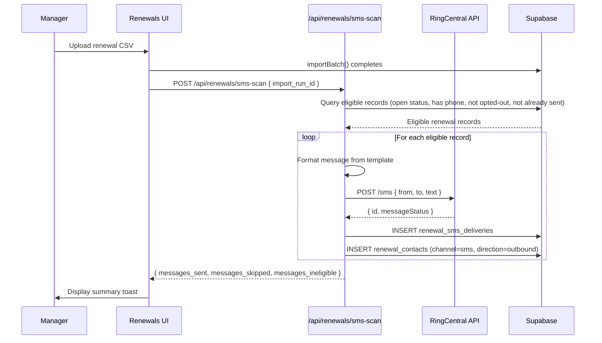
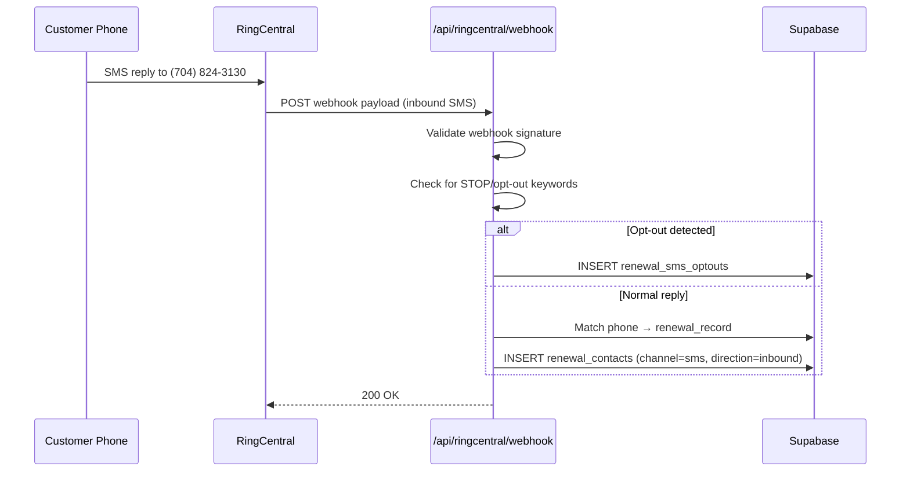

# Design Document: Renewal SMS via RingCentral

## Overview

This design defines the architecture for automated renewal SMS notifications using RingCentral's REST API. The system hooks into the existing renewal import flow, scans for eligible records at the 30-day and 25-day marks, sends professional SMS messages, tracks delivery, handles inbound replies, and manages TCPA opt-out compliance.

### Key Design Decisions

1. **Post-import trigger** — SMS scanning is invoked as the final step of `importBatch()` in the renewals API, ensuring messages are sent immediately after data is fresh.
2. **Server-side only** — All RingCentral API calls happen in Next.js API routes, never from the client. JWT auth tokens are stored as server-only env vars.
3. **Idempotent delivery** — The `renewal_sms_deliveries` table uses a unique constraint on `(record_id, touchpoint)` preventing duplicate sends.
4. **E.164 normalization** — All phone numbers are normalized to +1XXXXXXXXXX before any RC API call.
5. **Two-number strategy** — SMS sent FROM (704) 879-3673 (dedicated texting line) to protect the main office number (704) 824-3130 from carrier spam flagging. The message body directs customers to call the main office.
6. **Webhook for inbound** — A registered RingCentral webhook pushes inbound SMS to `/api/ringcentral/webhook` where replies are parsed for opt-out keywords and logged to renewal contacts.
6. **Template-driven messages** — Message templates live in a `renewal_sms_templates` table, editable by managers, so copy changes don't require code deploys.

## Architecture

### System Context

```
┌─────────────────────────────────────────────────────────┐
│ Next.js App (Vercel)                                     │
│                                                          │
│  ┌──────────────┐    ┌───────────────────┐              │
│  │ Renewals UI  │───▶│ /api/renewals/    │              │
│  │ (client)     │    │ import-sms-scan   │              │
│  └──────────────┘    └────────┬──────────┘              │
│                               │                          │
│                    ┌──────────▼──────────┐               │
│                    │ /api/ringcentral/   │               │
│                    │ send-sms            │               │
│                    │ webhook             │               │
│                    │ health              │               │
│                    └──────────┬──────────┘               │
└───────────────────────────────┼──────────────────────────┘
                                │
                    ┌───────────▼───────────┐
                    │   RingCentral API     │
                    │  • Send SMS           │
                    │  • Webhook callbacks  │
                    │  • Delivery receipts  │
                    └───────────────────────┘
                                │
                    ┌───────────▼───────────┐
                    │   Supabase (PG)       │
                    │  • renewal_records    │
                    │  • renewal_sms_*      │
                    │  • renewal_contacts   │
                    └───────────────────────┘
```

### Data Flow: Import → SMS Send



### Data Flow: Inbound Reply



## Database Schema Additions

### Table: `renewal_sms_templates`

| Column | Type | Notes |
|--------|------|-------|
| id | uuid PK | |
| touchpoint | text NOT NULL | '30' or '25' |
| template_body | text NOT NULL | Message with {placeholders} |
| is_active | boolean | Only one active per touchpoint |
| created_by | uuid FK → profiles | |
| created_at | timestamptz | |
| updated_at | timestamptz | |

**Unique constraint:** `(touchpoint) WHERE is_active = true` (only one active template per touchpoint)

### Table: `renewal_sms_deliveries`

| Column | Type | Notes |
|--------|------|-------|
| id | uuid PK | |
| record_id | uuid FK → renewal_records | |
| touchpoint | text NOT NULL | '30' or '25' |
| rc_message_id | text | RingCentral message ID |
| recipient_phone | text NOT NULL | E.164 format |
| message_body | text NOT NULL | Rendered message |
| delivery_status | text NOT NULL | queued / sent / delivered / failed |
| error_detail | text | Null unless failed |
| sent_at | timestamptz | |
| status_updated_at | timestamptz | |

**Unique constraint:** `(record_id, touchpoint)` — prevents duplicate sends

### Table: `renewal_sms_optouts`

| Column | Type | Notes |
|--------|------|-------|
| id | uuid PK | |
| phone_number | text NOT NULL UNIQUE | E.164 normalized |
| opted_out_at | timestamptz | |
| opted_in_at | timestamptz | NULL until re-opted |
| is_opted_out | boolean DEFAULT true | |

### Table: `renewal_sms_unmatched`

| Column | Type | Notes |
|--------|------|-------|
| id | uuid PK | |
| from_number | text NOT NULL | |
| message_body | text | |
| received_at | timestamptz | |
| rc_message_id | text | |

### Column additions to `renewal_records`

| Column | Type | Notes |
|--------|------|-------|
| sms_skip | boolean DEFAULT false | Manager override to suppress SMS |
| sms_first_contact_sent | boolean DEFAULT false | Tracks if STOP footer was included |

## API Routes

### `POST /api/renewals/sms-scan`

**Auth:** Manager only (checks `nhwd_role() = 'manager'`)
**Body:** `{ import_run_id?: string }`
**Logic:**
1. Query eligible renewal records:
   - status IN ('imported', 'assigned', 'in_progress', 'monitoring', 'requote_sent')
   - customer_phone IS NOT NULL
   - sms_skip = false
   - phone NOT IN renewal_sms_optouts
   - No existing delivery for the applicable touchpoint
   - Days until renewal = 29–31 (touchpoint_30) OR 24–26 (touchpoint_25)
2. For each eligible record, render template and call RingCentral send
3. Return summary

### `POST /api/ringcentral/send-sms`

**Auth:** Internal only (called by sms-scan, not exposed to client)
**Body:** `{ to: string, text: string, renewal_record_id: string, touchpoint: string }`
**Logic:**
1. Authenticate with RC via JWT
2. POST to RC SMS endpoint
3. Insert delivery record
4. Insert renewal_contact

### `POST /api/ringcentral/webhook`

**Auth:** RingCentral webhook validation (verification token on subscription setup, signature validation on events)
**Logic:**
1. Handle subscription validation (return `validationToken` header)
2. Parse inbound SMS event
3. Check for opt-out keywords → insert/update optouts table
4. Match phone to renewal record → insert renewal_contact
5. If unmatched → insert to unmatched table

### `GET /api/ringcentral/health`

**Auth:** Manager only
**Logic:** Attempt token refresh, return { status: 'ok', authenticated: true } or error

## RingCentral SDK Integration

```typescript
// src/lib/ringcentral.ts (server-only module)

interface RcSmsPayload {
  from: { phoneNumber: string };
  to: Array<{ phoneNumber: string }>;
  text: string;
}

interface RcSmsResponse {
  id: string;
  messageStatus: 'Queued' | 'Sent' | 'Delivered' | 'DeliveryFailed';
}
```

**Auth flow:** JWT grant → access_token (cached, auto-refreshed on 401)

**No SDK dependency** — use native `fetch()` with the RC REST API directly to avoid adding a heavy SDK package. The integration surface is small (send SMS + receive webhooks).

## Phone Number Normalization

```typescript
function toE164(phone: string): string | null {
  const digits = phone.replace(/\D/g, '');
  if (digits.length === 10) return `+1${digits}`;
  if (digits.length === 11 && digits.startsWith('1')) return `+${digits}`;
  return null; // Invalid — skip this record
}
```

## Message Template Rendering

```typescript
function renderTemplate(template: string, record: RenewalRecord): string {
  const firstName = record.customer_name.split(' ')[0];
  const date = new Date(record.renewal_date + 'T00:00:00');
  const formatted = date.toLocaleDateString('en-US', { month: 'long', day: 'numeric' });
  const carrier = record.carrier || 'auto';

  return template
    .replace('{customer_first_name}', firstName)
    .replace('{renewal_date_formatted}', formatted)
    .replace('{carrier}', carrier);
}
```

## Security Considerations

1. All RC credentials stored as server-only env vars (no NEXT_PUBLIC prefix)
2. Webhook endpoint validates RingCentral's verification token on subscription and checks request signatures
3. API routes check `nhwd_role()` before accepting management actions
4. Phone numbers are never exposed to the client in bulk — only within individual renewal record views
5. Rate limiting: max 50 SMS per scan invocation to stay within RC burst limits; if more eligible, queue remainder for next scan

## Error Handling

| Scenario | Behavior |
|----------|----------|
| RC 429 (rate limit) | Retry 3× with exponential backoff |
| RC 5xx | Retry 3× with exponential backoff |
| RC 4xx (perm fail) | Log to delivery record as `failed`, skip |
| Invalid phone number | Skip, log as ineligible |
| Webhook signature invalid | Return 401, do not process |
| Template missing placeholder | Use fallback (omit that variable) |

## UI Changes

1. **Renewal Drawer** — Add "SMS History" section showing delivery records (date, status badge, message preview)
2. **Renewal List** — Add SMS status indicator icon per row (✉️ sent / ⏳ pending / ⛔ skipped / 🚫 opted-out)
3. **Manager SMS Tab** — Dashboard showing today's sends, success rate, opt-out count, failures, with manual send/skip controls
4. **Template Editor** — Simple modal for managers to view/edit active message templates per touchpoint
