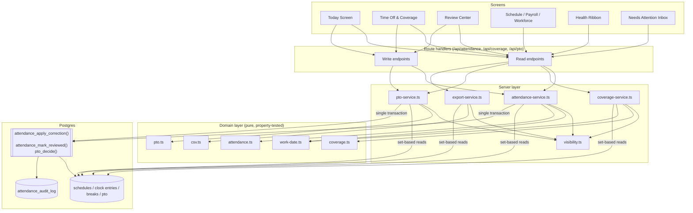
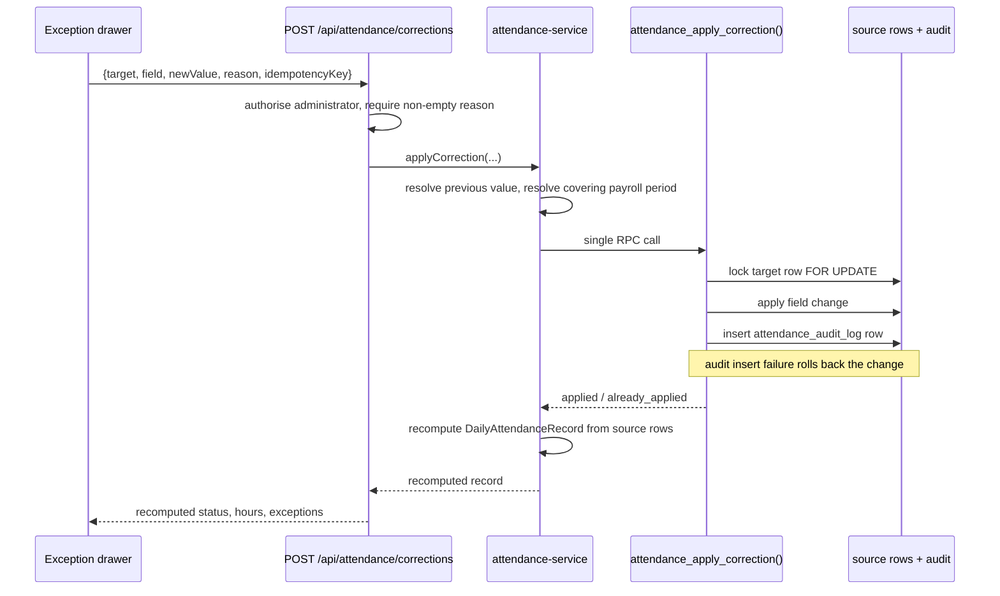
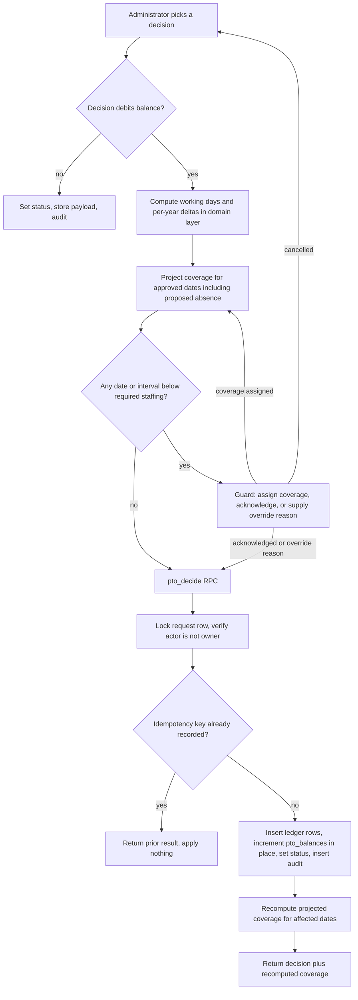
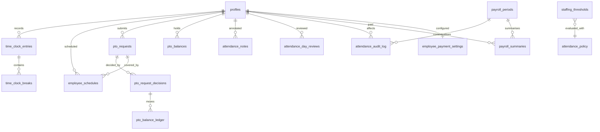

# Design Document

## Overview

This design delivers the Time & Attendance redesign in three layers:

1. **A pure domain layer** (`src/features/time-attendance/domain/`) that owns every attendance, coverage, time-off, and export rule as deterministic functions with no I/O. This is the single implementation demanded by Requirement 19, and it is the layer the property-based tests exercise.
2. **A server layer** (`src/features/time-attendance/server/` plus Next.js route handlers) that fetches source rows in set-based queries, feeds them to the domain layer, and performs mutations through Postgres functions that are atomic, idempotent, and audited.
3. **A presentation layer** (four screens, two cross-cutting controls, three preserved screens) that renders what the server returns and derives nothing.

The redesign is subtractive where it can be. Four components are removed (`TimeClock`, `PTORequests`, `StaffingCoverage`, `AttendanceReports`) and replaced by four screens. Three components are untouched in behaviour (`ScheduleManager`, `PayrollDashboard` + `PayrollProcessor`, `WorkforceAdmin`) and gain only navigation placement, filters, status vocabulary, styling, and reads from the Attendance_Service, which is the boundary Requirement 2, criterion 5 sets.

### Three decisions that shape everything else

**Daily_Attendance_Record is computed on read, not stored.** There is no materialised attendance table and no cache. Every read recomputes from `employee_schedules`, `time_clock_entries`, `time_clock_breaks`, `pto_requests`, and the correction columns already on those rows. This makes Requirement 3, criterion 16 (recompute before the next read returns) and Correctness Property 35 structurally true rather than something a cache-invalidation path has to remember. The cost is bounded: the roster is a single agency of tens of employees, so a 90-day window is a few thousand rows, retrieved by two indexed range queries. A materialised table was considered and rejected because it would introduce exactly the class of drift that Appendix A documents — several stores of the same number disagreeing.

**Arithmetic lives in TypeScript; atomicity lives in Postgres.** The status matrix, hours arithmetic, coverage projection, working-day count, balance deltas, and CSV formatting are pure TypeScript so that `fast-check` can drive them across thousands of generated inputs. Mutations that must not half-apply — a leave decision with its balance change and audit row, a punch correction with its audit row, a review stamp — run inside `security definer` Postgres functions that lock the target row, apply the change, write the audit entry, and return. The functions never compute a rule; they receive already-computed values from the server layer and enforce transactional integrity. This split is what lets Correctness Properties 22 through 29 be tested as arithmetic and Properties 28 through 31 be guaranteed by the database.

**Payroll parity is a mode, not a hope.** Requirement 19, criterion 6 asks Payroll to consume the Attendance_Service; Requirement 2, criterion 4 forbids any change to Payroll outputs. Those meet only if the service can reproduce the pre-redesign figures exactly. The Attendance_Service therefore exposes payroll inputs in two modes: `legacy_parity`, which reproduces the current arithmetic (sum of stored `total_hours` for closed entries, `break_minutes` as break hours, whole `total_days` for every overlapping approved request), and `recomputed`, which uses the unified rules. `legacy_parity` is the default and the only mode wired to `/api/payroll/calculate` in this redesign. A parity harness asserts `legacy_parity` output equals every stored `payroll_summaries` row. Switching the default to `recomputed` is the separately approved payroll rule change that Requirement 2, criterion 6 describes, and it is out of scope here.

### Research findings that informed the design

- **The business timezone already has a precedent.** `public.current_business_date()` in `supabase/schema.sql` is defined as `(now() at time zone 'America/New_York')::date`. The rotation subsystem has treated Eastern as the business calendar since v0.6.0. The Attendance_Service adopts the same anchor for schedule interpretation (Requirement 3, criterion 7) rather than inventing a second convention.
- **No date library is needed or wanted.** `package.json` carries no date dependency. Zoned conversion is implemented with `Intl.DateTimeFormat`, which is available in the Node runtime these routes already declare (`export const runtime = "nodejs"`). Adding `luxon` or `date-fns-tz` would grow the bundle for two functions. The offset-probe algorithm below handles daylight-saving transitions, including the spring-forward gap, deterministically.
- **`fast-check` 4.9.0 and `vitest` 4.1.10 are installed and already used with the required tag convention.** `src/features/cs-intake/__tests__/validation.test.ts` opens with `// Feature: customer-intake-claim-duplicate-quote, Property 1: ...` followed by `**Validates: Requirements 1.2, 1.5, 1.6**`. This design reuses that convention exactly. `package.json` declares no `test` script, so a `"test": "vitest --run"` script is added.
- **Double-submission can be closed at the schema level.** The current `/api/time-clock` guards clock-in with a `select` then an `insert`, which two concurrent requests can both pass. A partial unique index on `time_clock_entries(profile_id) where clock_out is null` makes a second open entry impossible, and the same shape on `time_clock_breaks(clock_entry_id) where break_end is null` closes double breaks. That is a stronger and simpler answer to Requirement 4, criterion 21 than a client-side in-flight flag.
- **Template application is currently N requests.** `/api/schedules` POST accepts one row, so `ScheduleManager` loops. Requirement 20, criterion 7 needs a batch body. This is the one change the preserved Schedule screen requires, and it is behaviour-preserving.
- **The audit surface is effectively absent.** Within Time & Attendance, `public.audit_log` is written by exactly one path, `/api/payroll/process`. It also lacks the employee, work date, and payroll period columns that Requirement 16, criteria 2 and 4 need as filterable fields. A dedicated `attendance_audit_log` table is added rather than overloading `audit_log` with attendance-shaped JSON.

### Architecture at a glance



The one-way arrow from screens into routes is the whole point of Requirement 3, criteria 14 and 15: no screen calls the domain layer, and no screen recreates a rule.

---

## Architecture

### Directory layout

```
src/features/time-attendance/
  domain/                        pure, no I/O, no Date.now()
    types.ts                     DerivedStatus, exception codes, policy, record shapes
    work-date.ts                 instant <-> work date, zoned wall clock <-> instant
    attendance.ts                status matrix, exception rules, hours arithmetic
    coverage.ts                  intervals, live and projected coverage, status thresholds
    pto.ts                       working-day count, balance deltas, year attribution
    inbox.ts                     needs-attention aggregation and dedup
    presentation.ts              primary-action selection, alert derivation, status tokens
    csv.ts                       CSV quoting, header, file naming
    __tests__/                   vitest + fast-check property tests
  server/                        I/O and composition
    visibility.ts                visibleProfileIds(actor) — the only scoping seam
    policy.ts                    loads attendance_policy and staffing_thresholds
    attendance-service.ts        day reads, range reads, metrics, corrections, payroll inputs
    coverage-service.ts          live, projected, intervals, impact preview
    pto-service.ts               inbox, submission, decisions
    export-service.ts            CSV assembly from the four view shapes
  today/
    TodayScreen.tsx              routes to My Day or Team Today
    MyDayPanel.tsx               employee shift card, single primary action, alerts
    MyDayHistory.tsx             14-day history list
    TeamTodayHeader.tsx          administrator's own compact clock control
    TeamTodaySummary.tsx         selectable counters
    TeamTodayTable.tsx           one row per employee
    LiveCoveragePanel.tsx        one row per department
    EmployeeDayDrawer.tsx        timeline, raw events, corrections, notes, audit
  timeoff/
    TimeOffCoverageScreen.tsx    three-pane / stacked layout
    RequestInbox.tsx             paged request list with filters
    CoverageCalendar.tsx         month and two-week projected coverage grid
    CoverageDateDrawer.tsx       per-date scheduled / absent / pending / intervals
    RequestDecisionDrawer.tsx    decision options and the below-minimum guard
    ApprovalImpactPreview.tsx    per-date and per-interval projection
    RequestComposer.tsx          employee self-service submission
  review/
    ReviewCenter.tsx             five views, Exceptions active by default
    ExceptionQueue.tsx           saved filters, virtualised rows, one primary action
    ExceptionDrawer.tsx          rule attribution and correction controls
    OverviewView.tsx             selectable metrics with drill-down
    EmployeeTrendsView.tsx       single-employee history
    ExportsView.tsx              export triggers
    AuditLogView.tsx             filtered audit entries
  shared/
    SideDrawer.tsx               focus trap, restore, Escape, responsive overlay
    NeedsAttentionInbox.tsx      module-wide unresolved list
    HealthRibbon.tsx             seven-day strip
    StatusPill.tsx               colour + label + icon
    CoverageBadge.tsx            colour + label + icon
    useAttendancePoll.ts         60-second refresh with visibility pause
  ScheduleManager.tsx            preserved
  PayrollDashboard.tsx           preserved
  PayrollProcessor.tsx           preserved
  WorkforceAdmin.tsx             preserved (gains policy and threshold editors)
  TimeAttendanceWorkspace.tsx    section router, six sections
  types.ts                       re-exports domain types for screen use
```

Removed after reference checks and in a separate commit, per Requirement 23, criteria 6 and 7: `TimeClock.tsx`, `PTORequests.tsx`, `StaffingCoverage.tsx`, `AttendanceReports.tsx`, and `/api/time-clock/reports`.

### Navigation restructure

`SubNavId` in `src/components/app-sidebar.tsx` changes as follows.

| Before | After | Note |
| --- | --- | --- |
| `ta_clock` | `ta_today` | Today, all users |
| `ta_schedule` | `ta_schedule` | unchanged |
| `ta_pto` | `ta_timeoff` | Time Off & Coverage, all users |
| `ta_reports` | `ta_review` | Review, administrators |
| `ta_staffing` | removed | folded into Today and Time Off & Coverage |
| `ta_payroll` | `ta_payroll` | unchanged |
| `ta_workforce` | `ta_workforce` | unchanged |

Order in the sub-navigation array is Today, Schedule, Time Off & Coverage, Review, Payroll, Workforce, satisfying Requirement 1, criterion 1. The administrator block appends Review, Payroll, Workforce, which gives criteria 3 and 4 from a single `permissions.attendanceAdministration` check.

`resolveNavigationForRole` currently falls back to `getDefaultNavigation(role)`, which lands a stale `ta_staffing` state on the Sales overview. That contradicts Requirement 1, criterion 10. The fallback becomes module-aware:

```ts
export function resolveNavigationForRole(role: AppRole, navigation: NavigationState): NavigationState {
  const module = getModulesForRole(role).find((m) => m.id === navigation.module);
  if (module?.subItems.some((s) => s.id === navigation.subNav)) return navigation;
  if (module?.subItems.length) return { module: module.id, subNav: module.subItems[0].id };
  return getDefaultNavigation(role);
}
```

For the Time & Attendance module the first sub-item is `ta_today`, so any removed identifier resolves to the Today screen without an error.

Requirement 1, criteria 11 and 12 need navigation to carry a record, which React state alone does not express today. `NavigationState` gains an optional target:

```ts
export interface NavigationTarget {
  screen: SubNavId;
  recordKind?: 'attendance_day' | 'pto_request' | 'coverage_date';
  recordId?: string;          // profileId:workDate, requestId, or ISO date
  openDrawer?: boolean;
}

export interface NavigationState {
  module: ModuleId;
  subNav: SubNavId;
  target?: NavigationTarget;
}
```

`RoleWorkspace` passes `target` down to `TimeAttendanceWorkspace`, which passes it to the owning screen. Each screen resolves the target once on mount and clears it. When the record read returns an authorisation failure or an empty result, the screen renders without the drawer and shows the stated reason, satisfying criterion 12. The target is deliberately not a URL: the module has no route today, and adding routing is a larger change than this redesign needs.

### Read and write API surface

Every read endpoint answers a whole screen in one request, which is the shape Requirement 20 asks for.

| Endpoint | Method | Serves | Requirements |
| --- | --- | --- | --- |
| `/api/attendance/day` | GET | My Day and Team Today for one date | 4.1–4.19, 5.3–5.13, 20.3 |
| `/api/attendance/records` | GET | Exception Queue and Employee Trends rows | 12.4–12.5, 12.17, 14.2, 20.8 |
| `/api/attendance/metrics` | GET | Overview metric set | 13.3, 13.7 |
| `/api/attendance/trends` | GET | one employee, one range | 14.2, 14.3, 14.6 |
| `/api/attendance/inbox` | GET | Needs Attention Inbox | 17.2–17.9 |
| `/api/attendance/audit` | GET | Audit Log view | 16.3, 16.4, 16.7 |
| `/api/attendance/export` | GET | CSV for six view shapes | 15.1–15.9 |
| `/api/coverage` | GET | Live panel, Coverage Calendar, Health Ribbon | 6.1–6.16, 8.2–8.12, 18.2–18.11 |
| `/api/coverage/impact` | GET | Approval Impact Preview | 9.1–9.6 |
| `/api/attendance/corrections` | POST | Correct Punch, Add Missing Punch, Approve Unscheduled Work | 5.15–5.18, 12.12–12.14 |
| `/api/attendance/notes` | POST | Add Manager Note | 5.15, 12.12 |
| `/api/attendance/reviews` | POST | Mark Reviewed | 12.15, 12.16 |
| `/api/pto/decisions` | POST | all eight decision options | 10.1–10.18 |
| `/api/pto` | GET, POST | Request Inbox, employee submission and cancel | 7.4–7.12, 11.1–11.10 |
| `/api/schedules` | POST | gains array body for batch template application | 20.7 |
| `/api/time-clock`, `/api/time-clock/breaks` | POST, PATCH | clock actions, unchanged contract | 4.8–4.10, 4.20, 4.21 |

`/api/staffing` and `/api/time-clock/reports` are removed once no reference remains.

The `/api/coverage` endpoint answers three consumers from one implementation, which is how Correctness Property 20 (ribbon agreement) is satisfied by construction: the ribbon does not have its own coverage code to disagree with.

### Request and refresh behaviour

`useAttendancePoll(fetcher, { intervalMs: 60_000 })` is the single polling hook, used by My Day, Team Today, and Live Coverage (Requirements 4.4, 5.19, 6.16). It pauses when `document.visibilityState` is `hidden` and refetches immediately on becoming visible, so a laptop reopened after lunch shows current state without a page reload. The Coverage Calendar, Review views, and Audit Log do not poll; they refetch on filter change and on explicit refresh.

Mutations use optimistic-free, response-driven updates: the write endpoints return the recomputed `DailyAttendanceRecord` (or the recomputed coverage for a date range, for leave decisions), and the screen replaces the affected row from that response. This satisfies Requirements 5.18 and 12.14 without a reload and keeps the client from deriving anything.

### Permissions model

`canAdministerAttendance` stays `super_admin` only, which is the Preserve option in Appendix B, Open Question 1, and matches both `v1.6.2-enforce-scoped-supervisor-access.sql` and the workspace rule that pay, payroll, clock edits, time-off approvals, and schedules are super-admin exclusive. Attendance_Administrator therefore reads as `super_admin` throughout, and no migration widens access.

Two seams make a later decision cheap:

```ts
// src/features/time-attendance/server/visibility.ts
export function canAdministerAttendance(role: AppRole): boolean;   // re-exported from lib/permissions
export function canReviewTeamAttendance(role: AppRole): boolean;   // today === canAdministerAttendance
export async function visibleProfileIds(actor: Actor): Promise<string[] | 'all'>;
```

`canReviewTeamAttendance` is the only predicate the read endpoints consult for team-wide reads. If Open Question 1 resolves to Extend read-only, that function changes and a forward-only migration adds `manager` to four select policies; no screen changes. `visibleProfileIds` is the only place Open Question 6 would introduce team or department scoping; it returns `'all'` today for administrators and `[actor.id]` otherwise.

Requirement 21, criteria 13 and 14 restore reads that `v1.6.2` removed: an employee reading that employee's own `payroll_summaries` and `employee_payment_settings`, and every authenticated user reading `staffing_thresholds` so coverage status can render. These are additive select policies in a new forward-only migration; no administrator capability moves.

Every endpoint enforces authorisation before touching data, and RLS enforces the same rule underneath (Requirement 21, criterion 10). `/api/payroll/settings` stops substituting a default object when no row is readable and returns an authorisation failure instead, closing the misleading-empty-settings behaviour recorded in Appendix A.2.

### Mutation flow, corrections



The audit insert and the field change share one transaction, which is Requirement 16, criterion 6 and Correctness Properties 30 and 32. Recompute happens after the transaction commits and reads the same source rows, which is Property 35. The correction never writes a derived value anywhere, so there is nothing to invalidate.

### Mutation flow, leave decisions



The guard in step G is Requirement 10, criterion 9. The recomputation in step L returning to the caller is how Correctness Property 21 (decision consistency) is verified: the preview and the post-decision projection call the same `projectCoverage` with the same inputs, and the response carries both so the screen can assert agreement.

### Timezone and work-date strategy

Two functions in `domain/work-date.ts` own every timezone concern (Requirement 19, criteria 9 and 10).

```ts
/** Calendar date of an instant in a named zone. Independent of process timezone. */
export function workDateOf(instant: Date, timeZone: string): string;      // 'YYYY-MM-DD'

/** Instant for a wall-clock date and time in a named zone, DST-correct. */
export function zonedToInstant(date: string, time: string, timeZone: string): Date;
```

`workDateOf` formats with `Intl.DateTimeFormat('en-CA', { timeZone, dateStyle: 'short' })`, which yields ISO-ordered `YYYY-MM-DD`. Because the zone is explicit, the result does not depend on `process.env.TZ`, which is Correctness Property 11 and the fix for the two conflicting bucketing conventions in Appendix A.5.

`zonedToInstant` uses offset probing rather than string parsing:

1. Build a provisional instant by treating the wall clock as UTC.
2. Format that instant back into the target zone and read the wall clock it produces.
3. The difference between the produced wall clock and the requested wall clock is the zone offset; subtract it.
4. Repeat once. A second pass is sufficient because a single correction can only be wrong when the first guess landed on the other side of a transition, and the second pass lands inside it.
5. For a spring-forward gap, where the requested wall clock does not exist, the two passes converge on the instant immediately after the transition. That is documented behaviour, not an error, and it is deterministic.

Schedules are interpreted in `America/New_York` (Requirement 3, criterion 7) because that is the business calendar the repository already uses in `current_business_date()`. Clock instants map to work dates in the employee's `profiles.timezone` (Requirement 3, criterion 6). Display formatting also uses the employee timezone through one helper, replacing the hardcoded offsets in `ScheduleManager.tsx`.

Overnight shifts (Requirement 3, criterion 18) are detected by `shift_end <= shift_start`, in which case the shift window runs to the following day. Session attribution assigns any session whose clock-in falls inside `[shiftStart - 4h, shiftEnd + 4h]` to the shift's start date; sessions outside every shift window are attributed by `workDateOf`. The 4-hour margin is wide enough to absorb an early arrival or a late clock-out and narrow enough that two consecutive shifts cannot claim the same session.

### Migration and rollout stages

Each stage is a separate forward-only migration and a separate commit, per Requirement 23, criteria 1, 2, and 7. No released migration is edited.

| Stage | Migration | Contents | Rollback |
| --- | --- | --- | --- |
| 1 | `v1.9.0-attendance-foundations.sql` | `attendance_policy`, `attendance_closed_dates`, `attendance_notes`, `attendance_day_reviews`, `attendance_audit_log` with immutability trigger, RLS for all five | `drop table` for the five new tables; no existing row touched |
| 2 | `v1.9.1-attendance-indexes.sql` | `time_clock_entries(clock_in)`, `pto_requests(start_date, end_date)`, partial approved-overlap index; partial unique indexes closing double clock-in and double break, preceded by a repair step | `drop index`; repair step is logged and reversible from the audit rows it writes |
| 3 | `v1.9.2-attendance-reads.sql` | additive select policies: own `payroll_summaries`, own `employee_payment_settings`, all-authenticated `staffing_thresholds` | `drop policy` for the three added policies |
| 4 | `v1.9.3-pto-decisions.sql` | extend `pto_requests.status` check to add `waitlisted`, `information_requested`, `partially_approved`; `pto_request_decisions`; `pto_balance_ledger`; `pto_decide()` | restore the prior check constraint after mapping any new status back to `pending`; drop the two tables and the function |
| 5 | `v1.9.4-attendance-mutations.sql` | `attendance_apply_correction()`, `attendance_mark_reviewed()` | `drop function`; routes fall back to nothing, so this stage ships with its callers |
| 6 | deferred | `staffing_thresholds` seed | blocked on Open Question 3 |

Stage 2's repair step is the only stage that touches existing rows. Any pre-existing set of two or more open entries for one profile is reduced by closing all but the earliest, with `clock_out` set to the later entry's `clock_in`, an `adjustment_reason` of `'v1.9.1 duplicate open entry repair'`, and one `attendance_audit_log` row per closure. `v1.7.0-purge-test-data.sql` deleted all clock entries, so this is expected to affect nothing, but the migration does not assume that.

The parity harness required by Requirement 23, criterion 5 runs before stage 5 as a script under `scripts/` that reads every `payroll_periods` row with status `processed` or `paid`, recalculates through `legacy_parity`, and reports any field that differs from the stored `payroll_summaries` row. A non-empty report blocks the stage.

Requirement 23, criterion 4 (record the pre-redesign rules before replacing them) is already satisfied: Appendix A of the requirements document is that record, and the design references it rather than duplicating it.

---

## Components and Interfaces

### Domain layer

#### `domain/types.ts`

```ts
export type DerivedStatus =
  | 'scheduled' | 'working' | 'on_break' | 'completed' | 'late' | 'absent'
  | 'approved_time_off' | 'clocked_in_unscheduled' | 'left_early'
  | 'missing_clock_in' | 'missing_clock_out' | 'needs_review';

export type ExceptionCode =
  | 'missing_clock_in' | 'missing_clock_out' | 'late_arrival' | 'early_departure'
  | 'absent' | 'unscheduled_work' | 'break_overrun' | 'open_break_at_clock_out'
  | 'overlapping_sessions' | 'negative_duration' | 'schedule_without_clock';

export interface AttendanceException {
  code: ExceptionCode;
  ruleId: string;               // 'AX-02'
  ruleDescription: string;      // plain language, shown as visible text
  payrollBlocking: boolean;
  detail?: Record<string, number | string>;
}

export interface AttendancePolicy {
  businessTimezone: string;                    // 'America/New_York'
  gracePeriodMinutes: number;                  // 5
  earlyDepartureToleranceMinutes: number;      // 15
  missingClockOutToleranceMinutes: number;     // 120
  unpaidBreakTypes: readonly BreakType[];      // ['lunch']
  breakOverrunMinutes: number;                 // 60
}

export interface ClockSessionInput {
  id: string;
  clockIn: string;                             // ISO instant
  clockOut: string | null;
  breaks: Array<{
    id: string; type: BreakType;
    start: string; end: string | null;
    durationMinutes: number | null;
  }>;
  adjustedBy: string | null;
  adjustmentReason: string | null;
}

export interface AttendanceInputs {
  profileId: string;
  workDate: string;                            // YYYY-MM-DD
  employeeTimezone: string;
  schedule: { start: string; end: string; shiftType: ShiftType; status: ScheduleStatus } | null;
  sessions: ClockSessionInput[];
  approvedAbsence: { requestId: string; ptoType: PTOType } | null;
  unscheduledWorkApproved: boolean;
  reviewedAt: string | null;
  policy: AttendancePolicy;
  evaluatedAt: string;                         // ISO instant, supplied by the caller
}

export interface DailyAttendanceRecord {
  profileId: string;
  workDate: string;
  scheduledStart: string | null;               // ISO instant
  scheduledEnd: string | null;
  scheduledHours: number;
  firstClockIn: string | null;
  lastClockOut: string | null;
  hasOpenSession: boolean;
  workedHours: number;
  paidBreakMinutes: number;
  unpaidBreakMinutes: number;
  lateMinutes: number;
  earlyDepartureMinutes: number;
  derivedStatus: DerivedStatus;
  statusRuleId: string;
  exceptions: AttendanceException[];
  payrollBlocking: boolean;
  reviewedAt: string | null;
  sessions: ClockSessionInput[];               // carried through for the drawer timeline
}
```

`evaluatedAt` is a parameter, never `Date.now()`. Without it, Correctness Property 2 (determinism) is untestable and every status involving "has passed" would be a moving target.

#### `domain/attendance.ts`

```ts
export function deriveDailyAttendance(inputs: AttendanceInputs): DailyAttendanceRecord;
export function deriveRange(inputs: AttendanceInputs[]): DailyAttendanceRecord[];
export const STATUS_RULES: readonly StatusRule[];
export const EXCEPTION_RULES: readonly ExceptionRule[];
```

The status matrix is data, not branching code:

```ts
interface StatusRule {
  order: number;
  id: string;                                   // 'AS-01' .. 'AS-12'
  status: DerivedStatus;
  description: string;
  holds(ctx: EvaluationContext): boolean;
}
```

`deriveDailyAttendance` builds an `EvaluationContext` (resolved instants, session facts, absence facts), then returns the first rule whose `holds` is true. Because rule 12 (`needs_review`) has `holds: () => true`, exactly one status is always assigned, which is Correctness Property 1 by construction rather than by inspection.

Rule order follows the Status Rule Matrix in Requirement 3 exactly, and the rule id is returned on the record so the drawer can show which rule fired (Requirement 3, criterion 13).

Exception rules are evaluated independently and all matches are collected, so one record can carry several exceptions while appearing once in the queue (Requirement 12, criterion 20). `payrollBlocking` on the record is the OR of the exception flags, and the three blocking cases are exactly those in Requirement 12, criterion 8: `missing_clock_out`, `missing_clock_in` on a scheduled date, and `unscheduled_work` without approval.

Hours arithmetic:

- Session span: `clockOut ?? evaluatedAt` minus `clockIn`, floored at zero.
- Unpaid break minutes per session: sum of `durationMinutes` for breaks whose type is in `policy.unpaidBreakTypes`, using elapsed time to `evaluatedAt` for an unended break.
- Paid break minutes: the complement. Paid breaks never reduce worked hours (Correctness Property 6).
- Worked hours: sum over sessions of `max(0, span - unpaidBreakMinutes)`, rounded to two decimals at the boundary only.
- Scheduled hours: derived once from the schedule row, never multiplied by session count (Requirement 3, criterion 11; Correctness Property 10).
- Late minutes: earliest session's clock-in minus scheduled start, floored at zero; a late condition is reported only when the value exceeds `gracePeriodMinutes` strictly, so exactly five minutes is not late and six minutes is (Correctness Property 8).
- Overlapping sessions raise the `overlapping_sessions` exception and force `needs_review`, which is what keeps the worked-hours bound of Correctness Property 5 true.

#### `domain/coverage.ts`

```ts
export type CoverageStatus = 'critical' | 'at_minimum' | 'warning' | 'healthy';

export interface ShiftWindow { profileId: string; start: Date; end: Date; }

export interface CoverageInterval {
  start: string; end: string;
  availableStaff: number; requiredStaff: number | null;
  status: CoverageStatus; profileIds: string[];
}

export function buildCoverageIntervals(shifts: ShiftWindow[], absentProfileIds: Set<string>): CoverageInterval[];
export function classifyCoverage(available: number, threshold: Threshold | null): CoverageStatus;
export function projectCoverage(input: ProjectionInput): DateCoverage;
export function liveCoverage(input: LiveInput): DepartmentCoverage[];
export const COVERAGE_SEVERITY: Record<CoverageStatus, number>;
```

`classifyCoverage` implements Requirement 6, criteria 9 through 12 as a single ordered comparison and returns `healthy` when `threshold` is null (criterion 4). Because it is a step function of `available` with fixed cut points, decreasing `available` can never improve the result, which is Correctness Property 18.

`buildCoverageIntervals` collects every distinct start and end instant, sorts them, pairs consecutive boundaries, computes the active set for each pair, and drops pairs with an empty active set. The output is contiguous within each block of activity, non-overlapping, and spans exactly the union of the shifts, which is Correctness Property 16. Absent profiles are excluded from the active set but still contribute boundaries, so removing one employee changes counts without changing the partition.

`projectCoverage` is the identity Requirement 8, criterion 6 and Correctness Property 13 state: `scheduled − approvedAbsences − proposedAbsences`, floored at zero for the reported available figure while the raw arithmetic is retained for the shortfall display. It takes no clock data at all, which makes Correctness Property 19 (live and projected separation) a type-level guarantee rather than a test outcome.

`liveCoverage` takes the day's `DailyAttendanceRecord[]` and counts by status: `working` for available staffing, `on_break` separately and excluded (Requirement 6, criterion 7), `approved_time_off` for approved-off, and for missing the scheduled employees whose status is none of those three (criterion 8). Missing is the length of the list the drawer shows behind it (criterion 14), so the figure and the employees it names cannot disagree, and it is non-negative because it counts a subset of a roster rather than subtracting one headcount from another (Correctness Property 14). A subtraction would not have that guarantee: Status Rule Matrix rules 1, 3, and 4 assign Approved_Time_Off, On_Break, and Working without requiring a published schedule, so an employee picking up an unscheduled day is counted as working while never counting as scheduled, and `scheduled − working − onBreak − approvedOff` can floor to zero while a scheduled employee is genuinely absent.

#### `domain/pto.ts`

```ts
export function countWorkingDays(start: string, end: string, closedDates: ReadonlySet<string>): number;
export function workingDaysByYear(ranges: DateRange[], closedDates: ReadonlySet<string>): Map<number, number>;
export function balanceDeltas(ptoType: PTOType, ranges: DateRange[], closedDates: ReadonlySet<string>, sign: 1 | -1): BalanceDelta[];
export const PTO_TYPE_TO_BALANCE_FIELD: Record<PTOType, 'vacation_used' | 'sick_used' | 'personal_used'>;
```

`countWorkingDays` is the one implementation of the working-day rule (Requirement 19, criterion 8), replacing the duplicated `countWeekdays` in `PTORequests.tsx` and `/api/pto`. It is a pure function of the two dates and the closed-date set, so the count at submission equals the count at decision (Correctness Property 27).

`balanceDeltas` returns one delta per affected year and balance field. Attribution is by the calendar year of each date, not the year of the decision, which fixes the December-approves-January bug in Appendix A.5 and gives Requirement 10, criteria 15 and 16 and Correctness Property 26. Passing `sign: -1` produces the reversal deltas for Requirement 10, criterion 14 and Correctness Properties 23 and 24, from the same function — so a credit cannot disagree with the debit it reverses.

`PTO_TYPE_TO_BALANCE_FIELD` is the only mapping from request type to balance column. Pending Open Question 4, `birthday` is not offered by the UI at all, since the database check constraint rejects it; `personal` covers it.

#### `domain/inbox.ts`

```ts
export type InboxCategory =
  | 'payroll_blocking' | 'critical_coverage' | 'missing_punch' | 'pending_request'
  | 'unapproved_unscheduled' | 'unapproved_correction' | 'unresolved_exception';

export function buildInbox(sources: InboxSources): InboxItem[];
export const CATEGORY_SEVERITY: Record<InboxCategory, number>;
```

Items are keyed `${recordKind}:${recordId}`. A record qualifying under several categories collapses to one item carrying the highest-severity category, which is Requirement 17, criterion 4 and Correctness Property 36. Sorting is severity then age, with `payroll_blocking` and `critical_coverage` first (criterion 7).

#### `domain/presentation.ts`

Presentation choices that carry a rule live here rather than inside components, so they can be tested without a DOM.

```ts
export type ClockAction = 'clock_in' | 'start_break' | 'end_break' | 'clock_out';
export type RowAction = 'correct_punch' | 'add_clock_out' | 'review_lateness'
                      | 'approve_unscheduled' | 'add_manager_note' | 'mark_reviewed';

export function primaryClockAction(record: DailyAttendanceRecord): ClockAction;
export function secondaryClockActions(record: DailyAttendanceRecord): ClockAction[];
export function primaryRowAction(record: DailyAttendanceRecord): RowAction;
export function buildMyDayAlerts(
  today: DailyAttendanceRecord,
  precedingSevenDays: DailyAttendanceRecord[],
  policy: AttendancePolicy,
): MyDayAlert[];
export function statusToken(status: DerivedStatus | CoverageStatus | RibbonState): StatusToken;

export interface StatusToken {
  role: 'neutral' | 'accent' | 'healthy' | 'warning' | 'critical' | 'pending';
  label: string;      // always non-empty
  icon: string;       // lucide icon name, always non-empty
  surface: string;    // tailwind surface class
  text: string;       // tailwind text class
}
```

`primaryClockAction` returns exactly one action, and `secondaryClockActions` returns `['clock_out']` only in the open-session-no-break state, which is Requirement 4, criteria 8 through 11 expressed once. `primaryRowAction` is the exception-code lookup behind Requirement 12, criteria 6 and 7. `buildMyDayAlerts` derives the six alert conditions of Requirement 4, criteria 12 through 17 from records rather than from component state. `statusToken` is the only place a status becomes a colour, and it always returns a label and an icon alongside, which is how Requirement 22, criterion 6 holds across every screen.

#### `domain/csv.ts`

```ts
export function toCsv<T>(rows: readonly T[], columns: readonly CsvColumn<T>[]): string;
export function exportFileName(view: ExportView, range: DateRange, filters: FilterSummary): string;
```

`toCsv` encloses every field in double quotes and doubles embedded quotes (Requirement 15, criterion 4), emits the header row from the column definitions (criterion 5), and preserves the row order it is given (criterion 3). An empty `rows` array still produces the header row (criterion 8). Column definitions are declared per view, and the pay-rate and pay-amount columns are filtered out for non-administrator requests before `toCsv` is called (criterion 9), so the writer itself has no authorisation logic.

### Server layer

```ts
// attendance-service.ts
export async function getDay(actor: Actor, date: string): Promise<DayResponse>;
export async function getRecords(actor: Actor, q: RecordQuery): Promise<Paged<DailyAttendanceRecord>>;
export async function getMetrics(actor: Actor, q: MetricQuery): Promise<AttendanceMetrics>;
export async function getTrends(actor: Actor, profileId: string, range: DateRange): Promise<TrendResponse>;
export async function applyCorrection(actor: Actor, input: CorrectionInput): Promise<DailyAttendanceRecord>;
export async function markReviewed(actor: Actor, profileId: string, workDate: string): Promise<ReviewResult>;
export async function payrollInputs(period: DateRange, mode: 'legacy_parity' | 'recomputed'): Promise<PayrollInputRow[]>;
```

Each read follows the same three steps: resolve scope through `visibleProfileIds`, fetch source rows with set-based range queries, then call `deriveRange`. `getDay` issues five queries regardless of roster size — profiles, schedules for the date, clock entries in the date window, breaks for those entries, approved absences overlapping the date — which satisfies Requirement 20, criteria 1 through 3. `getRecords` adds the review and note tables and caps at 100 rows (criterion 8).

`RecordQuery` carries the saved filters of Requirement 12, criterion 3 as a discriminated `savedFilter` field plus free filters for department, status, exception type, review status, and payroll-blocking. The Overview drill-down of Requirement 13, criterion 5 works by handing the Exception Queue the same `RecordQuery` that produced the metric, so a metric and its rows cannot disagree.

```ts
// coverage-service.ts
export async function getCoverage(actor: Actor, q: CoverageQuery): Promise<CoverageResponse>;
export async function getImpact(actor: Actor, requestId: string): Promise<ImpactResponse>;

interface CoverageQuery {
  from: string; to: string;
  mode: 'live' | 'projected';
  department?: Department;
  proposedAbsence?: { profileId: string; ranges: DateRange[] };
}
```

One query shape serves the Live panel (`mode: 'live'`, single date), the Coverage Calendar (`mode: 'projected'`, month or fortnight), the Health Ribbon (`mode: 'projected'`, seven dates), and the Approval Impact Preview (`mode: 'projected'` plus `proposedAbsence`). `getImpact` is a thin wrapper that loads the request and calls `getCoverage` with the request's ranges as the proposed absence, which is why the preview and the post-decision projection agree (Correctness Property 21).

```ts
// pto-service.ts
export async function listRequests(actor: Actor, q: RequestQuery): Promise<Paged<RequestRow>>;
export async function submitRequest(actor: Actor, input: SubmissionInput): Promise<RequestRow>;
export async function cancelOwnRequest(actor: Actor, requestId: string): Promise<RequestRow>;
export async function decide(actor: Actor, input: DecisionInput): Promise<DecisionResult>;

interface DecisionInput {
  requestId: string;
  decision: 'approve_full' | 'deny' | 'approve_partial' | 'suggest_dates'
          | 'assign_coverage' | 'approve_with_coverage' | 'waitlist' | 'request_info';
  approvedRanges?: DateRange[];
  declinedRanges?: DateRange[];
  suggestedRanges?: DateRange[];
  coverageAssignments?: Array<{ date: string; coveringProfileId: string; shiftStart: string; shiftEnd: string }>;
  reason?: string;
  overrideReason?: string;
  acknowledgedShortfall?: boolean;
  idempotencyKey: string;
}
```

`decide` computes deltas server-side from stored request rows; it never accepts a day count or a balance figure from the browser. It maps the eight decision options onto stored statuses: `approve_full` and `approve_with_coverage` to `approved`, `approve_partial` to `partially_approved`, `deny` to `denied`, `waitlist` to `waitlisted`, and both `suggest_dates` and `request_info` to `information_requested` with the payload distinguishing them (Requirement 10, criteria 5 and 7). It rejects a decision by the request owner (criterion 19) before any other work.

```ts
// export-service.ts
export async function exportView(actor: Actor, view: ExportView, q: ExportQuery): Promise<{ filename: string; csv: string }>;
```

Export reuses the same service reads the screens use, with paging removed, so exported values are the screen's values (Requirement 15, criteria 2, 3, and 7).

### Presentation layer

**`SideDrawer`** is the one drawer implementation, giving Requirement 22, criteria 10 and 11 in one place: on open it stores `document.activeElement`, moves focus to the drawer's first focusable node, and confines Tab with a wrap-around handler; on close it restores focus to the stored element. Escape closes. Below 768 pixels it renders as a full-width overlay (criterion 3 and Requirement 7, criterion 3). Every detail view in the module uses it, so focus behaviour cannot vary between screens.

**`StatusPill`** and **`CoverageBadge`** each take a status value and render colour, text label, and icon together. Because no screen composes a colour directly, Requirement 22, criterion 6 and Requirements 8.4, 12.9, and 18.7 hold everywhere at once. The colour roles of Requirement 22, criterion 5 map to a single token table in `shared/tokens.ts`: Neutral to `slate`, Accent to `#223f7a` (the existing brand token in `nhwd-shared/ui.ts`), Healthy to `emerald`, Warning to `amber`, Critical to `rose`, Pending to `violet`. Contrast for body and status text is verified against the 700-weight text on 50-weight surfaces already used in `ui.ts`, which clears 4.5 to 1.

**`MyDayPanel`** renders exactly one primary action, chosen by a single expression over the day's record so that the three states of Requirement 4, criteria 8 through 10 are mutually exclusive by construction:

```ts
const primary =
  !record.hasOpenSession ? 'clock_in'
  : record.derivedStatus === 'on_break' ? 'end_break'
  : 'start_break';                     // Clock Out renders as secondary in this state only
```

Alerts are a list built from the record and the preceding seven days, covering Requirement 4, criteria 12 through 17, each rendered as visible text with its reason (Requirement 22, criterion 7).

**`TeamTodaySummary`** counters are values from the response, and selecting one sets a `RecordQuery` filter rather than filtering client-side, so a counter and its rows come from the same source (Requirement 5, criteria 4 and 5).

**`CoverageCalendar`** date cells render at most one status indicator and at most four numbers (Requirement 8, criterion 3): scheduled, approved off, pending, and projected. Required coverage and the interval breakdown appear in the date drawer, which is where they have room to be legible.

**`ExceptionQueue`** virtualises with a windowed list above 100 rows and pages at 100 (Requirement 12, criteria 17 and 18). Each row's primary action is selected by a lookup from the row's highest-priority exception code to one of the six actions in criterion 7, so the "at most one primary action" rule of criterion 6 is a property of the lookup, not of review discipline.

**`HealthRibbon`** takes a seven-date coverage response and maps each date to one of five states: `closed` when the date is in `attendance_closed_dates`, `no_schedule` when the date is open and has no published schedule, and otherwise the Coverage_Service status collapsed to Healthy, Warning, or Critical, with `at_minimum` presented as Warning. It renders identically on all three screens because it receives its data from the shared endpoint (Requirement 18, criterion 10).

**Preserved screens** change as follows and no further. `ScheduleManager` replaces its hardcoded timezone offsets with the shared display helper and submits template application as one batched request. `PayrollDashboard` and `PayrollProcessor` keep every calculation and gain the server-side export in place of the browser-built CSV. `WorkforceAdmin` keeps pay-rate, PTO-balance, and clock-entry editing and gains an attendance-policy editor; the staffing-threshold editor is drafted but deferred with Open Question 3.

---

## Data Models

### New tables

```sql
-- Single-row policy. Owns the tolerances the Status Rule Matrix refers to.
create table if not exists public.attendance_policy (
  singleton_key boolean primary key default true check (singleton_key),
  business_timezone text not null default 'America/New_York',
  grace_period_minutes integer not null default 5 check (grace_period_minutes >= 0),
  early_departure_tolerance_minutes integer not null default 15 check (early_departure_tolerance_minutes >= 0),
  missing_clock_out_tolerance_minutes integer not null default 120 check (missing_clock_out_tolerance_minutes >= 0),
  break_overrun_minutes integer not null default 60 check (break_overrun_minutes >= 0),
  unpaid_break_types text[] not null default array['lunch'],
  updated_by uuid references public.profiles(id),
  updated_at timestamptz not null default now()
);

-- Dates the organisation is closed. Feeds the ribbon's Closed state and the working-day count.
create table if not exists public.attendance_closed_dates (
  closed_date date primary key,
  label text not null,
  created_by uuid not null references public.profiles(id),
  created_at timestamptz not null default now()
);

-- Manager notes, one row per note per employee per work date.
create table if not exists public.attendance_notes (
  id uuid primary key default gen_random_uuid(),
  profile_id uuid not null references public.profiles(id),
  work_date date not null,
  note text not null check (length(btrim(note)) > 0),
  author_profile_id uuid not null references public.profiles(id),
  created_at timestamptz not null default now()
);
create index if not exists idx_attendance_notes_profile_date
  on public.attendance_notes(profile_id, work_date);

-- Review status. The unique key is what makes marking reviewed idempotent.
create table if not exists public.attendance_day_reviews (
  profile_id uuid not null references public.profiles(id),
  work_date date not null,
  reviewed_by uuid not null references public.profiles(id),
  reviewed_at timestamptz not null default now(),
  primary key (profile_id, work_date)
);

-- Append-only attendance audit trail.
create table if not exists public.attendance_audit_log (
  id uuid primary key default gen_random_uuid(),
  profile_id uuid references public.profiles(id),        -- affected employee
  work_date date,                                        -- affected work date
  entity_type text not null,                             -- clock_entry | break | schedule | pto_request | review | payroll_period
  entity_id uuid,
  action text not null,                                  -- correct_punch | add_punch | approve_unscheduled | add_note
                                                         -- | mark_reviewed | pto_decision | coverage_override | payroll_process
  field text,                                            -- changed field when the action changes one
  old_value jsonb,
  new_value jsonb,
  actor_profile_id uuid not null references public.profiles(id),
  reason text,
  payroll_period_id uuid references public.payroll_periods(id),
  created_at timestamptz not null default now()
);
create index if not exists idx_attendance_audit_profile_date
  on public.attendance_audit_log(profile_id, work_date desc);
create index if not exists idx_attendance_audit_created
  on public.attendance_audit_log(created_at desc);
create index if not exists idx_attendance_audit_actor
  on public.attendance_audit_log(actor_profile_id, created_at desc);
```

Immutability (Requirement 16, criterion 5 and Correctness Property 31) is enforced twice. RLS grants insert and select only, with no update or delete policy. A trigger refuses the operation even for a `security definer` path:

```sql
create or replace function public.attendance_audit_immutable()
returns trigger language plpgsql as $$
begin
  raise exception 'attendance_audit_log is append-only';
end;
$$;

create trigger attendance_audit_no_update
  before update or delete on public.attendance_audit_log
  for each row execute function public.attendance_audit_immutable();
```

The two-layer approach matters because the mutation functions are `security definer` and would otherwise bypass RLS.

### Time-off decision tables

```sql
-- Extends the four legacy statuses. Forward-only; existing rows are untouched.
alter table public.pto_requests drop constraint if exists pto_requests_status_check;
alter table public.pto_requests add constraint pto_requests_status_check
  check (status in ('pending','approved','denied','cancelled',
                    'waitlisted','information_requested','partially_approved'));

alter table public.pto_requests
  add column if not exists short_notice boolean not null default false,
  add column if not exists working_days numeric(5,1);

-- One row per committed decision. Carries the payload the legacy columns cannot hold.
create table if not exists public.pto_request_decisions (
  id uuid primary key default gen_random_uuid(),
  request_id uuid not null references public.pto_requests(id) on delete cascade,
  idempotency_key text not null,
  decision text not null check (decision in (
    'approve_full','deny','approve_partial','suggest_dates',
    'assign_coverage','approve_with_coverage','waitlist','request_info'
  )),
  previous_status text not null,
  new_status text not null,
  approved_ranges jsonb not null default '[]'::jsonb,
  declined_ranges jsonb not null default '[]'::jsonb,
  suggested_ranges jsonb not null default '[]'::jsonb,
  reason text,
  override_reason text,
  acknowledged_shortfall boolean not null default false,
  actor_profile_id uuid not null references public.profiles(id),
  created_at timestamptz not null default now(),
  constraint unique_decision_idempotency unique (request_id, idempotency_key)
);

-- Append-only balance movements. The unique key is what makes a repeated decision a no-op.
create table if not exists public.pto_balance_ledger (
  id uuid primary key default gen_random_uuid(),
  profile_id uuid not null references public.profiles(id),
  request_id uuid references public.pto_requests(id) on delete set null,
  decision_id uuid references public.pto_request_decisions(id) on delete set null,
  year integer not null,
  balance_field text not null check (balance_field in ('vacation_used','sick_used','personal_used')),
  delta_days numeric(5,1) not null,
  created_at timestamptz not null default now(),
  constraint unique_ledger_movement unique (decision_id, year, balance_field)
);
create index if not exists idx_pto_ledger_profile_year
  on public.pto_balance_ledger(profile_id, year);

-- Links a schedule row created to cover an absence back to the request that caused it.
alter table public.employee_schedules
  add column if not exists coverage_for_request_id uuid references public.pto_requests(id);
```

`pto_balances.*_used` remains the column Payroll and the screens read, so nothing downstream changes shape. It is now maintained only by in-place increment inside `pto_decide()`:

```sql
insert into public.pto_balances (profile_id, year, vacation_used, sick_used, personal_used)
values (p_profile_id, v_year, 0, 0, 0)
on conflict (profile_id, year) do nothing;

update public.pto_balances
   set vacation_used = vacation_used + v_vacation_delta,
       sick_used     = sick_used     + v_sick_delta,
       personal_used = personal_used + v_personal_delta
 where profile_id = p_profile_id and year = v_year;
```

Two concurrent decisions for the same employee therefore sum correctly (Correctness Property 29), which the read-then-write pair in the current `/api/pto` cannot guarantee. The ledger is the audit of every movement and, with the unique constraint on `(decision_id, year, balance_field)`, the mechanism that makes a resubmitted decision apply once (Correctness Property 25). An invariant check function asserts `pto_balances.<field>_used = coalesce(sum(ledger.delta_days), 0)` per profile, year, and field; it is exercised by the tests and available as a diagnostic.

### Indexes and integrity added

```sql
-- Date-range queries spanning all employees, which is what Today, Review, and Coverage all need.
create index if not exists idx_time_clock_clock_in on public.time_clock_entries(clock_in);
create index if not exists idx_pto_requests_range on public.pto_requests(start_date, end_date);
create index if not exists idx_pto_requests_approved_range
  on public.pto_requests(start_date, end_date) where status in ('approved','partially_approved');

-- At most one open clock entry per employee, and at most one open break per entry.
create unique index if not exists uniq_time_clock_open_entry
  on public.time_clock_entries(profile_id) where clock_out is null;
create unique index if not exists uniq_time_clock_open_break
  on public.time_clock_breaks(clock_entry_id) where break_end is null;
```

`idx_employee_schedules_date (schedule_date, profile_id)` already exists and serves Requirement 20, criterion 11 unchanged. Requirement 20, criterion 13 is met by recording `explain (analyze, buffers)` output for each new range query in `supabase/verification/` alongside the migration.

The two partial unique indexes are the enforcement behind Requirement 4, criterion 21. A double-clicked clock-in fails the second insert on a unique violation, which the route translates into a success response describing the existing open session rather than an error, since the user's intent was satisfied.

### Mutation functions

```sql
create or replace function public.attendance_apply_correction(
  p_entity_type text, p_entity_id uuid, p_profile_id uuid, p_work_date date,
  p_field text, p_new_value jsonb, p_reason text, p_idempotency_key text
) returns jsonb language plpgsql security definer set search_path = public as $$ ... $$;

create or replace function public.attendance_mark_reviewed(
  p_profile_id uuid, p_work_date date
) returns jsonb language plpgsql security definer set search_path = public as $$ ... $$;

create or replace function public.pto_decide(
  p_request_id uuid, p_decision text, p_new_status text,
  p_approved_ranges jsonb, p_declined_ranges jsonb, p_suggested_ranges jsonb,
  p_balance_deltas jsonb, p_reason text, p_override_reason text,
  p_acknowledged_shortfall boolean, p_idempotency_key text
) returns jsonb language plpgsql security definer set search_path = public as $$ ... $$;
```

Each function asserts the caller is `super_admin`, locks its target row with `for update`, rejects an empty reason where a reason is required, applies the change, inserts the audit row, and returns the applied state. `attendance_mark_reviewed` uses `insert ... on conflict (profile_id, work_date) do nothing`, which retains the first reviewer and timestamp (Requirement 12, criterion 16 and Correctness Property 34). `pto_decide` refuses when `p_request_id`'s owner is the caller (Requirement 10, criterion 19) and validates that the supplied `p_balance_deltas` sum matches the working days implied by `p_approved_ranges`, rejecting the call rather than trusting a mismatched payload.

### Type changes in `types.ts`

```ts
// Corrected to the database check constraint. 'birthday' is removed until Open Question 4 resolves.
export type PTOType = 'vacation' | 'sick' | 'personal' | 'bereavement' | 'unpaid';

// Extended to the statuses the decision options require.
export type PTOStatus = 'pending' | 'approved' | 'denied' | 'cancelled'
  | 'waitlisted' | 'information_requested' | 'partially_approved';
```

The existing `PTOType = 'vacation' | 'birthday'` is the direct cause of the constraint-rejection bug in Appendix A.6: the type selector could submit a value the database refuses. Aligning the type with the constraint removes the failure mode at compile time.

### Entity relationships



`DailyAttendanceRecord` is absent from this diagram on purpose. It is a computed projection over `employee_schedules`, `time_clock_entries`, `time_clock_breaks`, `pto_requests`, `attendance_notes`, and `attendance_day_reviews`, and it is never stored.

---

## Correctness Properties

*A property is a characteristic or behavior that should hold true across all valid executions of a system — essentially, a formal statement about what the system should do. Properties serve as the bridge between human-readable specifications and machine-verifiable correctness guarantees.*

Each property below is implemented by exactly one property-based test with a minimum of 100 generated cases. Criteria classified as example, edge case, integration, or smoke during the acceptance-criteria analysis are covered by the corresponding tests described in the Testing Strategy, not by these properties.

### Attendance derivation

#### Property 1: Status totality, precedence, and determinism

*For any* generated set of schedules, clock sessions, breaks, and approved absences, `deriveRange` produces at most one record per employee and work date, every record carries a `derivedStatus` drawn from the twelve-value set together with the `statusRuleId` that assigned it, no rule earlier in the matrix than that rule holds for the record, every declared field is defined, and evaluating the same inputs twice produces identical records.

**Validates: Requirements 3.1, 3.3, 3.4, 3.5**

#### Property 2: Exception rule attribution

*For any* generated record, every entry in `exceptions` names a rule whose predicate holds against that record's evaluation context and carries a non-empty plain-language description.

**Validates: Requirements 3.13**

#### Property 3: Hours arithmetic invariants

*For any* generated set of non-overlapping clock sessions with breaks of any type mix, and any evaluation instant at or after the last clock-in, worked hours equal the sum over sessions of the session span minus that session's unpaid break minutes floored at zero, worked hours never exceed the span from the first clock-in to the last clock-out, worked hours and both break figures are non-negative, unpaid break minutes reduce worked hours by exactly their amount, paid break minutes do not reduce worked hours and are still reported, and an open session is measured to the evaluation instant.

**Validates: Requirements 3.8, 3.9, 3.10**

#### Property 4: Late minutes monotonicity and grace boundary

*For any* schedule and any pair of first clock-in instants where one is later than the other, reported late minutes are non-decreasing in the clock-in instant; and *for any* offset around the configured grace period, the late condition is false at exactly the grace period and true one minute beyond it.

**Validates: Requirements 3.12**

#### Property 5: Session-count invariance

*For any* record with at least one session, appending a session later in the same work date increases worked hours by that session's contribution and leaves scheduled hours and late minutes unchanged.

**Validates: Requirements 3.11, 3.17**

#### Property 6: Work-date stability across process timezones

*For any* clock instant and any employee timezone from the deployed set, the mapped work date is identical under every process timezone and equals the calendar date of that instant in the employee's zone.

**Validates: Requirements 3.6, 19.9, 19.10**

#### Property 7: Business-timezone schedule round trip

*For any* calendar date in a multi-year range including both daylight-saving transitions and any wall-clock time of day, converting the wall clock to an instant in the business timezone and formatting that instant back in the same zone recovers the original wall clock, except for times inside the spring-forward gap, which resolve to the instant immediately after the transition.

**Validates: Requirements 3.7**

#### Property 8: Overnight shift attribution

*For any* shift whose end time is at or before its start time, every clock session inside that shift's window is attributed to the shift's scheduled start date, and the shift contributes scheduled hours to that date only.

**Validates: Requirements 3.18**

#### Property 9: Payroll-blocking classification

*For any* generated record, `payrollBlocking` is true exactly when the record carries a missing clock-out exception, carries a missing clock-in exception on a date with a published schedule, or carries unscheduled work that has not been approved.

**Validates: Requirements 12.8**

### Coverage

#### Property 10: Coverage status classification and severity monotonicity

*For any* available staffing count and any threshold pair, including a null threshold and a threshold whose warning value is below its minimum, the assigned Coverage_Status matches the Requirement 6 matrix, a null threshold yields Healthy with an unconfigured required figure, and decreasing available staffing never improves the assigned severity.

**Validates: Requirements 6.4, 6.9, 6.10, 6.11, 6.12, 6.13, 8.11**

#### Property 11: Live coverage headcount partition

*For any* generated set of daily attendance records for one date, the working, on-break, and approved-off headcounts equal the counts of records matching their respective statuses, working and on-break are disjoint, missing headcount equals the number of scheduled employees whose status is none of working, on break, and approved time off, and the employee lists shown behind the headcounts are pairwise disjoint with lengths equal to those counts.

**Validates: Requirements 6.2, 6.5, 6.6, 6.7, 6.8, 6.14**

#### Property 12: Projection identity, monotonicity, and department partition

*For any* generated schedule set, approved-absence set, and proposed-absence set for a date, Projected_Coverage equals scheduled minus approved minus proposed, adding one approved absence on that date decreases Projected_Coverage by exactly one, removing one never decreases it, and the sum of the per-department projections equals the organisation projection when departments partition the roster.

**Validates: Requirements 8.6, 8.8, 9.1, 9.2**

#### Property 13: Live and projected separation

*For any* projection input and any generated set of clock entries and breaks, Projected_Coverage and every Coverage_Interval availability figure are unchanged.

**Validates: Requirements 8.7, 9.6, 19.4**

#### Property 14: Coverage interval partition

*For any* set of shift windows on a date, including overlapping, nested, and identical windows, the produced Coverage_Interval set is sorted, pairwise non-overlapping, contiguous within each block of activity, covers exactly the union of the shift windows, and each interval's available count equals the number of shifts active across that interval.

**Validates: Requirements 8.9, 8.10, 9.4, 9.5**

#### Property 15: Health ribbon totality, precedence, and agreement

*For any* start date, closed-date set, schedule set, and coverage result set, the ribbon yields exactly seven consecutive dates beginning at the start date, assigns exactly one state per date following the precedence Closed, then No_Schedule, then coverage status, and assigns a state equal to the Coverage_Service status for that date whenever the date is open and carries a published schedule.

**Validates: Requirements 18.2, 18.3, 18.4, 18.5, 18.6, 18.10**

#### Property 16: Below-minimum approval guard

*For any* projected shortfall across the requested dates and intervals and any combination of coverage-assigned, shortfall-acknowledged, and override-reason inputs, the approval is permitted exactly when no shortfall exists or at least one of the three escape conditions holds.

**Validates: Requirements 10.9**

#### Property 17: Preview and commit agreement

*For any* pending request and coverage state, the Projected_Coverage returned after the decision commits equals the value the Approval_Impact_Preview computed for every affected date and interval before the decision.

**Validates: Requirements 10.12**

### Time off

#### Property 18: Working-day agreement

*For any* date range and closed-date set, the working-day count computed at submission equals the count computed at decision time, weekend dates and closed dates are excluded, the count is non-negative, and the count never exceeds the calendar span of the range.

**Validates: Requirements 11.2**

#### Property 19: Decision status mapping and balance delta

*For any* request and any of the eight decision options, the resulting stored status matches the decision mapping, and the total balance delta equals the number of approved working days for approve-full, approve-with-coverage, and approve-partial, and is exactly zero for deny, suggest-dates, waitlist, request-info, and assign-coverage.

**Validates: Requirements 10.2, 10.4, 10.5, 10.6, 10.7, 10.13**

#### Property 20: Year attribution

*For any* approved date range, including ranges spanning a calendar-year boundary, the sum of the per-year balance deltas equals the total approved working days, and each date's contribution is attributed to the calendar year containing that date.

**Validates: Requirements 10.15, 10.16**

#### Property 21: Reversal round trip

*For any* request and any starting balance, approving and then denying, and approving and then cancelling, both restore the balance for every affected year and every affected balance field to the value held before the approval.

**Validates: Requirements 10.14**

#### Property 22: Decision replay idempotence

*For any* decision and any replay count of one or more submissions carrying the same idempotency key, the final balance and the final request status equal the result of applying that decision exactly once.

**Validates: Requirements 10.17**

#### Property 23: Decision atomicity

*For any* decision and any injected failure position within the decision sequence, the resulting store is either fully applied, with the status change, every balance delta, and the audit entry all present, or fully unapplied with none of them present.

**Validates: Requirements 10.18**

#### Property 24: Guard rejections

*For any* reason string whose trimmed value is empty, any actor identical to the request owner, and any request type outside the accepted set, the mutation is rejected, no status changes, no balance changes, and no audit entry is written; and *for any* reason string with non-whitespace content the mutation is accepted.

**Validates: Requirements 5.16, 10.3, 10.10, 10.19, 10.20, 12.13, 21.9**

#### Property 25: Request cancellation eligibility

*For any* request status, the cancel action is offered and accepted exactly for pending and waitlisted requests and rejected for every other status with no change recorded.

**Validates: Requirements 11.8, 11.9, 11.10**

#### Property 26: Submission disclosure

*For any* remaining balance and any requested range, submission is accepted, the reported shortfall equals the requested working days minus the remaining balance floored at zero, and the short-notice flag is true exactly when the requested start is fewer than 14 calendar days after the submission date.

**Validates: Requirements 11.4, 11.5**

#### Property 27: Request decision context

*For any* request and surrounding data, the after-approval balance equals the before balance minus the approved working days, the notice figure equals the calendar days between submission and requested start, the nearby-absence set equals the requester's approved absences within 14 days of the range, the conflict set equals the pending requests whose ranges overlap the requested range, and the backup set equals the employees scheduled on the requested dates minus those holding an approved absence on those dates.

**Validates: Requirements 9.8, 9.9, 9.10, 9.11, 9.12**

#### Property 28: Request ordering and coverage risk

*For any* generated request set, no decided request precedes a pending request in the default order, and each row's coverage risk indicator equals the worst Coverage_Status across that request's requested dates.

**Validates: Requirements 7.8, 7.9**

### Aggregation, review, and export

#### Property 29: Metric and row agreement

*For any* generated record set and any summary counter, Overview metric, or Employee Trends value, the metric equals the aggregate of the corresponding field or predicate over that record set, the drill-down row set is exactly the records that contributed to the metric, and re-aggregating the drill-down set reproduces the metric value.

**Validates: Requirements 5.3, 5.4, 5.5, 13.3, 13.4, 13.5, 14.2, 14.3, 14.4**

#### Property 30: Query shaping

*For any* generated record or request set and any saved filter or filter combination, every returned row satisfies every active filter, no qualifying row is omitted, row keys are unique per employee and work date even when a record carries several exceptions, and the returned page size never exceeds the requesting view's declared cap.

**Validates: Requirements 5.9, 7.6, 7.7, 7.12, 12.3, 12.4, 12.17, 12.20, 16.7, 20.8**

#### Property 31: Needs Attention aggregation

*For any* generated set of pending requests, critical coverage dates, missing punches, unapproved corrections, unapproved unscheduled work, and payroll-blocking records, every qualifying record yields exactly one inbox item even when it qualifies under several categories, no non-qualifying record yields an item, every item carries a category, a subject, and a reason, the order is non-increasing in category severity and then non-decreasing in age, and removing a source record removes its item.

**Validates: Requirements 17.3, 17.4, 17.5, 17.7, 17.10**

#### Property 32: CSV serialisation round trip

*For any* generated row set whose fields include commas, double quotation marks, newlines, and non-ASCII characters, parsing the emitted CSV recovers the input rows exactly, every field is enclosed in double quotation marks with embedded quotation marks doubled, the first line is the header naming each column, an empty row set emits the header line alone, and the generated file name contains both range dates and every active filter value while containing no character illegal in a file name.

**Validates: Requirements 15.4, 15.5, 15.6, 15.8**

#### Property 33: Export and view agreement

*For any* record set and any filter set, the exported data rows equal the rows the requesting view renders for the same query, field for field and in the same order.

**Validates: Requirements 15.2, 15.3, 15.7**

#### Property 34: Audit completeness

*For any* generated sequence of corrections, leave decisions, coverage overrides, and review status changes, the number of audit entries equals the number of committed mutations, every entry populates affected employee, work date, entity, action, previous value, new value, actor, and timestamp, every override and correction entry carries a non-empty reason, and an entry carries the covering payroll period whenever a period covers the work date.

**Validates: Requirements 5.17, 10.11, 16.1, 16.2**

#### Property 35: Review idempotence

*For any* record and any sequence of review submissions by any actors, the stored reviewer and review timestamp are those of the first submission.

**Validates: Requirements 12.15, 12.16**

### Access, presentation, and performance

#### Property 36: Permission decision table

*For any* role, any capability, and any actor-to-target pairing, the authorisation decision equals the specification table, out-of-scope requests are refused with no change recorded, employee names are included in shared absence data exactly when administration or the shared-calendar permission holds, and export pay columns appear exactly when the role administers attendance; and *for every* exported permission predicate, accepting `manager` implies accepting `super_admin`, while no predicate grants `manager` a capability reserved to `super_admin`.

**Validates: Requirements 5.21, 7.11, 8.13, 11.11, 15.9, 17.8, 21.1, 21.2, 21.3, 21.4, 21.5, 21.6, 21.7, 21.8, 21.11, 21.12, 21.15**

#### Property 37: Navigation resolution

*For any* role and any sub-navigation identifier that the Time & Attendance module does not define, resolving navigation for that module returns the Today screen without raising an error; and *for any* role, the module always offers Today, Schedule, and Time Off & Coverage, offers Review, Payroll, and Workforce exactly when the role administers attendance, and never offers a standalone Coverage or Reports item.

**Validates: Requirements 1.2, 1.3, 1.4, 1.5, 1.6, 1.10**

#### Property 38: Exactly one primary action

*For any* daily attendance record, the My Day primary action is exactly one of Clock In, Start Break, or End Break and matches the record's session and break state, Clock Out is offered as a secondary action only while a session is open with no unended break, and the Exception Queue primary action for that record is exactly one of the six row actions and matches the mapping for the record's highest-priority exception.

**Validates: Requirements 4.7, 4.8, 4.9, 4.10, 4.11, 12.6, 12.7, 22.4**

#### Property 39: My Day alert derivation

*For any* daily attendance record and any set of records for the preceding seven dates, the derived alert list contains an alert of each defined kind exactly when that kind's condition holds and contains no alert of a kind whose condition does not hold.

**Validates: Requirements 4.12, 4.13, 4.14, 4.15, 4.16, 4.17**

#### Property 40: Collection rendering completeness

*For any* generated record, request row, coverage row, calendar date state, or history row, the rendered row or cell contains every field the corresponding requirement names, a calendar date cell renders exactly one status indicator and at most four numeric values, and no field is silently omitted for a null or boundary value.

**Validates: Requirements 4.1, 4.2, 4.3, 4.4, 4.5, 4.6, 4.18, 4.19, 5.7, 5.8, 6.1, 6.2, 7.4, 7.5, 8.2, 8.3, 12.5**

#### Property 41: Detail panel completeness

*For any* generated drawer or preview payload, every section the corresponding requirement names renders, each displayed exception shows its rule description, and a section with no data renders an empty state rather than disappearing.

**Validates: Requirements 5.11, 5.12, 5.13, 5.14, 9.3, 9.7, 12.11**

#### Property 42: Status token completeness

*For any* status value of any status family, the token carries the colour role the requirements assign to that meaning, a non-empty text label, and a non-empty icon name, and any record carrying an exception renders that exception's rule description as text content rather than only as a hover title.

**Validates: Requirements 8.4, 12.9, 18.7, 22.5, 22.6, 22.7**

#### Property 43: Status text contrast

*For any* status value of any status family, the computed contrast ratio between the token's text colour and its surface colour is at least 4.5 to 1.

**Validates: Requirements 22.13**

#### Property 44: Metric control accessible name

*For any* generated metric set, every metric control exposes an accessible name containing both the metric label and the formatted metric value.

**Validates: Requirements 13.6, 22.12**

#### Property 45: Drawer focus round trip

*For any* generated set of drawer children, including a first child that is not focusable and a drawer with a single focusable child, opening the drawer moves focus inside it, Tab and Shift+Tab never move focus outside it while it is open, and closing it returns focus to the control that opened it.

**Validates: Requirements 22.10, 22.11**

#### Property 46: Query count independence

*For any* roster size and any date-range length, the number of outbound queries each screen loader issues is constant.

**Validates: Requirements 8.12, 13.7, 14.6, 17.9, 18.11, 20.1, 20.2, 20.3, 20.4, 20.5, 20.6, 20.7**

#### Property 47: Payroll legacy parity

*For any* generated set of closed clock entries, approved time-off rows, and payment settings over any period, the Payroll_Service in `legacy_parity` mode produces regular hours, overtime hours, break hours, total hours, PTO days, gross pay, deductions total, and net pay identical to a faithful transcription of the pre-redesign formula, including its period-average overtime cap, its whole-request time-off overlap, and its two-decimal rounding at each stage.

**Validates: Requirements 2.4**

---

## Error Handling

### Failure taxonomy

Every route handler returns one of five shapes, so the screens have a single error contract to render.

| Kind | Status | Body | Screen behaviour |
| --- | --- | --- | --- |
| Unconfigured | 503 | `{ error }` | Full-panel message, no retry |
| Unauthenticated | 401 | `{ error }` | Redirect to sign-in |
| Unauthorised | 403 | `{ error, code }` | Visible reason in place of the content; drawer suppressed for a navigation target |
| Invalid | 400 | `{ error, code, field? }` | Inline message on the offending field; submitted state preserved |
| Conflict | 409 | `{ error, code, current }` | Message plus the current server state so the user can retry against fresh data |
| Failed | 500 | `{ error, code }` | Visible reason plus a retry control |

`code` is a stable machine-readable string (`reason_required`, `owner_cannot_decide`, `coverage_shortfall`, `already_clocked_in`, `stale_request_state`), which lets a screen distinguish a recoverable conflict from a hard failure without matching on prose.

### Domain-layer errors

The domain layer never throws for data it can classify. A record whose data is internally inconsistent — overlapping sessions, a clock-out before its clock-in, a negative stored break duration — resolves to `needs_review` with the specific exception attached. This is a deliberate choice: an exception thrown deep inside a range derivation would blank a whole screen because one employee has a bad row, whereas a `needs_review` record puts that employee in front of an administrator who can fix it. The domain layer throws only for programmer error, meaning a malformed policy or an unknown timezone identifier, which is a deployment fault rather than a data fault.

### Mutation failures

Each mutation function is a single transaction, so a failure at any point leaves nothing behind (Correctness Property 23). Three failure classes are handled explicitly.

**Audit write failure.** The audit insert is the last statement before return. If it raises, the transaction rolls back and the source row is unchanged, which is Requirement 16, criterion 6. The route returns `500` with `code: 'audit_write_failed'`.

**Concurrent modification.** Every mutation locks its target with `for update` and re-reads the current status inside the lock. If the status is no longer the one the caller saw, the function returns `stale_request_state` with the current row, the route answers `409`, and the drawer refreshes and re-presents the decision rather than silently applying it to a changed record.

**Duplicate submission.** A repeated correction, decision, or review carrying the same idempotency key is recognised inside the transaction and returns the prior result with `applied: false`. The route answers `200`, because from the user's point of view the intent succeeded. The distinction is visible in the audit trail: a repeated correction that changes nothing still records a second audit entry, which is intentional — it evidences that a second attempt was made.

**Clock double-submission.** A second concurrent clock-in violates `uniq_time_clock_open_entry`. The route catches the unique-violation code, reads the existing open entry, and returns it as a success with `already_open: true`. The screen shows the open session rather than an error, since the user's intent was to be clocked in and they are.

### Read failures and partial results

Coverage projection can fail for one date inside a range, for instance when the threshold lookup errors. `/api/coverage` returns per-date results with an optional `unavailable: { reason }` rather than failing the whole range, which is Requirement 9, criterion 14 and keeps a single bad date from blanking a month. The calendar renders that date with an unavailable marker and the stated reason.

Every screen renders three states explicitly: loading while a request is outstanding, empty with the active filters named when the result set is empty, and failed with the reason and a retry control (Requirement 22, criteria 14 through 16). These come from one `useAsyncResource` wrapper so the three states cannot be inconsistently implemented per screen.

### Data-integrity guards

Guards that belong to the database live in the database, because a guard in a route handler protects only that route.

- `attendance_notes.note` carries `check (length(btrim(note)) > 0)`, so an empty note cannot be stored by any path.
- `pto_balance_ledger` carries `unique (decision_id, year, balance_field)`, so a replayed decision cannot double-debit.
- `attendance_day_reviews` uses the composite primary key with `on conflict do nothing`, so first-writer-wins is enforced by the key rather than by a read-then-write.
- `attendance_audit_log` has no update or delete policy and a trigger that raises on either, so immutability survives a `security definer` path.
- The two partial unique indexes make a second open clock entry or a second open break impossible.

### Payroll safety

A correction to a date inside a `processed` or `paid` payroll period does not alter that period's stored `payroll_summaries` rows, because nothing recomputes a stored summary. The correction is still permitted, since an administrator may need to fix the record of what happened, and the audit entry carries `payroll_period_id`. The Review center surfaces such corrections under a `corrected after processing` filter so a subsequent period can carry any adjustment deliberately. Requirement 2, criterion 6 governs any change to that behaviour.

---

## Testing Strategy

### Framework and conventions

`vitest` 4.1.10 and `fast-check` 4.9.0 are already installed, and `vitest.config.ts` targets `src/**/*.{test,spec}.{ts,tsx}` in a node environment with the `@` alias resolved. Tests live in `src/features/time-attendance/**/__tests__/`, matching the layout the `cs-intake`, `notifications`, `quotes`, and `rotation` suites already use.

`package.json` declares no test script, so `"test": "vitest --run"` is added. Tests run with `npm test` or `npx vitest --run`; watch mode is never used in automation.

Each property test opens with the tag convention this repository already follows:

```ts
// Feature: time-attendance-ui-redesign, Property 3: Hours arithmetic invariants
// **Validates: Requirements 3.8, 3.9, 3.10**
describe('PBT-3: Hours arithmetic invariants', () => {
  it('worked hours equal the per-session identity and never exceed the outer span', () => {
    fc.assert(
      fc.property(sessionSetArb, evaluationInstantArb, (sessions, evaluatedAt) => { /* ... */ }),
      { numRuns: 200 },
    );
  });
});
```

`numRuns` is at least 100 for every property and 200 for the arithmetic and timezone properties, where the input space is largest.

### Property-based tests

One property-based test per numbered property, 47 in total. Each property is implemented as a single test, not split across several, so a failure names the guarantee that broke.

Generators live in `domain/__tests__/arbitraries.ts` and are shared across the suite:

- `clockSessionArb` produces sessions with an optional clock-out, an arbitrary break multiset across all three types, and optional unended breaks. A `nonOverlappingSessionSetArb` combinator sorts and spaces sessions so the well-formed properties have valid inputs, while `anySessionSetArb` deliberately produces overlaps for the `needs_review` classification path.
- `instantArb` clusters instants around midnight, around both daylight-saving transitions, and around scheduled boundaries, because uniform random instants almost never land where the bugs are. This is the generator that makes Properties 6 and 7 meaningful.
- `scheduleArb` produces same-day and overnight shifts, including shifts whose end equals their start.
- `thresholdArb` includes a null threshold and thresholds whose warning value is below the minimum, so Property 10 exercises the degenerate ordering.
- `dateRangeArb` produces ranges that straddle 31 December, ranges of a single day, and ranges entirely inside a weekend, which is what Properties 18 and 20 need.
- `csvFieldArb` produces strings containing commas, double quotation marks, newlines, and non-ASCII characters, since those are exactly what corrupts the current browser-built export.
- `roleArb` draws from `APP_ROLES` rather than a hand-written list, so a role added later is automatically covered by Properties 36 and 37.

Property 23 (decision atomicity) uses model-based testing against an in-memory store with an injectable failure position, because the guarantee is about ordering and rollback rather than about a value. Property 47 (payroll parity) tests against a transcription of the pre-redesign formula kept in `__tests__/payroll-reference.ts`, which is annotated with the Appendix A.5 description it transcribes.

Property 32 uses a test-local RFC 4180 reader in `__tests__/csv-reader.ts` to close the round trip. It is test-only on purpose: the product needs to write CSV, not read it, and shipping a parser only to satisfy a test would be the wrong trade. The reader is small, independent of the writer, and its own correctness is checked against a handful of fixed fixtures.

Properties that assert rendering (40, 41, 42, 44, 45) run against the component functions with `@testing-library/react` under `environment: 'jsdom'` for those files via a `// @vitest-environment jsdom` pragma, keeping the node default for the domain suite. Adding `@testing-library/react` and `jsdom` is the only new dev dependency this design introduces.

### Unit and example tests

Example-based tests cover the criteria the analysis classified as example, and they stay deliberately few, because the property tests already sweep the input space:

- Navigation: sub-navigation order for both role classes; each of the three screen selections; the Review center defaulting to Exceptions; a navigation target reaching a screen; an unreadable target rendering without a drawer.
- Preserved screens: presence and wiring of the Schedule week grid, navigation, add, delete, and template controls; the Payroll period selection, calculate, review, process, lock, history, and export controls; the Workforce pay-rate, balance, and clock-entry editors. These are regression assertions against Requirement 2, criteria 1 through 3.
- Failure and lifecycle states: a failed clock action showing its reason with the pill unchanged; a failed team read showing a retry; the loading, empty, and failed states of each screen.
- Polling: fake timers proving a refetch inside 60 seconds and a pause while the document is hidden.
- Responsive layout: snapshots of each screen at 360, 768, 1024, and 1440 pixels, including the three-pane arrangement above 1280 pixels, the stacked arrangement below it, and the full-width drawer below 768 pixels.
- Keyboard walk: Tab reachability and Enter or Space activation across each screen's controls.
- Virtualisation: a 5,000-record set rendering a bounded node count.
- Memory bound: a 180-day load retaining at most 90 days of detail.
- Coverage detail: a future ribbon date and a past ribbon date showing the specified section sets.
- Edge cases folded into generators rather than written as separate tests: a null staffing threshold, a zero-length date range, a record with no schedule and no sessions, a break with a null duration, and a request whose range is entirely weekend.

### Integration tests

These run against a Supabase instance with the migrations applied and cover the criteria that depend on real transactions, real policies, or real data.

- Recompute coupling: apply a correction through the route, then read the day and assert the changed status and hours (Requirements 3.16, 5.18, 12.14).
- Clock concurrency: fire two simultaneous clock-in requests and assert one open entry with both responses successful (Requirement 4.21).
- Audit immutability: attempt an update and a delete on `attendance_audit_log` as an administrator and through a definer path; assert both fail and the row is unchanged (Requirement 16.5).
- Audit coupling: force the audit insert to fail inside `attendance_apply_correction` and assert the source row is unchanged (Requirement 16.6).
- Decision atomicity in the database: force a constraint violation inside `pto_decide` and assert neither the status nor the balance moved (Requirement 10.18).
- Coverage assignment: assign coverage for a date and assert the schedule row exists with `coverage_for_request_id` set (Requirement 10.8).
- Row level security: execute representative reads and writes as each role and assert the policy outcomes, including an employee reading own payroll summaries, own pay settings, and the staffing thresholds that `v1.6.2` had removed (Requirements 21.10, 21.13, 21.14).
- Row retention: capture counts in the eight preserved tables before and after each migration stage (Requirement 23.3).
- Payroll parity harness: replay every `processed` and `paid` period through `legacy_parity` and assert all eight fields match the stored `payroll_summaries` row. This runs as a script under `scripts/` so it can be executed against production data as a pre-release gate, and it blocks migration stage 5 if any field differs (Requirements 2.4, 23.5).

### Smoke and structural checks

- Schema presence: the nine preserved tables and the five new tables exist; the three new indexes exist (Requirements 2.7, 20.10, 20.11, 20.12).
- Migration hygiene: no released migration file has changed (Requirements 23.1, 23.2).
- Reference scan: no source file references `TimeClock`, `PTORequests`, `StaffingCoverage`, `AttendanceReports`, `ta_clock`, `ta_pto`, `ta_staffing`, `ta_reports`, `/api/staffing`, or `/api/time-clock/reports` after the cleanup commit (Requirement 23.6).
- Single-implementation scan: each rule name is exported from exactly one domain module, and no file under `today/`, `timeoff/`, `review/`, or `shared/` re-implements a derivation. This is the automated backstop for Requirement 19, criteria 8 through 10 and Requirement 3, criteria 14 and 15, and it is the test most likely to catch a regression six months from now.
- Query plans: `explain (analyze, buffers)` output for each new date-range query recorded under `supabase/verification/` alongside its migration (Requirement 20.13).

### What is deliberately not property-tested

Layout, spacing, and visual arrangement are snapshot-tested, because there is no universal statement to make about them. Row level security, transaction rollback, and index existence are integration or smoke concerns: the behaviour does not vary with input, and a hundred iterations would tell us nothing a single execution does not. Requirement 2, criteria 5 and 6, Requirement 14, criterion 5, Requirement 20, criterion 13, and Requirement 23, criteria 4, 8, and 9 are process constraints on how the work is carried out and are enforced by review rather than by a test.

---

## Open Questions Carried From Requirements

The design resolves each open question in a way that keeps the alternative cheap, and names the single seam a different decision would move.

| Question | Design position | Seam if the decision differs |
| --- | --- | --- |
| 1. Manager access (blocking) | Preserve. Attendance_Administrator is `super_admin` only, matching `v1.6.2` and the super-admin exclusivity rule. No migration widens access. | `canReviewTeamAttendance` in `server/visibility.ts`, plus four additive select policies. No screen changes. |
| 2. Split shifts | Interval detail derives from differing start and end instants across employees within the existing one-shift-per-day model. | `buildCoverageIntervals` already accepts multiple windows per employee, so adding a lunch window or a second shift needs no engine change. |
| 3. Staffing thresholds unconfigured | Unconfigured departments report required as unconfigured and status Healthy. The seed migration and the Workforce threshold editor are drafted but deferred to migration stage 6. | One seed migration plus one editor panel. `classifyCoverage` already handles both the null and the configured case. |
| 4. Time-off vocabulary | `PTOType` is corrected to the five values the database constraint accepts; `birthday` is removed from the client, and `personal` covers it. | `PTO_TYPE_TO_BALANCE_FIELD` is the single mapping; adding `birthday` is a constraint change plus one map entry. |
| 5. Overtime rule | Preserve the period-average cap. `legacy_parity` reproduces it exactly, and Property 47 locks it in place. | Switching `payrollInputs` to `recomputed` mode, which Requirement 2, criterion 6 makes a separately approved change. |
| 6. Administrator visibility scope | Organisation-wide, since no manager-to-team relationship exists in `profiles`. | `visibleProfileIds` in `server/visibility.ts` is the only call site that would gain scoping. |

Open Question 1 remains the one blocking item. The design is implementable under the Preserve reading as written, and a later move to Extend read-only touches one predicate and one migration rather than any screen.
